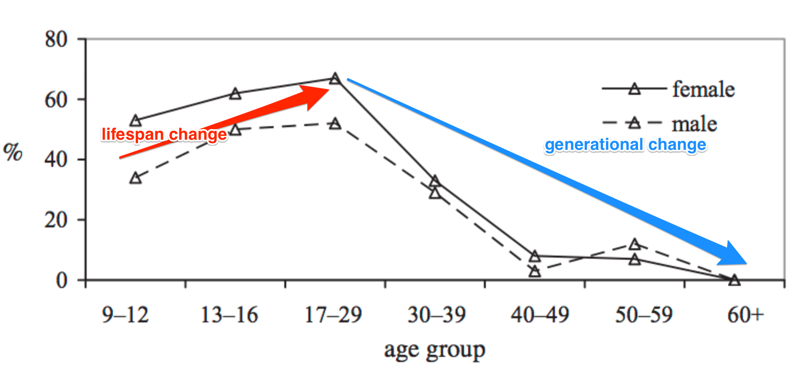

```{r setup, include= F}
  library(knitr)
  opts_chunk$set(dev = 'svg', 
                 echo = F,
                 message = F,
                 error = F,
                 warning = F,
                 cache = T)
dep_auto()
  knit_hooks$set(webgl = hook_webgl)
```

```{r data_packages, cache = F}
  library(UhUm)
  library(cohortsPackage)

```

```{r packages, cache=  F, include = F}
  library(dplyr)
  library(magrittr)
  library(ggplot2)
  library(scales)
  library(ggmap)
  library(reshape2)
  library(grid)
  library(GGally)
  library(gamm4, quietly = T)
  library(rgl)
  library(beepr)

  source("../../R/my_gamm4.R")
  
```

# The Time Dimensions of Language Change

## Time Dimensions

>- Generations
    - Incrementation of a change between one generation and the next.
    - Individuals remain stable, the community changes.
>- Lifespans
    - Incrementation of a change within an individual across their lifespan.
    - "When I was a child, I spake as a child, I understood as a child, I thought as a child: but when I became a man, I put away childish things." - 1 Corinthians
        - *Age Grading* could also be a stable phenomenon
    
## Time Dimensions    

- The Zeitgeist


      
      
## Generations Changing

> Generations I and II still say ɬ; and, without a single exception, generation III says y. Those between 30 and 40 fluctuate between the two pronunciations. -- Gauchat (1902)

The Apparent Time Construct is the foundation upon which almost all we know about language change in progress is built.

## Individuals Changing

Outside of second dialect acquisition contexts, there are a handful studies finding lifespan change. E.g. Celebrity case studies like Harrington et al (2000)

```{r}
  fis <- Sys.glob("../presentation/figures/queen/*csv")
  fis_df <- data_frame(fi=fis)
  
  fis_df %>%
    rowwise()%>%
    do(data.frame(vowel = gsub(".csv", "", basename(.$fi)),
      read.csv(.$fi, skip = 5)%>%
         mutate(group = c("5","8","S"),
                speaker = c("queen","queen","community"))))->queen
```

```{r fig.width = 8, fig.height = 4.5}
  queen %>%
    filter(group %in% c("5","8"))%>%
    melt(id = c("vowel","group","speaker"))%>%
    dcast(vowel + speaker ~ variable + group)->queen_comp
  
    
  queen %>%
    filter(group %in% c("5","S"))%>%
    ggplot(aes(f2, f1, color = speaker))+
      geom_segment(data = queen_comp, aes(f2_5, f1_5, xend = f2_8, yend = f1_8),
                   arrow = arrow())+
      geom_text(aes(label = vowel))+
      scale_y_reverse()+
      scale_x_reverse()+
      scale_color_manual(values = c("#685642","#663399"))+
      theme_bw()+
      coord_fixed()
  
```

## Individuals Changing

Sankoff and colleagues' longitudinal study of Montreal is perhaps the most systematic study of lifespan change vis-a-vis the broader speech community.

>- Sankoff & Blondeau (2007): Speakers who were variable between [r]~[R] increased their [R] usage between 1971 and 1984.
>- Sankoff & MacKenzie (2010): Individuals showed a mixture of lifespan participation, retrogression & stability for a number of vowel quality changes.
>- Wagner & Sankoff (2011): Speakers with high socio-professionals status increased their use of inflected future between 1971 and 1984, a retrograde movement.

## Individuals Changing

Adolescence and Post-Adolescence are turbulent times.

>- De Decker (2006) Found four Canadian had further retracted their /æ/ between high school and college.
>- Wagner (2012) found women decreased non-standard *-in'* frequency in the year between high school and college.
>- Van Hofwegen & Wolfram (2010) have found very dynamic patterns of vernacularity in African American children between 4 years old and 15-16 years old.
>- Rickford & Price (2013) found sharp drops in AAVE features (3sg -s absence, habitual *be*) for two women between their teens and 30s.

## Individuals Changing

The Peaks Model suggests that individual instability is *necessary* for language change to increment. 



(Tagliamonte & D'Arcy, 2009)

## Zeitgeist

I don't know of that much sociolinguistic work that attributes anything to a "Zeitgeist".

## Time Dimensions

Given the undeniable fact of lifespan change in some cases, and the centrality of the Apparent Time construct for our understanding of language change in progress, it's important to figure out to what extent it plays a role in any of our data.

# "Long" Corpora

## "Long" Corpora

There are an increasing number of "long" corpora being constructed, where the fieldwork was conducted over many years.

## "Long" Corpora

<object type="image/svg+xml" data="figures/data_structure.svg">Your browser does not support SVG</object>

## Examples of Long Corpora

- Philadelphia Neighborhood Corpus
    - Fieldwork 1973 - 2013
- Diachronic Electronic Corpus of Tyneside English
    - Recordings 1960s - 2000s
- Origins of New Zealand English
    - Recordings 1940s - 2000s


## A modelling challenge

<div style = "width:49%;float:left">
<object type="image/svg+xml" data="figures/triangle.svg">Your browser does not support SVG</object>
</div>
<div style = "width:49%;float:left">
```{r fig.width = 6, fig.height = 6}
  um_PNC%>%
    mutate(dob = year-age)%>%
    group_by(idstring, year, age, dob)%>%
    tally()%>%
    ungroup()%>%
    select(year,age,dob)%>%
    ggpairs()
  
```
</div>

## Previous Approaches

### Labov, Rosenfelder & Fruehwald (2013)
Fit 3 models

1. outcome ~ age
2. outcome ~ year of interview
3. outcome ~ date of birth

Model with largest $r^2$ wins.


## Previous approaches

### Zellou & Tamminga (2014)

Sub-sample all of the data to create:

1. A trend sample by restricting speakers' ages (age <= 25)
2. A cohort sample by restricting speakers' dates of birth <br> (1940 <= dob <= 1949)

## The Approach Here

> 1. Fit a 2 dimensional tensor-product smooth with random intercepts for speaker and lexical item.
> 2. Examine slices across the two dimensional surface.
> 3. Examine rates of change across these slices.

## The Approach Here

This modelling approach produces a 2d surface.

```{r message=F, include = F, error = F, warning=F}
  set.seed(2) ## simulate some data... 
  dat <- gamSim(1,n=400,dist="normal",scale=2)
  b <- gam(y~te(x0,x1, bs = "tp"),data=dat)
  b_pred <- expand.grid(x0 = (0:100)/100,
                        x1 = (0:100)/100,
                        x2 = 0.5,
                         x3 = 0.5)
  b_pred$y <- as.vector(unname(predict(b, newdata = b_pred)))
  cols <- brewer_pal("div", palette = 5)(5)
  b_pred$col <- gradient_n_pal(colours=cols, values = seq(2.5, 12, length = 100))(b_pred$y)
```


<div style = "width:60%">
```{r 3dplot, webgl = TRUE}
  plot3d(x=b_pred$x0, y=b_pred$x1, z = b_pred$y,
         col = b_pred$col,
         xlab = "x0",
         ylab = "x1",
         zlab = "y")
  
```
</div>


# Application & Results

## Philadelphia

```{r}
  load("../presentation/philly_in.rda")  
  load("../presentation/philly_out.rda")

  fam <- data.frame(lon = -75.0817,
                    lat = 40.0615)  
```


<div style ="width:100%">
<div style="width:49%;float:left;">
```{r fig.width = 5,fig.height = 5, dev = 'png'}
  ggmap(philly_out, extent = 'device')  
```
</div>
<div style="width:49%;float:left;">
```{r fig.width = 5,fig.height = 5, dev = 'png'}
  ggmap(philly_in, extent = 'device') + 
    geom_point(data = fam,
               color = "red",
               size = 2)
```
</div>
</div>


## The Philadelphia Neighborhood Corpus

- Sociolinguistic interviews carried out between 1973 and 2013 (40 years of field work).
- No re-interviews

```{r}
  um_PNC %>% 
    mutate(dob = year-age)%>%
    group_by(idstring, transcribed, nvowels , nwords, dob) %>% 
    tally()%>%ungroup()%>%
    summarise(speakers = n(), 
              `transcribed audio` = paste(round((sum(transcribed)/60)/60, digits= 2), " hours"), 
              `words` = formatC(sum(nwords), format = 'd', big.mark = ","),
              `stressed vowels` = formatC(sum(nvowels), format = 'd', big.mark = ","),
              `date of birth range` = paste(range(dob), collapse= "-"))%>%
    kable(align = 'r')
```  
  
- Transcribed by hand
- Automatic word and phone alignments
- Bayesian formant tracking for vowel analysis.


## Changes Examined


**/ay0/ = Pre-voiceless /ay/**<br>
Nucleus has risen from [ɑ] to [ʌ]

**/eyC/**<br>
Pre-consonantal /ey/ has raised, beginning to overlap with /iy/

**/ow/**<br>
Fronted for first half of the 20th century, has begun to reverse.


## /ay0/


```{r "prep_ay0"}
ay0 <- ay0%>% 
          filter(plt_vclass == "ay0")%>%
          mutate( dob = year-age,
                 dob0 = dob_centering(x = dob),
                 age0 = age_centering(x = age),
                 year0 = year_centering(x=year),
                 sex = factor(sex))%>%
          select(idstring, word, F1_n, sex, age, year, year0, age, dob, dob0, age0)%>%
          group_by(idstring, word, sex, age, year, age, dob, year0, dob0, age0)%>%
          summarise(F1_n = mean(F1_n))

```

```{r basic_ay_plot, fig.width = 10/1.25, fig.height = 5/1.25, fig.cap = "Basic pattern for pre-voiceless /ay/ in apparent time.\\label{fig:basic_ay_plot}"}
  ay0 %>%
    group_by(idstring, sex, dob)%>%
    summarise(F1_n = mean(F1_n))%>%
    ggplot(aes(dob, F1_n, color = sex))+
      geom_point()+
      stat_smooth(method = gam, formula =  y~ t2(x))+
      scale_y_reverse("normalized F1")+
      xlab("date of birth")+
      scale_color_brewer("gender", palette = "Dark2")+
      facet_wrap(~sex)+
      theme_bw()+
      ggtitle("/ay0/ - Basic Pattern")

```


```{r fit_ay0_f}
ay0_model_f <- ay0 %>% filter(sex == "f")%>%
                gamm4(F1_n ~ t2(dob0, year0, bs = 'tp'),
                   random = ~(1|word) + (1|idstring),
                   data = .,
                   verbose = T);beep(8)
```

```{r ay0_pos_f}
ay0_post_f <- posterior_dist(ay0_model_f$gam, n = 10000)
```

```{r fit_ay0_m}
ay0_model_m <- ay0 %>% filter(sex == "m")%>%
                gamm4(F1_n ~ t2(dob0, year0, bs = "tp"),
                   random = ~(1|word) + (1|idstring),
                   data = .);beep(8)
```


```{r ay_post_m}
ay0_post_m <- posterior_dist(ay0_model_m$gam, n = 10000)
```


```{r ay0_pred_f}
ay0_pred_f <- expand.grid(dob0 = dob_centering(x=1888:1998),
                    year0 = year_centering(x = 1973:2013))%>%
                mutate(dob = dob_centering(xc = dob0, out = "x"),
                       year = year_centering(xc = year0, out = "x"),
                       age = year-dob,
                       sex = "f")%>%
                filter(age >= 20, age <= 90)
                  

ay0_pred_f$F1 <- as.vector(predict(ay0_model_f$gam, newdata = ay0_pred_f))
ay0_cis_f <- sim_cis(ay0_model_f$gam, pred = ay0_pred_f, posterior = ay0_post_f, prob = 0.95)
ay0_pred_f <- cbind(ay0_pred_f, ay0_cis_f)

```

```{r ay0_pred_m}
ay0_pred_m <- expand.grid(dob0 = dob_centering(x=1888:1998),
                    year0 = year_centering(x = 1973:2013))%>%
                mutate(dob = dob_centering(xc = dob0, out = "x"),
                       year = year_centering(xc = year0, out = "x"),
                       age = year-dob,
                       sex = "m")%>%
                filter(age >= 20, age <= 90)
                  

ay0_pred_m$F1 <- as.vector(predict(ay0_model_m$gam, newdata = ay0_pred_m))
ay0_cis_m <- sim_cis(ay0_model_m$gam, pred = ay0_pred_m, posterior = ay0_post_m, prob = 0.95)
ay0_pred_m <- cbind(ay0_pred_m, ay0_cis_m)
```


```{r ay0_pred_all}
  ay0_pred_all <- rbind_list(ay0_pred_f, ay0_pred_m)
```

## /ay0/ model results

```{r ay0_by_dob, fig.width = 10/1.25, fig.height = 5/1.25, fig.cap = "Pre-voiceless /ay/ raising by date of birth cohort grouping. Lines represent GAM model fit, with 95% credible intervals.\\label{ay0_by_dob}"}
  ay0_pred_all %>% filter(dob %% 20 == 0) %>%
    group_by(dob, sex)%>%
    slice(1) -> ay0_dob_labels

  ay0_pred_all %>% filter(dob %% 20 ==0 )%>%
    ggplot(aes(year, F1, color = sex))+
      geom_line(aes(group = dob), linetype = 2, size = 1)+
      geom_ribbon(aes(group = dob, ymin = lo, ymax = hi, fill = sex), 
                  alpha = 0.3)+
      geom_text(data = ay0_dob_labels, aes(label = dob, x = year-3), show_guide = F, 
                size = 3.5)+
      scale_y_reverse()+
      scale_color_brewer("gender", palette = "Dark2")+
      scale_fill_brewer("gender", palette = "Dark2")+
      facet_wrap(~sex)+
      theme_bw()+
      ggtitle("ay0 Model Results - Cohort Grouping")
```

## /ay0/ Results

- The generational stratification is reliable.
- No cohort lifespan changes are reliable.


## /ey/

```{r "prep_ey"}
ey <- ey%>% 
  filter(plt_vclass == "ey",
         !grepl("[AEIOUL]", fol_seg))%>%
  mutate( dob = year-age,
          dob0 = dob_centering(x = dob),
          age0 = age_centering(x = age),
          year0 = year_centering(x=year),
          sex = factor(sex))%>%
  select(idstring, word, F1_n, F2_n, sex, age, year, year0, age, dob, dob0, age0)%>%
  group_by(idstring, word, sex, age, year, age, dob, year0, dob0, age0)%>%
  summarise(Diag = mean(F2_n-F1_n),
            F2_n = mean(F2_n),
            F1_n = mean(F1_n))

```

```{r basic_ey_plot, fig.width = 10/1.25, fig.height = 5/1.25}
ey %>%
  group_by(idstring, sex, dob)%>%
  summarise(Diag = mean(Diag))%>%
  ggplot(aes(dob, Diag, color = sex))+
  geom_point()+
  stat_smooth(method = gam, formula =  y~ t2(x))+
  #scale_y_reverse("normalized F1")+
  xlab("date of birth")+
  scale_color_brewer("gender", palette = "Dark2")+
  facet_wrap(~sex)+
  theme_bw()+
  ggtitle("/ey/ - Basic Pattern")
```

## /ey/

```{r fit_ey_m}
ey_model_m <- ey %>% filter(sex == "m")%>%
  my_gamm4(Diag ~ t2(dob0, year0, bs = "tp"),
        random = ~(1|word) + (1|idstring),
        data = .);beep(8)
```


```{r ey_post_m}
  
  ey_post_m <- posterior_dist(ey_model_m$gam, n = 10000)
```


```{r ey_pred_m}
  
ey_pred_m <- expand.grid(dob0 = dob_centering(x=1888:1998),
                          year0 = year_centering(x = 1973:2013))%>%
  mutate(dob = dob_centering(xc = dob0, out = "x"),
         year = year_centering(xc = year0, out = "x"),
         age = year-dob,
         sex = "m")%>%
  filter(age >= 20, age <= 90)


ey_pred_m$Diag <- as.vector(predict(ey_model_m$gam, newdata = ey_pred_m))
ey_cis_m <- sim_cis(ey_model_m$gam, pred = ey_pred_m, posterior = ey_post_m, prob = 0.95)
ey_pred_m <- cbind(ey_pred_m, ey_cis_m)
```


```{r fit_ey_f}
ey_model_f <- ey %>% filter(sex == "f")%>%
  my_gamm4(Diag ~ t2(dob0, year0, bs = "tp"),
        random = ~(1|word) + (1|idstring),verbose = T,
        data = .);beep(8)
```


```{r ey_post_f}

  ey_post_f <- posterior_dist(ey_model_f$gam, n = 10000)
```


```{r ey_pred_f}

ey_pred_f <- expand.grid(dob0 = dob_centering(x=1888:1998),
                          year0 = year_centering(x = 1973:2013))%>%
  mutate(dob = dob_centering(xc = dob0, out = "x"),
         year = year_centering(xc = year0, out = "x"),
         age = year-dob,
         sex = "f")%>%
  filter(age >= 20, age <= 90)

ey_pred_f$Diag <- as.vector(predict(ey_model_f$gam, newdata = ey_pred_f))
ey_cis_f <- sim_cis(ey_model_f$gam, pred = ey_pred_f, posterior = ey_post_f, prob = 0.95)
ey_pred_f <- cbind(ey_pred_f, ey_cis_f)
```

```{r ey_pred_all}

ey_pred_all <- rbind_list(ey_pred_m, ey_pred_f)
```


```{r ey_by_dob, fig.width = 10/1.25, fig.height = 5/1.25}

ey_pred_all %>% filter(dob %% 20 == 0) %>%
  group_by(dob, sex)%>%
  slice(1) -> ey_dob_labels

ey_pred_all %>% filter(dob %% 20 ==0 )%>%
  ggplot(aes(year, Diag, color = sex))+
  geom_line(aes(group = dob), linetype = 2, size = 1)+
  geom_ribbon(aes(group = dob, ymin = lo, ymax = hi, fill = sex), 
              alpha = 0.3)+
  geom_text(data = ey_dob_labels, aes(label = dob, x = year-3), show_guide = F, 
            size = 3.5)+
  scale_color_brewer("gender", palette = "Dark2")+
  scale_fill_brewer("gender", palette = "Dark2")+
  facet_wrap(~sex)+
  theme_bw()+
  ggtitle("ey Model Results - Cohort Grouping")
```

## /ey/ Tangents

```{r ey_tangents_setup}

ey_diff_pred_f  <- expand.grid(dob0 = dob_centering(x=1888:1998),
                                year0 = year_centering(x = 1973:2013))%>%
  mutate(dob = dob_centering(xc = dob0, out = "x"),
         year = year_centering(xc = year0, out = "x"),
         age = year-dob,
         sex = "f")%>%
  filter(age >= 20, age <= 90)
ey_diff_pred_f$F1 <- as.vector(predict(ey_model_f$gam, newdata = ey_diff_pred_f))

ey_diff_pred_m  <- expand.grid(dob0 = dob_centering(x=1888:1998),
                                year0 = year_centering(x = 1973:2013))%>%
  mutate(dob = dob_centering(xc = dob0, out = "x"),
         year = year_centering(xc = year0, out = "x"),
         age = year-dob,
         sex = "m")%>%
  filter(age >= 20, age <= 90)
ey_diff_pred_m$F1 <- as.vector(predict(ey_model_m$gam, newdata = ey_diff_pred_m))
```   


```{r ey_calc_diffs_age}

ey_diff_pred_f %>%
  group_by(age) %>%
  mutate(diff = c(NA, diff(F1)))%>%
  do(cbind(., diffs_ci(model = ey_model_f$gam, pred = ., posterior = ey_post_f)))->ey_dob_slopes_f


ey_diff_pred_m %>%
  group_by(age) %>%
  mutate(diff = c(NA, diff(F1)))%>%
  do(cbind(., diffs_ci(model = ey_model_m$gam, pred = ., posterior = ey_post_m)))->ey_dob_slopes_m

ey_dob_slopes <- rbind_list(ey_dob_slopes_f, ey_dob_slopes_m)

```


```{r ey_calc_diffs_dob}

ey_diff_pred_f %>%
  group_by(dob) %>%
  arrange(age)%>%
  filter(n()>3)%>%
  mutate(diff = c(NA, diff(F1)))%>%
  do(cbind(., diffs_ci(model = ey_model_f$gam, pred = ., posterior = ey_post_f)))->ey_age_slopes_f


ey_diff_pred_m %>%
  group_by(dob) %>%
  arrange(age)%>%
  filter(n()>3)%>%
  mutate(diff = c(NA, diff(F1)))%>%
  do(cbind(., diffs_ci(model = ey_model_m$gam, pred = ., posterior = ey_post_m)))->ey_age_slopes_m

ey_age_slopes <- rbind_list(ey_age_slopes_f, ey_age_slopes_m)

```


```{r setup_ey_slope_plot}
  
   ey_dob_slopes %>% filter(age %% 20 ==0)%>%
      mutate(age = factor(age, levels = age %>% unique()%>%sort%>%rev))->ey_dob_slopes

   ey_age_slopes %>% filter(dob %in% c(1950, 1955, 1960, 1965, 1970))->ey_age_slopes2


  ey_ymin <- min(c(ey_dob_slopes$lo, ey_age_slopes$lo), na.rm = T)
  ey_ymax <- max(c(ey_dob_slopes$hi, ey_age_slopes$hi), na.rm = T)
```

```{r ey_age_slope, fig.width = 12/1.25, fig.height = 5/1.25}
  
ey_age_slopes2 %>%
    mutate(age2 = as.numeric(as.character(age)))%>%
    filter(age2 %% 10==0)%>%
    select(year, age, dob, sex)->ey_age_slopes_marks
  
ey_age_slopes_marks %<>% mutate(ymark = ey_ymax + abs(ey_ymax * 0.1))

 ey_age_slopes2 %>%
 ggplot(aes(year, diff, fill = sex, color = sex)) + 
    geom_hline(y = 0)+  
    geom_line(linetype = 2, size=  1)+
    geom_ribbon(aes(ymin = lo, ymax = hi), alpha = 0.3)+
    geom_text(data = ey_age_slopes_marks,  aes(y = ey_ymax + abs(ey_ymax * 0.1), 
                                                label = age),
              color = "grey40", size=3.5)+    
    scale_color_brewer(palette = "Dark2")+
    scale_fill_brewer(palette = "Dark2")+
    #ylim(ey_ymin, ey_ymax - abs(ey_ymax * 0.1))+
    facet_grid(sex~dob)+
    theme_bw()
```

## /ey/ Zeitgeist Effect

```{r fig.width = 10/1.25, fig.height = 5/1.25}
#  ey_age_slopes %>%
#      filter(dob > 1955, dob < 1975,
#             sex == 'f')%>%
#      group_by(dob)%>%
#      summarise(x = max(diff, na.rm = T),
#                year = year[which.max(diff)],
#                age = age[which.max(diff)])
#                
# Peak = 1991

ey_age_slopes %>%
    filter(year %in% c(1991),
           age > 20, age < 80) %>%
    ggplot(aes(age, diff, color = sex))+
      geom_hline(y = 0)+
      geom_line()+
      geom_ribbon(aes(ymin = lo, ymax = hi, fill = sex), alpha = 0.3)+
      scale_color_brewer(palette = "Dark2")+
      scale_fill_brewer(palette = "Dark2")+   
      theme_bw()+
      facet_grid(year~sex)+
      ggtitle("Year = 1991")
```


## /ow/ 

```{r ow_means}


ow <- ow%>% 
  mutate(edu = as.numeric(as.character(years_of_schooling)))%>%
  filter(!fol_seg %in% c("M","N","NG", "L"),
         edu <= 12)%>%
  mutate(dob = year-age,
         dob0 = dob_centering(x = dob),
         age0 = age_centering(x = age),
         year0 = year_centering(x=year),
         sex = factor(sex),
         F2 = F2_n)%>%
  dplyr::select(idstring, word, F2, sex, age, year, year0, age, dob, dob0, age0)%>%
  group_by(idstring, word, sex, age, year, age, dob, year0, dob0, age0)%>%
  summarise(F2 = mean(F2))
```


```{r ow_basic_plot, fig.width = 10/1.25, fig.height = 5/1.25}
  ow %>%
    group_by(idstring, dob, age, sex)%>%
    summarise(F2 = mean(F2))%>%
    ggplot(aes(dob, F2, color = sex))+
      geom_point()+
      stat_smooth(method = gam, formula = y ~ t2(x))+
      scale_color_brewer(palette = "Dark2")+
      facet_wrap(~sex)+
      theme_bw()+
      ggtitle("/ow/ Basic Pattern")
```

```{r fit_ow_f_m}
ow_model_f <- ow %>% filter(sex == "f")%>%
  gamm4(F2 ~ t2(dob0, year0, bs = "tp"),
        random = ~(1|word) + (1|idstring),
        data = .); beep(8)

ow_model_m <- ow %>% filter(sex == "m")%>%
  gamm4(F2 ~ t2(dob0, year0, bs = "tp"),
        random = ~(1|word) + (1|idstring),
        data = .); beep(8)
```


```{r ow_post}
ow_post_f <- posterior_dist(ow_model_f$gam, n = 10000)
ow_post_m <- posterior_dist(ow_model_m$gam, n = 10000)
```

```{r ow_pred_f}
ow_pred_f <-  expand.grid(dob0 = dob_centering(x=1888:1998),
                    year0 = year_centering(x = 1973:2013))%>%
                mutate(dob = dob_centering(xc = dob0, out = "x"),
                       year = year_centering(xc = year0, out = "x"),
                       age = year-dob,
                       sex = "f")%>%
                filter(age >= 20, age <= 90)

ow_pred_f$F2 <- as.vector(predict(ow_model_f$gam, newdata = ow_pred_f))
ow_cis_f <- sim_cis(ow_model_f$gam, pred = ow_pred_f, posterior = ow_post_f)
ow_pred_f <- cbind(ow_pred_f, ow_cis_f)


ow_pred_m <-  expand.grid(dob0 = dob_centering(x=1888:1998),
                    year0 = year_centering(x = 1973:2013))%>%
                mutate(dob = dob_centering(xc = dob0, out = "x"),
                       year = year_centering(xc = year0, out = "x"),
                       age = year-dob,
                       sex = "m")%>%
                filter(age >= 20, age <= 90)

ow_pred_m$F2 <- as.vector(predict(ow_model_m$gam, newdata = ow_pred_m))
ow_cis_m <- sim_cis(ow_model_m$gam, pred = ow_pred_m, posterior = ow_post_m)
ow_pred_m <- cbind(ow_pred_m, ow_cis_m)
```


```{r ow_pred_all}
ow_pred_all <- rbind_list(ow_pred_m, ow_pred_f)
```

## /ow/ Modelling Results

```{r ow_by_dob, fig.width = 10/1.25, fig.height = 5/1.25}
  ow_pred_all %>% filter(dob %% 20 == 0) %>%
    group_by(dob, sex)%>%
    slice(1) -> ow_dob_labels

  ow_pred_all %>% filter(dob %% 20 ==0 )%>%
    ggplot(aes(year, F2, color = sex))+
      geom_line(aes(group = dob), linetype = 2, size = 1)+
      geom_ribbon(aes(group = dob, ymin = lo, ymax = hi, fill = sex), 
                  alpha = 0.3)+
      geom_text(data = ow_dob_labels, aes(label =dob, x = year-3), size = 3.5, show_guide = F)+
      scale_color_brewer(palette = "Dark2")+
      scale_fill_brewer(palette = "Dark2")+
      facet_wrap(~sex)+
      theme_bw()+
      ggtitle("ow Model Results - Cohort Grouping")
      x <- 1
```


```{r ow_tangents_setup}
ow_diff_pred_f  <- expand.grid(dob0 = dob_centering(x=1888:1998),
                                year0 = year_centering(x = 1973:2013))%>%
  mutate(dob = dob_centering(xc = dob0, out = "x"),
         year = year_centering(xc = year0, out = "x"),
         age = year-dob,
         sex = "f")%>%
  filter(age >= 20, age <= 90)
ow_diff_pred_f$F2 <- as.vector(predict(ow_model_f$gam, newdata = ow_diff_pred_f))

ow_diff_pred_m  <- expand.grid(dob0 = dob_centering(x=1888:1998),
                                year0 = year_centering(x = 1973:2013))%>%
  mutate(dob = dob_centering(xc = dob0, out = "x"),
         year = year_centering(xc = year0, out = "x"),
         age = year-dob,
         sex = "m")%>%
  filter(age >= 20, age <= 90)
ow_diff_pred_m$F2 <- as.vector(predict(ow_model_m$gam, newdata = ow_diff_pred_m))
```   

```{r ow_calc_diffs_age}
ow_diff_pred_f %>%
  group_by(age) %>%
  mutate(diff = c(NA, diff(F2)))%>%
  do(cbind(., diffs_ci(model = ow_model_f$gam, pred = ., posterior = ow_post_f)))->ow_dob_slopes_f


ow_diff_pred_m %>%
  group_by(age) %>%
  mutate(diff = c(NA, diff(F2)))%>%
  do(cbind(., diffs_ci(model = ow_model_m$gam, pred = ., posterior = ow_post_m)))->ow_dob_slopes_m

ow_dob_slopes <- rbind_list(ow_dob_slopes_f, ow_dob_slopes_m)

```


## /ow/ Tangents

```{r ow_calc_diffs_dob}
ow_diff_pred_f %>%
  group_by(dob) %>%
  arrange(age)%>%
  filter(n()>3)%>%
  mutate(diff = c(NA, diff(F2)))%>%
  do(cbind(., diffs_ci(model = ow_model_f$gam, pred = ., posterior = ow_post_f)))->ow_age_slopes_f


ow_diff_pred_m %>%
  group_by(dob) %>%
  arrange(age)%>%
  filter(n()>3)%>%
  mutate(diff = c(NA, diff(F2)))%>%
  do(cbind(., diffs_ci(model = ow_model_m$gam, pred = ., posterior = ow_post_m)))->ow_age_slopes_m

ow_age_slopes <- rbind_list(ow_age_slopes_f, ow_age_slopes_m)
```


```{r setup_ow_slope_plot}
  
   ow_dob_slopes %>% filter(age %% 20 ==0)%>%
      mutate(age = factor(age, levels = age %>% unique()%>%sort%>%rev))->ow_dob_slopes

   ow_age_slopes %>% filter(dob %% 20 ==0)->ow_age_slopes2


  ow_ymin <- min(c(ow_dob_slopes$lo, ow_age_slopes$lo), na.rm = T)
  ow_ymax <- max(c(ow_dob_slopes$hi, ow_age_slopes$hi), na.rm = T)
```

```{r ow_age_slope, fig.width = 12/1.25, fig.height = 5/1.25}
  
ow_age_slopes2 %>%
    mutate(age2 = as.numeric(as.character(age)))%>%
    filter(age2 %% 10==0, dob %% 20 == 0)%>%
    select(year, age, dob, sex)->ow_age_slopes_marks
  
ow_age_slopes_marks %<>% mutate(ymark = ey_ymax + abs(ey_ymax * 0.1))

 ow_age_slopes2 %>%
 ggplot(aes(year, diff, fill = sex, color = sex)) + 
    geom_hline(y = 0)+  
    geom_line(linetype = 2, size=  1)+
    geom_ribbon(aes(ymin = lo, ymax = hi), alpha = 0.3)+
    geom_text(data = ey_age_slopes_marks,  aes(y = ey_ymax + abs(ey_ymax * 0.1), 
                                                label = age),
              color = "grey40", size=3.5)+    
    scale_color_brewer(palette = "Dark2")+
    scale_fill_brewer(palette = "Dark2")+
    #ylim(ey_ymin, ey_ymax - abs(ey_ymax * 0.1))+
    facet_grid(sex~dob)+
    theme_bw()
```


## /ow/ Zeitgeist effect

```{r ow_zeitgeit, fig.width = 10/1.25, fig.height = 5/1.25}
  ow_age_slopes %>%
    filter(year == 1982) %>%
    ggplot(aes(age, diff, color = sex))+
      geom_hline(y = 0)+
      geom_line()+
      geom_ribbon(aes(ymin = lo, ymax = hi, fill = sex), alpha = 0.3)+
      scale_color_brewer(palette = "Dark2")+
      scale_fill_brewer(palette = "Dark2")+   
      theme_bw()+
      facet_grid(year~sex)+
      ggtitle("Year = 1982")
```

# Summing Up

## Time dimensions

>- In all three of these changes, there is a reliable effect of generational cohort, distinct from lifespan or zeitgeist.
    - The same is true for two more changes not presented here (/aw/ fronting, UM)
>- For /ey/ and /ow/ there is a reliable Zeitgeist effect. Speakers changing across their lifespan, but fixed to a particular era for all speakers.
    - These are the only two of the 5 changes examined that exhibit a Zeitgeist effect.
>- There is differential participation in the Zeitgeist trends
    - In the 80s, old men are regressive wrt /ow/ fronting
    - In the 90s, young women are progressive wrt /ey/ raising.
    
## Importance

- These results help shore up some uncertainties surrounding the Apparent Time construct.
- They address some questions regarding who participates in the incrementation of the change.
- For the most part, the change is incremented by speakers younger than displayed here (i.e. according to the Peaks model).
    

