```{r setup, include=FALSE}
  library(knitr)
  opts_chunk$set(cache=TRUE, warning=FALSE, fig.width = 8/1.5, fig.height = 5/1.5)
  dep_auto()
```

```{r prep, echo = F, message=F, cache = F}
  library(plyr)
  library(ggplot2)
  library(dplyr)
  library(FAVErtools)
  library(reshape2)
```

# Introduction

## Outline

1. The Benefit of Automation
2.  The tools we've built
    *  FAVE Align
    *  FAVE Extract
3.  Some of the results.

## [FAVE](http://fave.ling.upenn.edu/)

<embed src = "http://fave.ling.upenn.edu/" width="100%" height="500"></embed>

## [Thank you National Science Foundation!](http://www.nsf.gov/awardsearch/showAward?AWD_ID=0921643)

<embed src = "http://www.nsf.gov/awardsearch/showAward?AWD_ID=0921643" width="100%" height="500"></embed>

# The Benefit of Automation

## FUD

* Fear
* Uncertainty
* Doubt


## "It'll make mistakes!"


```{r read_tels, echo = F}
read.tels <- function(file){
  data <- scan(file, blank.lines.skip = F, what = "list", sep = "\n", quiet = T)
  filename <- rev(unlist(strsplit(file, split = "/")))[1]
  
  header.info <- data[1]
  
  last <- (which(unlist(lapply(data, nchar))==0)-1)
  n <- last-3
  data <- data[3:last]
  
  to.compile <- llply(data, function(x)unlist(strsplit(gsub("[<>]", "", x), split = "  ")))
  
  out <- ldply(to.compile, function(x)unlist(strsplit(x[[1]], split = ","))[1:6])
  colnames(out) <- c("F1","F2","F3","VCoding","Dur_Stress","Info")
  
  infos <- strsplit(out$Info, split=" ")
  infos <- unlist(llply(infos, function(x)x[1]))
  
  out$Word <- infos
  
  if(length(grep("\\.", out$Dur_Stress)) > 0){
    out <- cbind(out, reshape2::colsplit(out$Dur_Stress, pattern = "\\.", names = c("Stress","Dur_msec")))
    out$Dur_msec <- as.numeric(out$Dur_msec)
  }else{
    out$Stress <- as.numeric(out$Dur_Stress)  
  }
  
  vcodings <- plt_code(out$VCoding)
  
  out <- cbind(out, vcodings[,-2])
  
  out$F1 <- as.numeric(out$F1)
  out$F2 <- as.numeric(out$F2)
  out$F3 <- as.numeric(out$F3)
  out$Stress <- as.character(out$Stress)
  out$Word <- as.character(out$Word)
  if(length(grep("\\[f\\]", out$Info)) > 0){
    out$Function <- FALSE
    out[grep("\\[f\\]", out$Info),]$Function <- TRUE
  }
  
  out$File <- filename
  header_vec <- unlist(strsplit(header.info, split=","))
  new_header_vec <- c(header_vec[1:2], rev(header_vec)[1:2])
  out <- cbind(data.frame(rbind(new_header_vec)), out)
  return(out)
}

```

```{r load_tels, echo =F, warning=FALSE}
  files <- Sys.glob("~/Documents/ANAE_Plot/telsur/files/*")
  tels <- llply(files, function(x)try(read.tels(x)))
  n_df <- table(unlist(llply(tels, class)))["data.frame"]
  new_tels <- vector(mode = "list", length = n_df)
  iter = 1
  for(i in 1:length(tels)){
    if(class(tels[[i]]) =="data.frame"){
      new_tels[[iter]] <- tels[[i]]
      iter <- iter + 1

    }
  }
  tels_df <- rbind.fill(new_tels)
```

## People make mistakes.

```{r dev = "png", echo = F}
  ggplot(tels_df, aes(F2, F1)) + 
    geom_point()+
    scale_y_reverse()+
    scale_x_reverse()+
    theme_bw()
```

## F2 = 15543?

```{r}
  tels_df %.% filter(F2 > 5000) %.%
              select(F1,F2,VClass,Word)

```

## F2 < F1?

```{r}
  tels_df %.% filter(F2 < F1, !is.na(F1)) %.%
              select(F1,F2,VClass,Word)
```


## What's this little hat?

```{r dev = "png", echo = F}
  ggplot(tels_df %.% filter(F2 < 5000), aes(F2, F1)) + 
    geom_point()+
    scale_y_reverse()+
    scale_x_reverse()+
    coord_fixed()+
    theme_bw()
```

## It's all low vowels?

```{r dev = "svg", echo = F}
  ggplot(tels_df %.% filter(F1 < 190, !is.na(F1)), aes(F2, F1, label = VClass)) + 
    geom_text()+
    scale_y_reverse()+
    scale_x_reverse()+
    coord_fixed()+
    theme_bw()
```

## Mistakes

- Hand Measurements &ne; Error Free

## "It's a black box!"

## People are black boxes


## [FAVE](https://github.com/JoFrhwld/FAVE)


## "It's like..."


## Well so is Praat!


---

<section fullscreen-img="images/hadron.jpg" class="slide level2">
</section>

## Don't stop looking at and listening to your data!

## Positive Benefits

- Consistancy
- Replicability


## When humans format data by hand


```
Diane Altwasser, 28, Calgary, AB  TS 663
```

<br>

```
Darcy Janzen (m), 36, Calgary, AB  TS 658
```

<br>


```
John Kistler, 47, m,ColoradoSprings, CO TS 147
```

## When humans curate data by hand

```
AB:Calgary:DAltwasser.txt:       text/plain; charset=us-ascii
...
AR:LittleRock:MKemp.pln:         text/x-c++; charset=iso-8859-1
...
AZ:Tucson:JBrunekant.pln:        text/plain; charset=iso-8859-1
...
IL:Chicago:JWojcik.pln:          text/x-c; charset=us-ascii
...
IL:Chicago:KReynen.pln:          text/x-c++; charset=us-ascii
```
```{r, echo = F, results='asis'}
  encodings <- read.delim("~/Documents/ANAE_Plot/telsur/types.txt", header = F)
  kable(t(as.matrix(table(encodings$V2))))
```

# Forced Alignment

## Hidden Markov Models

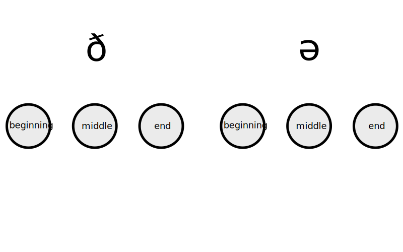	

## Hidden Markov Models

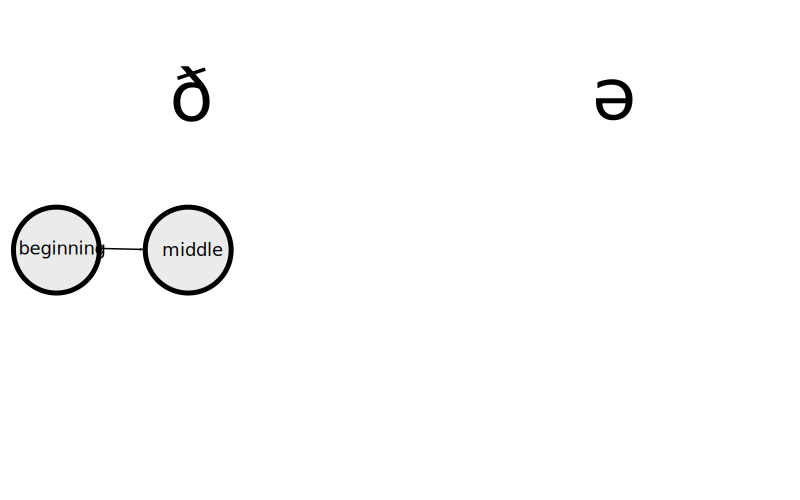      			


## Hidden Markov Models

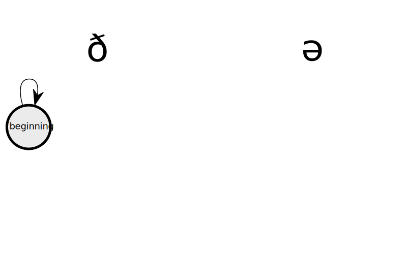        		


## Hidden Markov Models

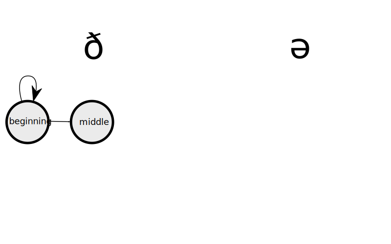          	


## Hidden Markov Models

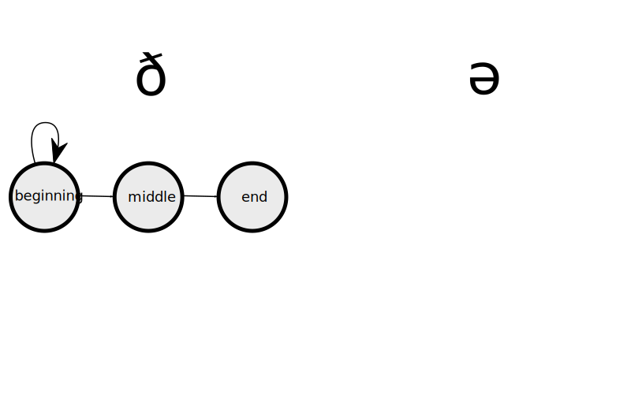            


## Hidden Markov Models

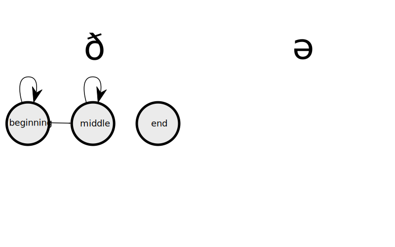      			


## Hidden Markov Models

        		


## Hidden Markov Models

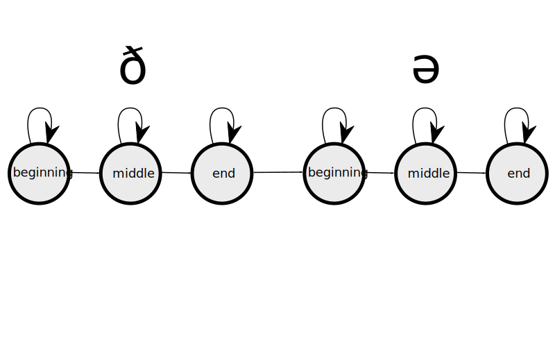  					


## Hidden Markov Models


## Hidden Markov Models

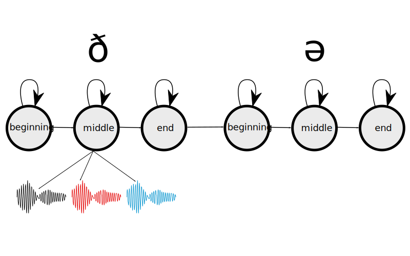

## Hidden Markov Models

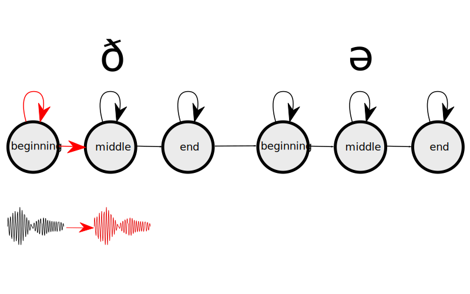

## Hidden Markov Models

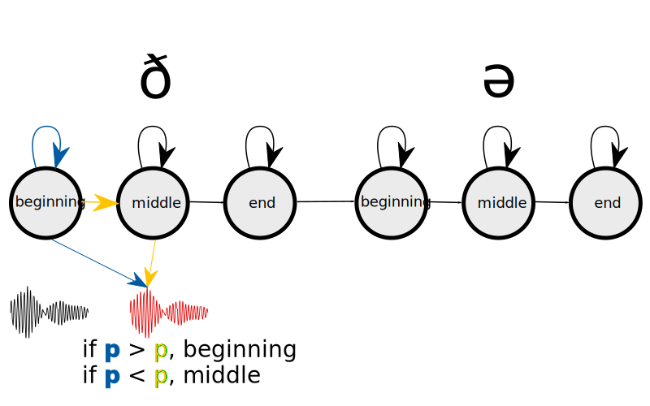

## Hidden Markov Models

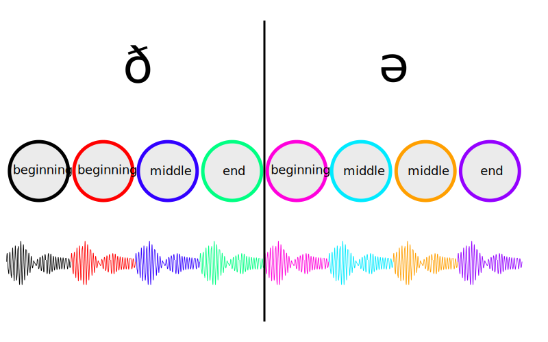


## The Result

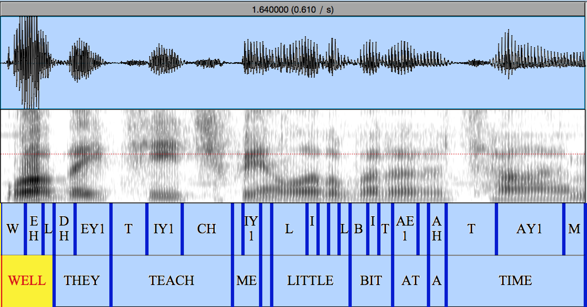

## Training & Use

* A lot (20+ hours) of hand aligned data.


<embed src = "http://htk.eng.cam.ac.uk/" class = "fragment", width = "100%", height = "500"></embed>


# FAVE-align

## P2FA

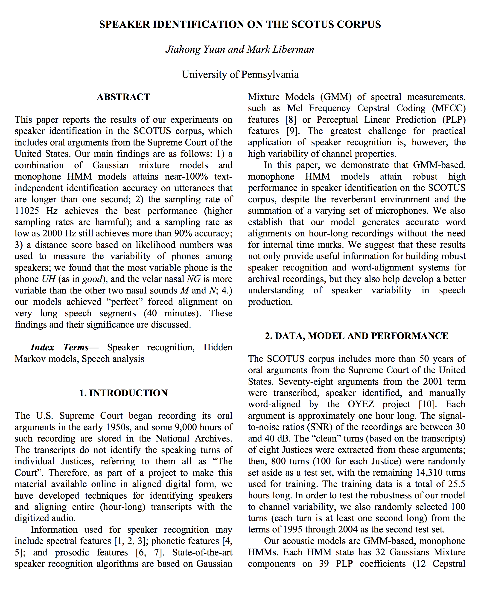

## Specs

- 25.5 hours training data.
- Monophone model
- 10 ms granularity

## Specs

Accuracy, from Yuan & Liberman (2008)

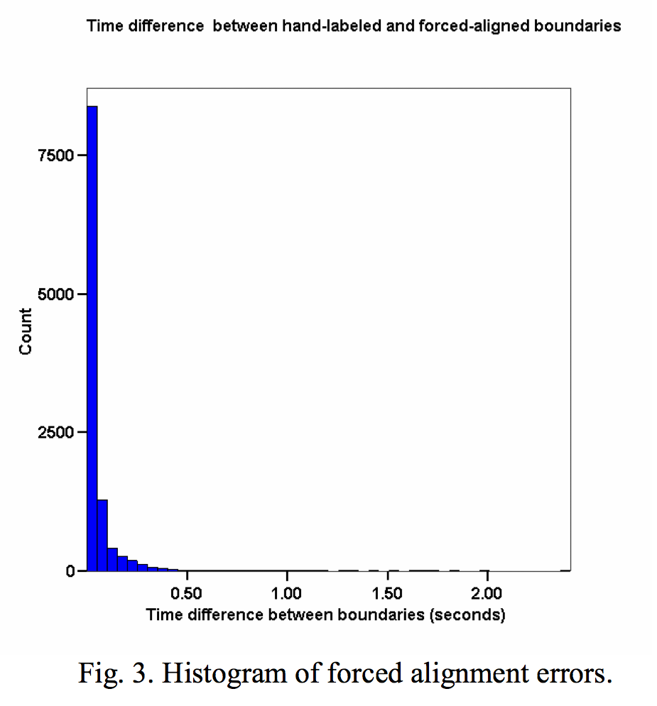

## Specs

MacKenzie & Turton compared FAVE to other aligners on British English.


<div style = "float:left;margin:5px;" class = "fragment">
|      | Median  |          |  | Mean    |          |  |Max      |         |
|:---- |-----:   | -------: |--|-----:   |----:     |--|----:    |----:    |
|      |**Onset**|**Offset**|  |**Onset**|**Offset**|  |**Onset**|**Offset**|
|FAVE  |0.009    | 0.009    |  | 0.019   | 0.021    |  | 0.583   | 0.588    |
| PLA  |0.015    | 0.019    |  | 0.267   | 0.252    |  |55.473   | 55.488   |
|SPPAS |0.150    | 0.155    |  | 0.504   | 0.480    |  |68.903   | 67.408   | 

</div>

## FAVE-Align


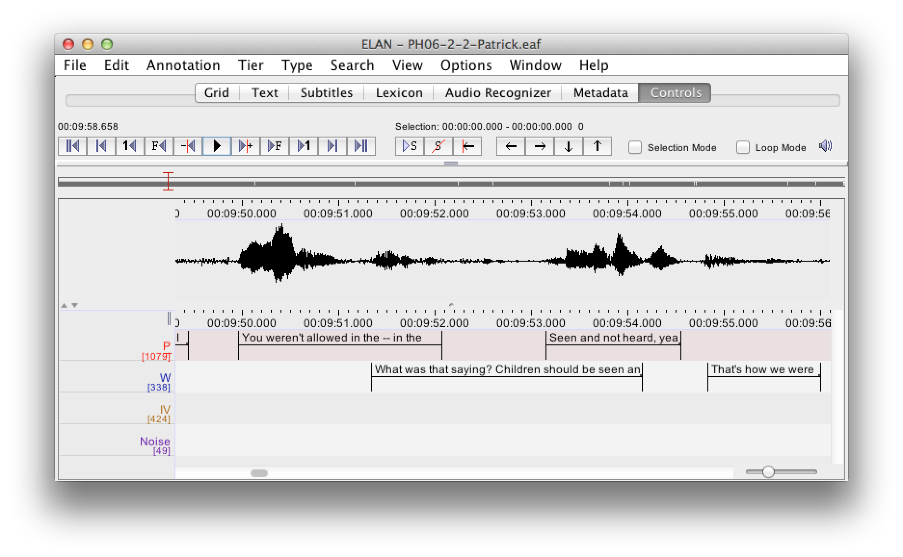

## FAVE-Align

<embed src = "http://www.speech.cs.cmu.edu/cgi-bin/cmudict" width = "100%" height = "500"></embed>

# Using Forced Alignment

## Variation in the dictionary

<div class = "fragment" align="center" style="margin:5%;">
### No
| car   | walking      | both     |
|-----  |---------     | -------  |
|```K AA R``` | ```W AO K IH NG``` | ```B OW TH```  |
|```K AA```   | ```W AO K IH N```  | ```B OW F```   |
<div class = "fragment">
  Requires special training of forced aligner.
</div>
</div>
<div class = "fragment" align="center"  style="margin:5%;">
### Maybe?
|  either   | going to         |
| ----------| -------          |
| ```AY DH ER```  | ```G OW IH NG  T UW``` |
| ```IY DH ER```  | ```G AA N AH```        |
</div>

## Using Forced Alignment

<div style="width:100%;">
  <div style="width:49%;float:left;font-size:50%;line-height:1;">
  <a href = "http://www.ling.upenn.edu/~jiahong/publications/cn1.pdf">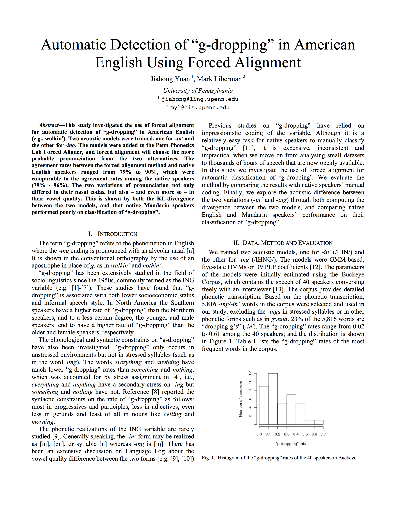</img></a>

Yuan, J., Liberman, M., “Automatic detection of ‘g-dropping’ in American English using forced alignment,” Proceedings of 2011 IEEE Automatic Speech Recognition and Understanding Workshop, pp. 490-493.
  </div>
  <div style="width:49%;float:left;font-size:50%;line-height:1;">
  <a href = "http://www.ling.upenn.edu/~jiahong/publications/c06.pdf">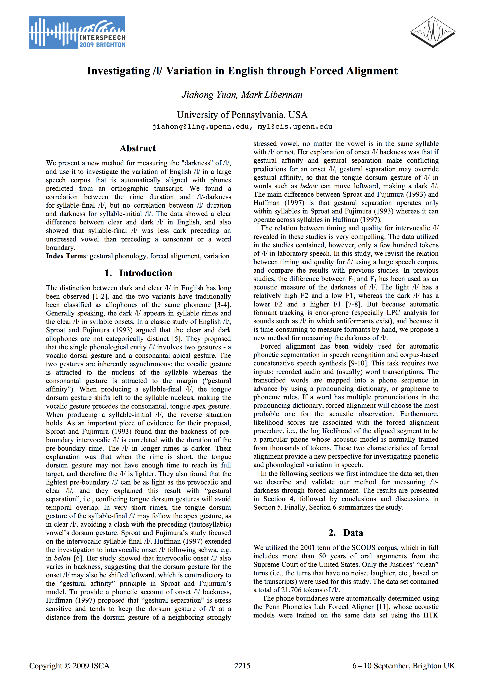</img></a>

Yuan, J, Liberman, M., “Investigating /l/ variation in English through forced alignment,” Proceedings of Interspeech 2009, pp. 2215-2218.
  </div>  
</div>


# FAVE-Extract

## Researcher degrees of freedom

- Where to measure.
- Multiple LPC parameter settings.
- **Whether or not to measure the vowel at all.**

## Formant Estimation

<div style="width:100%;">
<div class = "fragment" style="float:left;margin:3%;">
3

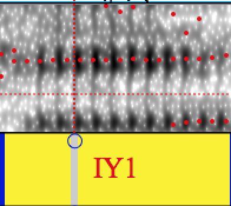</img>
</div>
<div class = "fragment" style="float:left;margin:3%;">
4

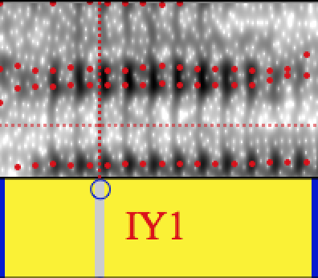</img>
</div>
<div class = "fragment" style="float:left;margin:3%;">
6

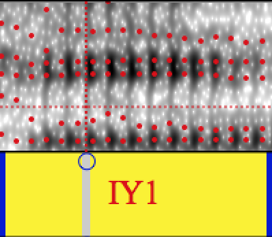</img>
</div>
</div>

## Formant Estimation


## Formant Estimation


## Automating Formant Estimation

* The bad errors are very very bad.
* Some small differences, any expert may disagree

<div style="width:100%;">
<div class = "fragment" style="float:left;margin:3%;">
4

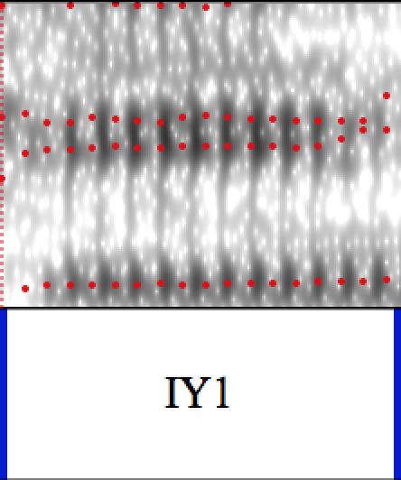</img>
</div>
<div class = "fragment" style="float:left;margin:3%;">
5

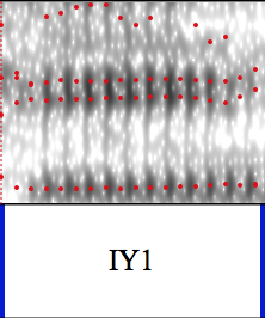</img>
</div>
</div>

## FAVE-extract


# Extaction Example

## Jean's Vowel Space

```{r prep_jeans, echo = F}
jean <- read.delim("data/PH06-2-1-AB-Jean.txt")
jean$.id <- 1:nrow(jean)
jean$poles <- gsub("\\[","", jean$poles)
split_poles <- function(x){
  out <- strsplit(x, split = "\\],?")[[1]]
  out <- strsplit(out, ",")
  out <- llply(out, as.numeric)
  return(out)
}

jean_poles <- llply(jean$poles, split_poles)
names(jean_poles) <- 1:length(jean_poles)


f1_f2 <- function(x){
  df <- data.frame(F1 = x[1], F2 = x[2])
  return(df)
}

jean_poles <- llply(jean_poles, function(x){ldply(x,f1_f2)})


add_cands <- function(df){
  df$candidates <- 1:nrow(df)
  return(df)
}

jean_poles <- ldply(jean_poles, add_cands)
jean_poles$candidates <- jean_poles$candidates + 2
jean_poles_m <- melt(jean_poles, id = c(1,4))
jean_poles_c <- dcast(jean_poles_m, .id ~ variable + candidates)

jean <- merge(jean, jean_poles_c, by = ".id")


jean$bandwidths <- gsub("\\[","", jean$bandwidths)
jean_bands <- llply(jean$bandwidths, split_poles)
names(jean_bands) <- 1:length(jean_bands)

b1_b2 <- function(x){
  df <- data.frame(B1 = x[1], B2 = x[2])
  return(df)
}

jean_bands <- llply(jean_bands, function(x){ldply(x,b1_b2)})
jean_bands <- ldply(jean_bands, add_cands)
jean_bands$candidates <- jean_bands$candidates + 2
jean_bands_m <- melt(jean_bands, id = c(1,4))
jean_bands_c <- dcast(jean_bands_m, .id ~ variable + candidates)

jean_all_cands <- merge(jean_bands, jean_poles)
jean_all_cands <- jean_all_cands %.% group_by(.id, candidates)

```

```{r jean_vspace, dev=  "svg", fig.width = 6, fig.height = 6, echo = F}
  ggplot(jean, aes(F2,F1))+
    stat_density2d(geom="polygon", fill = "grey")+
    geom_point(alpha = 0.6, size = 1.5)+
    theme_bw()+
    scale_y_reverse()+
    scale_x_reverse()
```

## Jean's /iy/

```{r prep_jean_iy, echo = F}
  iy <- subset(jean, plt_vclass == "iy")
  iy_candidates <- subset(jean_all_cands, .id %in% iy$.id)
  jean_poly <- stat_density2d(data = jean, aes(F2, F1), 
                            geom = "polygon",
                            fill = "grey")

```

```{r iy_candidates, dev = "svg",fig.width = 6, fig.height = 6, echo = F}
ggplot(iy_candidates, aes(F2, F1)) + 
  jean_poly +
  geom_point()+
  scale_y_reverse()+
  scale_x_reverse()+
  facet_wrap(~candidates, scales = "free")+
  ggtitle("/iy/ with different formant settings")+
  theme_bw()
```

## Jean's iys

<div class = "fragment" style="width:50%;float:left">

```{r dev = "svg", echo = F, fig.width = 3, fig.height = 3}
ggplot(subset(iy_candidates, .id == 3908 & is.finite(F2)), aes(F2, F1)) +
  jean_poly+
  geom_text(aes(label = candidates))+
  scale_y_reverse()+
  scale_x_reverse()+
  theme_bw()
```

</div>
<div class = "fragment" style="width:50%;float:left">
```{r dev = "svg", echo = F, fig.width = 3, fig.height = 3}
ggplot(subset(iy_candidates, .id == 75 & is.finite(F2)), aes(F2, F1)) +
  jean_poly+
  geom_text(aes(label = candidates))+
  scale_y_reverse()+
  scale_x_reverse()+
  theme_bw()
```


</div>


## What is a reasonable /iy/?
```{r anae_priors, echo = F}
  means <- read.delim("~/Documents/FAVE/FAVE-extract/means.txt", header = F)
  covs <- read.delim("~/Documents/FAVE/FAVE-extract/covs.txt", header=F)
  
  
  iy_means <- unlist(means[means$V1 == 11, 2:5])
  iy_covs <- matrix(unlist(covs[covs$V1==11,2:17]), ncol = 4)
  
  chol_decomp <- matrix(chol(as.matrix(iy_covs[1:2,1:2])), ncol = 2)
  dfn <- 2
  dfd <- nrow(iy)
  radius <- sqrt(dfn * qf(0.95, dfn, dfd))
  angles <- (0:51) * 2 * pi/51
  unit.circle <- cbind(cos(angles), sin(angles))
  ellipse_95 <- t(unlist(iy_means[1:2]) + radius * t(unit.circle %*% chol_decomp))
  colnames(ellipse_95) <- c("F1","F2")
  ellipse_95  <- as.data.frame(ellipse_95)
```

According to the ANAE:

```{r plot_anae_prior, echo = F, dev = "svg", fig.width = 6, fig.height = 6}
  ggplot(ellipse_95, aes(F2, F1)) + 
    jean_poly + 
    geom_path() +
    scale_y_reverse()+
    scale_x_reverse()+
    theme_bw()
```

## Formant Estimation

* Use F1, F2, log Bandwidth F1 and log Bandwidth F2
* For each potential measurement, calculate the distance from the ANAE distribution.
* Mahalanobis distance
* The closest is the winner.


## Result
```{r anae_step, echo = F}
iy_candidates <- iy_candidates %.% 
                  group_by(.id, candidates) %.%
                  mutate(dist = mahalanobis(c(F1,F2,log(B1),log(B2)), 
                                            center = iy_means, cov = iy_covs)) %.%
                  group_by(.id, add = F) %.%
                  mutate(first_win  = dist == min(dist, na.rm = T) & is.finite(dist))


first_winners <- iy_candidates %.%
                  group_by(.id, add = F) %.%
                  filter(dist == min(dist, na.rm = T) & is.finite(dist))

```

<div style="float:left;width:50%">
```{r example1, dev="svg", fig.width = 4, fig.height = 4, echo = F}
ggplot(subset(iy_candidates, .id == 9 & is.finite(F2)), aes(F2, F1)) +
  jean_poly+
  geom_text(aes(label = candidates, color = first_win))+
  scale_color_manual(guide = "none", values = c("black","red"))+
  geom_path(data = ellipse_95) +    
  scale_y_reverse()+
  scale_x_reverse()+
  theme_bw()

```
</div>


<div style="float:left;width:50%">

```{r example2, dev="svg", fig.width = 4, fig.height = 4, echo = F}
ggplot(subset(iy_candidates, .id == 848  & is.finite(F2)), aes(F2, F1)) +
  jean_poly+
  geom_text(aes(label = candidates, color = first_win))+
  scale_color_manual(guide = "none", values = c("black","red"))+
  geom_path(data = ellipse_95) +    
  scale_y_reverse()+
  scale_x_reverse()+
  theme_bw()

```
</div>


## Result

```{r first_winner_plot, fig.width = 6, fig.height = 6, dev = "svg", echo = F}
ggplot(first_winners, aes(F2, F1))+
    jean_poly+
    geom_point()+
    geom_path(data = ellipse_95) +  
    scale_x_reverse()+
    scale_y_reverse()+
    theme_bw()

```

## Have we only found what we "expected"?

```{r not_just_expected, echo = F, dev = "svg", fig.width = 6, fig.height = 6}
ggplot(first_winners, aes(F2, F1))+
    jean_poly+
    geom_point()+
    geom_point(data = subset(first_winners, .id == 2758), size = 4, color = "red")+
    geom_path(data = ellipse_95) +  
    scale_x_reverse()+
    scale_y_reverse()+
    theme_bw()
```

## Have we only found what we "expected"?

```{r not_just_expected2, echo = F, dev = "svg", fig.width = 6, fig.height = 6}
ggplot(subset(iy_candidates, .id == 2758 & is.finite(F2)), aes(F2, F1)) +
  jean_poly+
  geom_text(aes(label = candidates, color = candidates == 6))+
  geom_path(data = ellipse_95) +  
  scale_y_reverse()+
  scale_x_reverse()+
  scale_color_manual(guide = "none", values = c("black","red"))+
  theme_bw()
```

## Step 2 -- Re-estimation

* Take the winners from the first step.
* Re-estimate distribution for F1, F2, log Bandwidth 1, log Bandwidth 2, and log duration
* Go through all the candidates again, and choose the one closest to the speaker's own distribution.

## Re-estimation

```{r re_estimate_1, dev = "svg", fig.width = 6, fig.height = 6, echo = F}
ggplot(first_winners, aes(F2, F1))+
    jean_poly+
    geom_point()+
    stat_ellipse(type = "norm")+
    scale_x_reverse()+
    scale_y_reverse()+
    theme_bw()
```

## Re-estimation

```{r re_restimate2, echo = F}
first_winners <- merge(first_winners, iy[,c(".id","dur")])

first_winners$logB1 <- log(first_winners$B1)
first_winners$logB2 <- log(first_winners$B2)
first_winners$logdur <- log(first_winners$dur)

first_cov<- cov(first_winners[,c("F1","F2","logB1","logB2","logdur")])
first_means<- colMeans(first_winners[,c("F1","F2","logB1","logB2","logdur")])

iy_candidates <- merge(iy_candidates, iy[,c(".id","dur")])
iy_candidates$logdur <- log(iy_candidates$dur)

iy_candidates <- iy_candidates %.%
                    group_by(.id, candidates) %.%
                    mutate(dist2 = mahalanobis(c(F1,F2,log(B1),log(B2),log(dur)),
                                               cov = first_cov,
                                               center = first_means)) %.%
                    group_by(.id, add = F) %.%
                    mutate(second_win =  dist2 == min(dist2, na.rm = T) & is.finite(dist2))
```

<div style = "float:left;margin-left:25%;">
| Stayed the same | New re-estimation |
| --------:       | ----------:       |
| ```r with(iy_candidates, table(first_win, second_win))[2,2]``` | ```r with(iy_candidates, table(first_win, second_win))[1,2]```|
</div>

## We did something!

```{r worth_it, echo = F, dev = "svg", fig.width = 6, fig.height = 6}
all_means <- iy_candidates %.% 
    group_by(candidates, add = F) %.%
    summarise(F1 = mean(F1, na.rm = T), F2 = mean(F2, na.rm = T))

winner_means <- iy %.% summarise(F1 = mean(F1), F2 = mean(F2))

ggplot(subset(all_means, candidates > 3), aes(F2, F1)) + 
  jean_poly + 
  geom_text(aes(label = candidates)) + 
  geom_point(data = winner_means, size = 4)+
  scale_y_reverse() + scale_x_reverse() + 
  theme_bw()


```


## FAVE-extract for other dialects


# Results

## Language in Motion!

<embed src = "http://jofrhwld.github.io/assets/motion_ipa.html" width = "600", height = "500"></embed>


