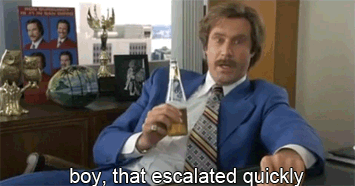
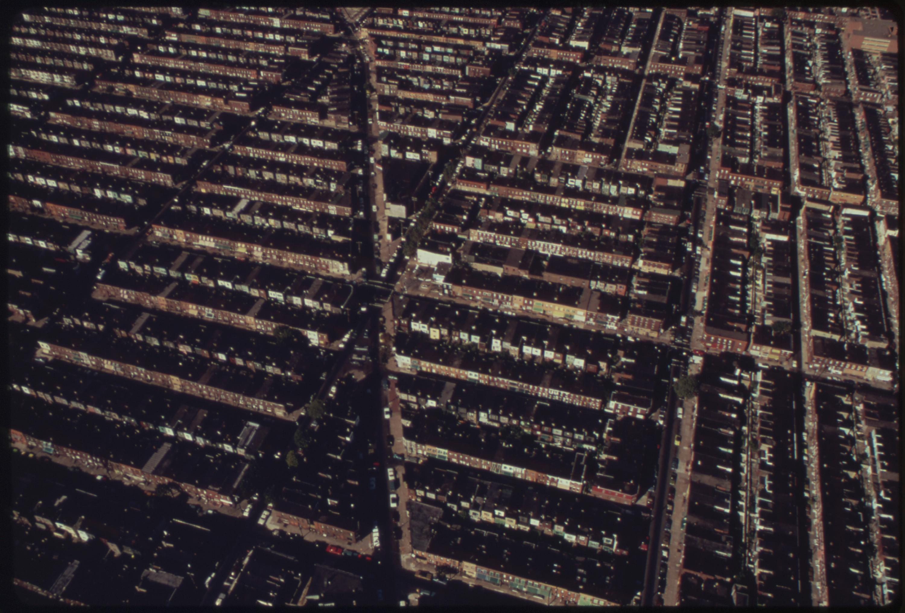
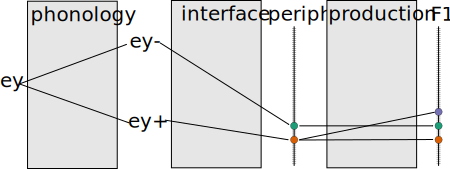

% Against Gradual Phonologization
% Josef Fruehwald, University of Edinburgh <br> November 16, 2013


```{r load_libraries, cache = F, include =F}
library(plyr)
library(ggplot2)
library(splines)
library(car)
library(reshape2)
library(plyr)
library(ggplot2)
library(directlabels)
library(mgcv)
#library(googleVis)
library(grid)
library(xtable)
library(extrafont)
library(RColorBrewer)
library(lme4)
library(lubridate)
library(moments)

opts_chunk$set(cache = T, autodep = T, warning=F, message =F, echo = F, fig.width = 8/1.5, fig.height = 5/1.5, out.width = "80%")
opts_knit$set(animation.fun = hook_scianimator)
dep_auto()

knit_hooks$set(no_figure = function(before, options, envir){
  if(!before){
    return("\\ ")
  }
})

font_import(paths="~/Documents/Numans/", recursive=T, prompt= F)

source("~/Documents/Classes/Dissertation/ay_stan_modeling/syllabify.R")
source("~/Documents/Classes/FAAV/r/stat-ellipse.R")
loadfonts()
```

```{r verboten, cache =  F}
verboten_vector <- c("PH76-3-1",
"PH84-2-5",
"PH84-2-3",
"PH92-1-1",
"PH82-1-16",
"PH80-2-5",
"PH80-2-4",
"PH85-1-5",
"PH84-1-2",
"PH84-1-1")

verboten_string <- paste(verboten_vector, collapse = "|")
```


```{r basic_context}
  load("~/Documents/Classes/FAAV_Data/basic_context.Rdata")
```

---

# Introduction

<div class = "incremental">

Welcome to my Dissertation Defense <del>2.0</del> 1.1 

I'll be making the case that the conventional wisdom surrounding the transition of phenomena from phonetic to phonological is not that well supported by studying language change in progress.

I'll argue that phonological reanalysis occurs at the *onset* of sound changes, not as late stage reanlyses.

In the process I'll also be trying to make the case that the difference between "phonetic" and "phonological" is not just a matter of degree, but of quality.

</div>

---

# Terminological Issues

<div style="position:absolute; z-index=100; width:100%; height:90%;">
<object data="https://en.wiktionary.org/wiki/phonologization" style="width:100%;height:90%;"></object>
</div>
<div class = "incremental">
  </img>
</div>

---

# Terminological Issues

<div class = "incremental">
<div>

#### Hyman (1976)

Phonologization is the reanalysis of an "intrinsic" phonetic property (universal, physiological, etc.) as an "extrinsic" phonetic property (language specific, under speaker control).

After phonologization comes *phonemicization*.

</div>
<div>

#### Berm&uacute;dez-Otero (2007)

Phonologization is the reanalyzis of an "intrinsic" phonetic property as an "extrinsic" phonetic property.

After phonologization comes *stablization*, where the extrinsic phonetic property becomes categorical.

---

# Terminological Issues

<div class = "incremental">
<div>

#### Kiparsky (2013)

Phonologization is the reanalysis of phonological allophones (categorically conditioned) as phonemes or quasiphonemes.

</div>
<div>

#### Fruehwald (2013)

Phonologization is the introduction of a new phonological process into the grammar.

</div>

</div>


---

# Terminological issues

#### Some work: 

* Phonetic processes = small phonetic differences
* Phonological processes = large phonetic differences.

#### What I mean:

* Phonetic processes = operate over and manipulate continuous phonetic dimensions.
* Phonological processes = operate over and manipulate categorical, featural representations

---


# The PNC
* Interviews collected between 1972 and 2010
    * Fieldwork associated with the Ling 560 Class
    * Goal: interview as many residents on a city block as possible
    * 1,107 interviews in catalog from mostly working class neighborhoods
* The PNC
    * 358 speakers transcribed and analyzed so far
    * Dates of Birth ranging from 1888 to 1991
    * 860,000 automated vowel measurements.
* This talk
    * A subset of 735,408 measurements from 308 speakers from the PNC.

<!-- http://www.flickr.com/photos/usnationalarchives/sets/72157630314917356/with/7455138062/ -->


------------------

<div style="background:black;height:100%;width:100%">
<myfig>
 \ 
<figcaption>Philadelphia Row Homes, 1973</figcaption>
</myfig> 
</div>

------------------

<div style="background:black;height:100%;width:100%">
<myfig>

<figcaption>North Philadelphia Row Homes, 1973</figcaption>
</myfig>
</div>


------------------

<div style="background:black;height:100%;width:100%">
<myfig>

<figcaption>North Philadelphia Row Homes, 1973</figcaption>
</myfig>
</div>


------------------

<div style="background:black;height:100%;width:100%">
<myfig>

<figcaption>South Philadelphia Row Homes, 2012</figcaption>
</myfig>
</div>

------------------

<div style="background:black;height:100%;width:100%">
<myfig>
 \ 
<figcaption>South Philadelphia Row Homes, 2012</figcaption>
</myfig>
</div>

# The PNC
#### Automating Acoustic Analysis

> Much of the time spent on measurement consists of locating the words of interest and storing these segments. More than one member of our research staff has projected a program for automatic location, segmentation, and measurement of vowel nuclei, but so far, all such attempts have led to an increase in gross error rates of several orders of magnitude. __At present, we find there is no effective substitute for the careful examination and measurement of the formant trajectories of each individual vowel token by an analyst relying on both auditory and visual information__, double-checking the computer’s analysis against auditory impressions.

<cite> Labov, Ash & Boberg (2006)</cite>

---

# The PNC
##### Step 1: Transcription

</img>

---

# The PNC
##### Step 2: Forced Alignment

</img>

---

# The PNC
##### Step 3: Formant Analysis
```{r load_means, include = F}
  all_means <- read.delim("~/Documents/Classes/FAAV_Data/all_means.txt")
  all_means <- subset(all_means, VClass != "aeBR")
  all_means$DOB <- all_means$Year - all_means$Age
```

```{r means_plot, echo = F, no_figure = T, out.width="70%", dependson="load_means", dev = 'svg'}
  ggplot(all_means, aes(F2, F1))+
    geom_point(alpha= 0.5, color = "#3182BD")+
    xlim(2,-2.5)+
    ylim(2,-2)+
    coord_fixed()+
    theme_bw()
```

---

# The PNC
[FAVE online suite](http://fave.ling.upenn.edu/)

<object type="text/html" data="http://fave.ling.upenn.edu/", style="width:100%;height:70%;"></object>


# Large Volumes of Data

```{r load_jean, include =F, dependson="load_means"}
  jean <- read.delim("~/Documents/Classes/FAAV_Data/context_norm/PH06-2-1-AB-Jean-norm.txt")
  jean.ae <- subset(jean, VClass == "ae")
  jean_mean <- subset(all_means, Name == "Jean " & VClass != "aeBR")
```


```{r test_jean_zoom1, fig.show = "animate", aniopts="controls", dependson="load_jean", fig.width=4, fig.height=4, dev = 'png'}

  for(i in 0:5){
    alph.out <- (5-i)/5
    alph.in <- i/5
    ymin <- ((3*alph.out) + (1.31 * alph.in))
    ymax <- ((-1*alph.out) + (-1.35 * alph.in))

    xmin <- ((1.6*alph.out) + (1.56 * alph.in))
    xmax <- ((-0.9*alph.out) + (-1.96 * alph.in))


    j2 <- ggplot(jean.ae, aes(F2.n, F1.n))+
      geom_point(alpha = alph.out)+
      geom_text(data = subset(jean_mean, VClass == "ae"), aes(F2, F1,label = VClass), 
                color = "red", size = 5)+
      geom_text(data =  subset(jean_mean, VClass != "ae"), aes(F2, F1,label = VClass), 
                color = "red", size = 5, alpha = alph.in)+
      ylim(ymin,ymax)+
      xlim(xmin, xmax)+
      ylab("F1")+
      xlab("F2")+
      theme_bw()
    print(j2)
  }


  for(i in 0:5){
    alph.out <- (5-i)/5
    alph.in <- i/5

    ymin <- ((2*alph.in) + (1.31 * alph.out))
    ymax <- ((-2*alph.in) + (-1.35 * alph.out))

    xmin <- ((2*alph.in) + (1.56 * alph.out))
    xmax <- ((-2.5*alph.in) + (-1.96 * alph.out))


    j3 <- ggplot(all_means, aes(F2, F1))+
            geom_point(alpha= (0.6*alph.in), color = "#3182BD")+
            geom_text(data= jean_mean,aes(label = VClass), color = "red", size = 5)+
            xlim(xmin,xmax)+
            ylim(ymin,ymax)+
            theme_bw()
    print(j3)
  }
  for(i in 1:1){
    print(j3)
  }
```


------------------

# The Use of Change in Progress

When we observe a language change in progress, the change is taking place in speakers' knowledge of their language from generation to generation.

- Speakers' supraglottal tracts are not changing meaningfully.
- The speed of sound at sea level isn't changing.
- Speakers' motor-planning abilities aren't changing meaningfully.

To know *which* aspect of their knowledge is changing, we really need to observe the sound change in progress.

---

# The Use of Change in Progress

#### Metathesis

1. It could be lexically gradual, moving one word at a time, possibly due to perceptual confusion (Blevins & Garret 2004)
    * e.g. chipotle -> chipolte
2. It could be due to a new phonological process being added to the grammar, which produces phonetically abrupt variation.
3. It could even be phonetically gradual
    * Andalusian pre-aspiration becoming post aspiration (Parrel, 2012; Ruch 2012)
         * ht > hth > th

In all three cases, the outcome is the same, but result from changes to three very different aspects of linguistic knowledge.

---


# Phonological innovation

Tucker (1944) on the Philadelphia dialect (emphasis mine).

> Both the [aɪ]-type diphthong and the [aʊ]-type diphthong exist in only one quality, whereas in most American dialects the first element is shortened and modified in quality before a voiceless consonant
[...] No such distinction is made in the Philadelphia dialect.


---

# Phonological Innovation

Today:

'Raymond', who was interviewed in 2010, was 19 (DOB 1981).

<div style = "width:100%;float:left;">
<div style = "width:50%;float:left;">
<table style="width:80%">
<tr>
<td>
"I grew up here my whole life."
</td>
</tr>
<tr>
<td>
<audio controls style="width:90%;float:left;">
  <source src = "file:///Users/joseffruehwald/Documents/Classes/Fall_2013/misc/mFiL_assets/life_long.wav" type = "audio/wav">
</audio>
</td>
</tr>
</table>
<table style="width:80%">
<tr>
<td>
"Um, right now I'm undecided."
</td>
</tr>
<tr>
<td>
<audio controls style="width:90%;float:left;">
  <source src = "file:///Users/joseffruehwald/Documents/Classes/Fall_2013/misc/mFiL_assets/undecided_long.wav" type = "audio/wav">
</audio>
</td>
</tr>
</table>

</div>

<div style = "width:50%;float:left;">
<table style="width:80%">
<tr>
<td>
"life"
</td>
</tr>
<tr>
<td>
<audio controls style="width:90%;float:left;">
  <source src = "file:///Users/joseffruehwald/Documents/Classes/Fall_2013/misc/mFiL_assets/life_short.wav" type = "audio/wav">
</audio>
</td>
</tr>
</table>
<table style="width:80%">
<tr>
<td>
"undecided."
</td>
</tr>
<tr>
<td>
<audio controls style="width:90%;float:left;">
  <source src = "file:///Users/joseffruehwald/Documents/Classes/Fall_2013/misc/mFiL_assets/undecided_short.wav" type = "audio/wav">
</audio>
</td>
</tr>
</table>

</div>

</div>


---

# Phonological Innovation

It looks like between Tucker's description, and Raymond's birth, there was a phonological innovation in Philadelphia.

<div style = "margin-left:25%">
    ay &rarr; -low/ __[-voice]
</div>
<div style = "width:100%" class = "incremental">
  <div style = "width:50%;float:left;" align = "center" class = "inslide">
    <table padding=10px>
      <tr>
        <td >/ay/</td>
        <td>
          <!-- { -->
          <embed src = "assets/bracket.svg"  type="image/svg+xml" />
        </td>
        <td >
            &#45; high<br>
            <b>&#43; low</b><br>
            &#43; back<br>
            &#45; round<br>
            &hellip;<br>
        </td>
      </tr>
    </table>
  </div>
  <div style = "width:50%;float:right;" align = "left" class = "inslide">
    <table padding=10px>
      <tr>
        <td>/ay/</td>
        <td>
          <embed src = "assets/bracket.svg"  type="image/svg+xml" />
        </td>
        <td>
            &#45; high<br>
            <b>&#45; low</b><br>
            &#43; back<br>
            &#45; round<br>
            &hellip;<br>
        </td>
      </tr>
    </table>
  </div>
</div>

---


## [Phonological Innovation?](https://jofrhwld.github.ioassets/motion_chart.html)

<object data="http://jofrhwld.github.io/assets/motion_chart.html" style="width:100%;height:90%;"></object>


---


# Phonological Innovation?

```{r load_ays}
  ays <- load.vowels(c("ay","ay0"), path = path)
  ays <- subset(ays, !grepl("a|h", Eth))
  ays <- subset(ays, !grepl(verboten_string, File))
```

```{r ays_means}
  ays_mean1 <- ddply(ays, .(File, Word, Sex, Age, Year, DOB, VClass), 
                     summarise, F1.n = mean(F1.n))
  ays_mean2 <- ddply(ays_mean1, .(File, Sex, Age, Year, DOB, VClass), 
                     summarise, F1.n = mean(F1.n))
```

```{r ay_plot, dev = "svg"}
ggplot(ays_mean2, aes(DOB, F1.n, color = VClass))+
    geom_point()+
    stat_smooth(method = gam, formula = y ~ s(x,bs="cs"))+
    scale_color_brewer(palette = "Set1")+
    scale_y_reverse()+
    xlab("Date of Birth")+
    theme_bw()+
    ggtitle("Pre-voiceless /ay/ raising")
```

---

# Phonological Innovation?

```{r cohen_d}
  cohen_d <- function(x,y){
    the_sds <- tapply(x, y, sd)
    ns <- table(y)
    pooled_sd <- sum((ns-1)*the_sds^2)/(sum(ns)-2)
    mean_diff <- diff(tapply(x,y,mean))
    if(all(ns>=5)){
      d <- mean_diff/pooled_sd
    }else{
      d <- NA
    }
    
    return(d)
  }

  pooled_sd <- function(x,y){
    the_sds <- tapply(x, y, sd)
    ns <- table(y)
    pooled_sd <- sum((ns-1)*the_sds^2)/(sum(ns)-2)
    return(pooled_sd)
  }
  ay_cohen <- ddply(ays, .(File, Sex, Age, Year, DOB), summarise, 
                    d = cohen_d(F1.n, VClass),
                    pooled_sd = pooled_sd(F1.n, VClass),
                    sd = sd(F1.n),
                    n_ay = table(VClass)["ay"],
                    n_ay0 = table(VClass)["ay0"])
```

```{r ay_plot_2, dev = "svg"}
  ggplot(ay_cohen, aes(DOB, d)) + 
    geom_hline(y = 0)+
    geom_ribbon(ymin = -0.2, ymax = 0.2, alpha = 0.15)+
    geom_ribbon(ymin = -0.5, ymax = 0.5, alpha = 0.15)+
    geom_ribbon(ymin = -0.8, ymax = 0.8, alpha = 0.15)+
    geom_point() + 
    stat_smooth(method = gam, formula = y ~ s(x, bs = "cs"))+
    ylab("Cohen's d")+
    ylim(0.9,-5)+
    xlab("Date of Birth")+
    theme_bw()+
    ggtitle("Voicing Effect Size")
```

---

# Phonological Innovation?

```{r ay0_summary}
  ay0 <- subset(ays, VClass == "ay0")
  ay0_summary <- ddply(ay0, .(File, Age, Year,DOB, Sex), summarise, 
    	                 F1_mean = mean(F1.n),
        	             F1_median = median(F1.n),
            	         F1_sd = sd(F1.n),
                	     F1_mad = mad(F1.n),
                    	 F1_kurt = kurtosis(F1.n),
                    	 F1_skew = skewness(F1.n),
	                     N = length(F1.n))


```

```{r periods}
  ay0_summary <- arrange(ay0_summary, F1_mean)
	early <- subset(ay0, File %in% subset(tail(ay0_summary, 6), DOB <= 1910 & N > 20)$File[1:4])
	late <- subset(ay0, File %in% subset(head(ay0_summary, 10), DOB >= 1975 & N > 20)$File[1:4])


	early$Period <- "early"
	late$Period <- "late"
	periods <- rbind(early, late)
	periods <- subset(periods, Word != "LIKE")
```

```{r sim}
  periods2 <- ddply(periods, .(File), head, n = 30)
	early <- subset(periods2, Period == "early")
	late <- subset(periods2, Period == "late")
	
	
	sim_1gen <- function(x, y, prob, N){
	  a <- table(sample(c("x","y"),size = N, replace = T, prob = prob))
	  name <- names(a)
	  out_vector <- vector(length = 2, mode = "list")
	  out_cat <- vector(length = 2, mode = "list")
	  for(i in 1:length(name)){
	    out_vector[[i]] <- sample(get(name[i]), size = a[name[i]], replace = T)
	    out_cat[[i]] <- rep(name[i], a[name[i]])
	  }
	  out_vector <- unlist(out_vector)
	  out_cat <- unlist(out_cat)
	  out <- data.frame(V1 = out_vector, 
	                    category = out_cat,
	                    prob = prob[1])  
	  return(out)
	}
	
	probs.df <- data.frame(prob = rep((0:100)/100, each = 100))
	probs.df$sim <- 1:nrow(probs.df)

	run_sim <- function(df, x, y, N){
	  new_prob <- c(df$prob, 1-df$prob)
	  out <- sim_1gen(x = x, y = y, N = N, prob = new_prob)
	  return(out)
	}

	sim <- ddply(probs.df, .(sim), run_sim, x = early$F1.n, y = late$F1.n, N = 40)

```


```{r sim_summary}
sim$catN <- as.numeric(sim$category)-1

sim_summary <- ddply(sim, .(sim, prob), summarise, 
                     F1_mean = mean(V1),
                     F1_sd = sd(V1),
                     F1_median = median(V1),
                     F1_mad = mad(V1),
                     F1_kurt = kurtosis(V1),
                     F1_skew = skewness(V1),
                     mix = mean(catN))


```


```{r plot_sim_sd, dev = "svg", width=7/1.5}
colnames(sim_summary) <- gsub("_",".",colnames(sim_summary))
colnames(ay0_summary) <- gsub("_",".",colnames(ay0_summary))

ggplot(sim_summary, aes(F1.mean, F1.sd))+
  stat_density2d(aes(fill = ..level..), geom = "polygon", show_guide = F)+
  stat_smooth(method = gam, formula = y ~ s(x, bs = "cs"), color = "steelblue1", se = F)+  
  scale_y_continuous(trans = "log2", name = "F1 standard deviation")+
  scale_x_reverse(name = "Normalized F1 mean")+
  geom_point(data = ay0_summary, aes(y = F1.sd), color = "red")+
  stat_smooth(data = ay0_summary, aes(y = F1.sd), color = "red",
              method = gam, formula = y ~ s(x, bs = "cs"))+
  scale_fill_gradient(guide = F)+
  theme_bw()
```
---


# Phonological Innovation?

#### Continuous Change

It looks like /ay/ rose continuously across the 20th century.

There isn't any point in time where there is an obvious discontinuity, either across the community or within speakers, where there was a transition from a phonetic change to a phonological one.

#### Conclusion?

Is there any meaningful distinction to be made between a phonetic change and a phonological one?


---

# Error Accumulation

</img>

Ohala (1981)

---

# Error Accumulation

#### Prediction

Regular articulatory and perceptual biases will lead to gradual phonetic shift, and perhaps later stage phonological or phonemic reanalysis.


---

# Non-phonologization

```{r load_aw}
aw <- load.vowels("aw", path = path)
aw <- subset(aw, !grepl("a|h", Eth))
aw <- subset(aw, !grepl(verboten_string, File))

```

```{r aw_means}
  aw_int <- subset(aw, Context == "Internal")
  aw_int$FolSeg <- "oral"
  aw_int$FolSeg[aw_int$FolSegTrans %in% c("M","N","NG")] <- "nasal"
  aw_int_mean1 <- ddply(aw_int, .(File, Word, Sex, Age, Year, DOB, FolSeg),
                        summarise, Diag = mean(F2.n - F1.n))
  aw_int_mean2 <- ddply(aw_int_mean1, .(File, Sex, Age, Year, DOB, FolSeg),
                        summarise, Diag = mean(Diag))
```

```{r aw_basic_plot, dev = "svg", fig.width = 9/1.5, fig = "svg"}
  ggplot(aw_int_mean2, aes(DOB, Diag, color = FolSeg))+
    geom_point()+
    stat_smooth(method = gam, formula =y ~ s(x, bs = "cs"))+
    scale_color_brewer(palette = "Set1")+    
    facet_wrap(~Sex)+
    theme_bw()+
    ggtitle("Effect of nasals on /aw/")
```

---

# Non-phonologization

```{r aw_cohen}
  aw_int$Diag <- aw_int$F2.n - aw_int$F1.n
  aw_cohen <- ddply(aw_int, .(File, Sex, Age, Year, DOB), summarise, 
                    d = cohen_d(Diag, FolSeg))
```

```{r aw_cohen_plot,dev = "svg"}
  ggplot(aw_cohen, aes(DOB, d)) +
    geom_ribbon(ymin = -0.2, ymax = 0.2, alpha = 0.15)+
    geom_ribbon(ymin = -0.5, ymax = 0.5, alpha = 0.15)+
    geom_ribbon(ymin = -0.8, ymax = 0.8, alpha = 0.15)+  
    geom_hline(y = 0)+
    geom_point() + 
    stat_smooth(method = gam, formula = y ~ s(x, bs = "cs"))+
    ylab("Cohen's d")+
    ylim(0.9,-5)+
    xlab("Date of Birth")+
    theme_bw()+
    ggtitle("Nasal Effect Size")
```

---

# Phonologization and Non-Phonologization

```{r ay_aw_comp}
  ay_cohen$VClass <- "ay"
  aw_cohen$VClass <- "aw"
  ay_aw_comp <- rbind.fill(ay_cohen, aw_cohen)
```

```{r ay_aw_comp_plot,dev = "svg"}
  ggplot(ay_aw_comp, aes(DOB, d,color = VClass)) + 
    geom_hline(y = 0)+
    stat_smooth(method = gam, formula = y ~ s(x, bs = "cs"))+
    scale_y_reverse("Cohen's d")+
    xlab("Date of Birth")+
    theme_bw()
```

---

# Phonologization and Non-Phonologization

In comparing these two phonetic changes, we can see that phonologization is not the deterministic outcome of a reliable and large phonetic phenomenon.

This result is even more striking when looking at the phonetic precursors of /ay/ alone

--- 

# Mismatches

The model of gradual reanalysis would predict that phonetic changes should progress from the most favoring environment to the least. 

In some cases, there is a mismatch between contexts which phonetically favor a change, and the eventual phonological conditioning in its outcome.

---

# Mismatches

#### /ay/ raising


(Joos, 1942; Chambers, 1973; Moreton & Thomas, 2007)

---

# Mismatches

```{r prep_flaps}
ay_TD <- subset(ays, FolSegTrans %in% c("T","D") & !(Context %in% c("Final", "Coextensive", "Initial")))


td_in_word_coda <- function(df){
  trans <- df$Trans
	FolSegTrans <- df$FolSegTrans
	PreSegTrans <- df$PreSegTrans

	FolSegTrans <- gsub("AH0","@",FolSegTrans)
	PreSegTrans <- gsub("AH0","@",PreSegTrans)


	syls <- syllabify(trans)
	syls_label <- unlist(syls)
	syls_label <- syls_label[names(syls_label)!="stress"]

	true_seg <- 0
	for(seg in 1:length(syls_label)){
		if(seg != 1 & seg != length(syls_label)){
			if(syls_label[seg] == "AY" & syls_label[seg-1] == PreSegTrans & syls_label[seg+1] == FolSegTrans){
				true_seg <- seg
			}
		}
	}
	if(true_seg != 0){
		return(names(syls_label[true_seg+1]))
	}else{
		return(NA)
	}
}


td_in_phrase_coda <- function(df){
	trans <- paste(df$Trans, df$FolTrans, sep = " ")
	trans <- gsub(" sp| ns| lg| br| cg", "", trans)
	FolSegTrans <- df$FolSegTrans
	PreSegTrans <- df$PreSegTrans

	FolSegTrans <- gsub("AH0","@",FolSegTrans)
	PreSegTrans <- gsub("AH0","@",PreSegTrans)

	syls <- syllabify(trans)
	syls_label <- unlist(syls)
	syls_label <- syls_label[names(syls_label)!="stress"]

	true_seg <- 0
	for(seg in 1:length(syls_label)){
		if(seg != 1 & seg != length(syls_label)){
			if(syls_label[seg] == "AY" & syls_label[seg-1] == PreSegTrans & syls_label[seg+1] == FolSegTrans){
				true_seg <- seg
			}
		}
	}
	if(true_seg != 0){
		return(names(syls_label[true_seg+1]))
	}else{
		return(NA)
	}
}


ay_TD$id <- 1:nrow(ay_TD)

out_word <- dlply(ay_TD, .(id), td_in_word_coda)
out_phrase <- dlply(ay_TD, .(id), td_in_phrase_coda)
ay_TD$Word_Level <- unlist(out_word)
ay_TD$Phrase_Level <- unlist(out_phrase)


not_flap <- ay_TD[grepl("coda", ay_TD$Word_Level) & grepl("coda", ay_TD$Phrase_Level),]
not_flap <- subset(not_flap, !grepl("[AEIOU]", FolSegTrans))


def_flap <- subset(ay_TD, grepl("onset", Word_Level) & grepl("onset", Phrase_Level) & grepl("0", Fole2SegTrans))

c("SNYDER", "SPIDER", "HEIDEL", "SPIDERS", 
"SNEIDER", "SNYDER'S",  
"CIDER", "SPIDERMAN", 
"FIGHTING", "FIGHTIN'",
"WRITIN'", 
"BITIN'", "BITING", "HANDWRITING", 
"ENLIGHTENMENT", "FRIGHTENING", 
"EXCITING", "LIGHTING", "FRIGHTENED", "FRIGHTEN", 
"TIGHTEN", "TIGHTENS", "LIGHTENING", 
"HANDWRITIN'", 
"ENLIGHTENED", "INVITING", "LIGHTENER",  
"LIGHTIN'", "FIREFIGHTING" )->exclude


def_flap <- subset(def_flap, !Word %in% exclude)
word_flap <- subset(ay_TD, grepl("coda", Word_Level) & grepl("onset", Phrase_Level) & grepl("0", Fole2SegTrans))


not_flap_sp <- subset(not_flap, Fole2SegTrans == "sp")
not_flap_sp$Context <- paste(not_flap_sp$FolSegTrans, "Surface", sep = "_")
def_flap$Context <- paste(def_flap$FolSegTrans, "Flap", sep = "_")


flap_comp <- rbind.fill(not_flap_sp, def_flap)
flap_comp$Context <- as.factor(flap_comp$Context)

flap_comp$Context <- relevel(flap_comp$Context, "T_Flap")
flap_comp$Context <- relevel(flap_comp$Context, "D_Flap")
flap_comp$Context <- relevel(flap_comp$Context, "T_Surface")
flap_comp$Context <- relevel(flap_comp$Context, "D_Surface")

flap_comp$Flap <- "Surface"
flap_comp$Flap[grepl("Flap",flap_comp$Context)] <- "Flap"
```


```{r flap_means}
  flap_mean1 <- ddply(flap_comp, .(File, Word, DOB, Context, Flap, FolSegTrans),
                      summarise, F1.n = mean(F1.n), Dur_msec = median(Dur_msec))
  flap_mean2 <- ddply(flap_mean1, .(File, DOB, Context, Flap, FolSegTrans),
                      summarise, F1.n = mean(F1.n), Dur_msec = median(Dur_msec))

```

```{r early_ay, dev = "svg"}
  early_ay <- subset(flap_mean2, DOB <= 1920)
  ggplot(flap_mean2, aes(Dur_msec, color = FolSegTrans, linetype = Flap))+
    geom_density()+
    scale_linetype("Realization",limits = c("Surface","Flap"), labels = c("Faithful","Flap"))+
    scale_color_brewer("Following\nSegment",palette = "Set1")+
    xlab("Duration (msec)")+
    theme_bw()
```

```{r}
 durs <- ddply(flap_mean2, .(FolSegTrans, Flap), summarise, Dur_msec = median(Dur_msec))
```

Faithful /d/ (`r round(subset(durs, FolSegTrans == "D" & Flap == "Surface")$Dur_msec)` ms) &gt; Flapped /d/ (`r round(subset(durs, FolSegTrans == "D" & Flap == "Flap")$Dur_msec)` ms); Faithful /t/ (`r round(subset(durs, FolSegTrans == "T" & Flap == "Surface")$Dur_msec)` ms); Flapped /t/ (`r round(subset(durs, FolSegTrans == "T" & Flap == "Flap")$Dur_msec)` ms)

---

# Mismatches

```{r}
  ingrid_files <- Sys.glob("~/Documents/Classes/Dissertation/Proposal/flaps/*ingrid*")
	ingrid_data <- ldply(ingrid_files, read.csv)


	ingrid_m <- melt(ingrid_data, id = c("NucGlide","Context","Sex"))
	ingrid_c <- dcast(ingrid_m, Context + Sex ~ NucGlide + variable)

	ingrid_c$Voice <- car::recode(ingrid_c$Context, "c('voiceless','flap')='voiceless'")
	ingrid_c$Context2 <- car::recode(ingrid_c$Context, "c('voiceless','voiced')='surface';")
```

```{r ingrid_plot, dev = "svg", fig.width = 10/1.5}
  ggplot(ingrid_c, aes(Nucleus_F2, Nucleus_F1, color = Voice, linetype = Context2, shape = Context2))+
		geom_point()+
		geom_segment(aes(xend = Glide_F2, yend = Glide_F1), arrow = arrow())+
		scale_y_reverse("F1")+
		scale_x_reverse("F2")+
		scale_color_brewer("Viocing", palette = "Set1")+
		scale_linetype("Context", limits = c("surface","flap"))+
		scale_shape_manual("Context", limits = c("surface","flap"), values = c(19,1))+		
		facet_wrap(~Sex, scales = "free")+
    coord_fixed()+
		theme_bw()
```

Data from Rosenfelder (2005)

---

# Mismatches

Depending on what the phonetic precursor is, we'd expect to see one of these two patterns of sound change initiation and reanalysis.

```{r create_ay_rean}
  F1.1 <- 1.5
  F1.2 <- 0.5

  x.1 <- 1888-1888
  x.2 <- 1991-1888

  slope <- (F1.2-F1.1)/(x.2-x.1)


  x_seq <- seq(x.1, x.2, length = 100)
  d_surf <- seq(F1.1, F1.1, length = 100)  
  
  t_surf <- d_surf + (x_seq*slope)
  t_flap <- t_surf + 0.05

  d_flap <- t_surf + 0.025
  
  d_flap.1 <- d_flap[20]
  d_flap.2 <- F1.1 - 0.025

  slope2 <- (d_flap.2 - d_flap.1)/length(d_flap[21:40])
  d_flap[21:40] <- d_flap[20] + (slope2*(0:19))
  d_flap[41:100] <- d_flap.2

  t_surf_df <- data.frame(FolSegTrans = "T", TD = "Surface", F1.n = t_surf, DOB = x_seq+1888)
  d_surf_df <- data.frame(FolSegTrans = "D", TD = "Surface", F1.n = d_surf, DOB = x_seq+1888)
  t_flap_df <- data.frame(FolSegTrans = "T", TD = "Flap", F1.n = t_flap, DOB = x_seq+1888)
  d_flap_df <- data.frame(FolSegTrans = "D", TD = "Flap", F1.n = d_flap, DOB = x_seq+1888)
  ay_rean_pred <- rbind.fill(d_surf_df, t_surf_df, t_flap_df, d_flap_df)

F1.1 <- 1.5
  F1.2 <- 0.5

  x.1 <- 1888-1888
  x.2 <- 1991-1888

  slope <- (F1.2-F1.1)/(x.2-x.1)


  x_seq <- seq(x.1, x.2, length = 100)
  d_surf <- seq(F1.1, F1.1, length = 100)  
  d_flap <- d_surf + 0.025

  t_surf <- d_surf + (x_seq*slope)

  t_flap <- d_surf - 0.025

  
  t_flap.1 <- t_flap[20]
  t_flap.2 <- t_surf[40]+0.025

  slope2 <- (t_flap.2 - t_flap.1)/length(t_flap[21:40])
  t_flap[21:40] <- t_flap[20] + (slope2*(0:19))
  t_flap[41:100] <- t_surf[41:100]+0.025

  t_surf_df <- data.frame(FolSegTrans = "T", TD = "Surface", F1.n = t_surf, DOB = x_seq+1888)
  d_surf_df <- data.frame(FolSegTrans = "D", TD = "Surface", F1.n = d_surf, DOB = x_seq+1888)
  t_flap_df <- data.frame(FolSegTrans = "T", TD = "Flap", F1.n = t_flap, DOB = x_seq+1888)
  d_flap_df <- data.frame(FolSegTrans = "D", TD = "Flap", F1.n = d_flap, DOB = x_seq+1888)
  ay_rean_pred2 <- rbind.fill(d_surf_df, t_surf_df, t_flap_df, d_flap_df)

```

<div style="width:100%;float:left;">
<div style="width:50%;float:left;">

```{r plot_dur_rean, dev = "svg", out.width = "100%"}
  ggplot(ay_rean_pred, aes(DOB, F1.n, color = FolSegTrans, linetype = TD))+
      geom_line(size = 1)+
      scale_color_brewer("Following\nSegment", palette = "Set1", breaks = c("T","D"))+
      xlab("Date of Birth")+
      scale_y_reverse("Normalized F1")+
      theme_bw()+
      ggtitle("Duration Precursor")
```

</div>
<div style="width:50%;float:left;">

```{r plot_glide_rean, dev = "svg", out.width = "100%"}
  ggplot(ay_rean_pred2, aes(DOB, F1.n, color = FolSegTrans, linetype = TD))+
      geom_line(size = 1)+
      scale_color_brewer("Following\nSegment", palette = "Set1", breaks = c("T","D"))+
      xlab("Date of Birth")+
      scale_y_reverse("Normalized F1")+
      theme_bw()+
      ggtitle("Glide Peripheralization Precursor")  
```

</div>
</div>
---

# Mismatches

It looks like /ay/ raising differentiates along phonological, not phonetic dimensions.

```{r plot_flaps, dev = "svg"}

  ggplot(flap_mean2, aes(DOB, F1.n, color = FolSegTrans, linetype = Flap, shape = Flap))+
      geom_point(size = 1)+
      stat_smooth(method = gam, formula = y ~ s(x,bs = "cs"))+
      scale_y_reverse("Normalized F1")+
      xlab("Date of Birth")+
      scale_linetype("Realization",limits = c("Surface","Flap"), labels = c("Faithful","Flap"))+
      scale_shape_manual("Realization", 
                         limits = c("Surface","Flap"), 
                         labels = c("Faithful","Flap"),
                         values = c(19,1))+      
      scale_color_brewer("Following\nSegment",palette = "Set1")+
      theme_bw()

```

---

# Mismatches

I constructed a statistical model defining these relationships between /ay/ in these different contexts, utilizing b-splines (a non-linear curve fitting method) to model the effects over date of birth. Also included were random intercepts for speaker and for word.


The model was implemented in Stan, which used Hamiltonion Monte Carlo to estimate the effects. All priors were non-informative

<div class = "incremental">

Question: When, across the time course of the change, is /ay/ raising conditioned by phonological voicing?

</div>

---

# Mismatches

Answer: At the very onset of the change.

/ay/ differentiates between pre-/t/ and pre-/d/ contexts in the exact same way whether the /t/ and /d/ are faithful, or flapped.


```{r load_ay_model}
  load("~/Documents/Classes/Dissertation/Manuscript/chapters/chapter5/ay_flap_model.Rdata")
```

```{r load_diffs}
  diffs <- extract_from_summary(model_summary, c("flap_diff","surf_diff"))
	diffs$pars <- as.factor(diffs$pars)
	diffs$pars <- relevel(diffs$pars, "surf_diff")
	levels(diffs$pars) <- c("surface","flap")
```


```{r plot_diffs, dev = "svg", fig.width = 10/1.5, outwidth = "100%"}
  custom_pal <- c("#940808", "#124978", "#F25151", "#68A7DC")

  ggplot(diffs, aes(V1+1887, mean, color = pars))+
		geom_hline(y=0, linetype = 2)+
		geom_line()+
		geom_ribbon(aes(ymin = hpd.lower, ymax = hpd.upper, fill = pars), alpha = 0.3, color = NA)+
		scale_fill_manual("Realization",
                      limits = c("surface","flap"), 
                       labels = c("faithful","flap"),values = custom_pal[c(2,4)])+
		scale_color_manual("Realization", 
                       limits = c("surface","flap"), 
                       labels = c("faithful","flap"), values = custom_pal[c(2,4)])+
		ylab("/ay/ height difference")+
		xlab("Date of Birth")+
		facet_wrap(~pars)+
		theme_bw()

```
---

# Mismatches

<div class = "incremental">
<div>

#### Counter-proposal: Analogy

Most of the /ay/ followed by flapped /t/ were from morphologically complex words (e.g *writer*)

Maybe the immediate participation of these contexts in /ay/ raising was analogy with the morphologically simplex forms (*write*).

</div>
<div>

#### Response, Part 1

Well, the analogy appears to have immediately spread to all of the relevant cases all at once.

</div>
---

# Mismatches

#### Response, Part 2

```{r load_eys}
eys <- load.vowels(c("ey", "eyF"), path = path)
eys <- subset(eys, !grepl("a|h", Eth))
eys <- subset(eys, !grepl(verboten_string, File))
```


```{r days_prep}

  day <- subset(eys, Word == "DAY" & grepl("[AEIOU]", FolSegTrans))
  days <- subset(eys, Word == "DAYS")

  day_comp <- rbind.fill(day, days)
  day_means <- ddply(day_comp, .(File, DOB, Word), summarise, Diag = mean(F2.n - F1.n))
```

```{r day_plot, dev = "svg"}
  ggplot(day_means, aes(DOB, Diag, color = Word))+
      geom_point()+
      stat_smooth(method = gam, formula = y ~ s(x, bs = "cs"))+
      scale_color_brewer(palette = "Dark2")+
      xlab("Date of Birth")+
      theme_bw()+
      ggtitle("/ey/ raising in 'day' and 'days'")
```


---

# Mismatches
#### /ey/ raising


```{r prep_eys}

  wday <- c("Sunday","Monday","Tuesday","Wednesday","Thursday","Friday","Saturday")
  wday_string <- paste(wday, collapse="|")
  wday_string <- toupper(wday_string)

  eys <- subset(eys, !grepl(wday_string, Word))  

  eys_int <- subset(eys, Context == "Internal")
  eys_int$FolSeg <- "C"
  eys_int$FolSeg[eys_int$FolSegTrans == "L"] <- "/l/"
  eys_int$FolSeg[grepl("[AEIOU]", eys_int$FolSegTrans)] <- "V"
  eys_int <- subset(eys_int, FolSegTrans != "G")

  eys_final <- subset(eys, Context == "Final")
  eys_final$FolSeg <- as.character(eys_final$FolSegTrans)
  eys_final$FolSeg[eys_final$FolSegTrans %in% c("B","CH","D","DH","F","G",
                                          "HH","JH","K","M","N","P","S","SH","T","TH","V",
                                          "Z")] <- "C"
  eys_final$FolSeg[grepl("[AEIOU]", eys_final$FolSegTrans)] <- "V"

  eys_final$FolSeg[eys_final$FolSegTrans %in% c("R")] <- "/r/"
  eys_final$FolSeg[eys_final$FolSegTrans %in% c("L")] <- "/l/"
  eys_final$FolSeg[eys_final$FolSegTrans %in% c("W")] <- "/w/"
  eys_final$FolSeg[eys_final$FolSegTrans %in% c("Y")] <- "/y/"
  eys_final$FolSeg[eys_final$FolSegTrans %in% c("cg","br","lg","ls","ns","sp")] <- "misc"

  eys_comp <- rbind.fill(eys_int, eys_final)
  eys_comp$FolSeg <- as.factor(eys_comp$FolSeg)
  eys_comp$FolSeg <- relevel(eys_comp$FolSeg, "/l/")
  eys_comp$FolSeg <- relevel(eys_comp$FolSeg, "V")
  eys_comp$FolSeg <- relevel(eys_comp$FolSeg, "C")
```

```{r eys_int_mean}
  eys_mean1 <- ddply(eys_comp, .(File, Word, Context, DOB, FolSeg), summarise, 
                         Diag = mean(F2.n - F1.n))
  eys_mean2 <- ddply(eys_mean1, .(File, Context, DOB, FolSeg), summarise, Diag = mean(Diag))
```


```{r plot_ey_raising, dev = "svg", fig.width = 9/1.5}
  ggplot(subset(eys_mean2, Context == "Internal"), aes(DOB, Diag, color = FolSeg)) + 
    stat_smooth(method = gam, formula =y ~s(x, bs = "cs")) +
    facet_wrap(~Context)+
    scale_color_brewer(palette = "Dark2")+
    xlab("Date of Birth")+
    theme_bw() -> p

  p <- direct.label(p, method = "last.points") + expand_limits(x = 2005)
  print(p)
```

---

# Mismatches

```{r int_mod}

eys_int$Diag <- eys_int$F2.n - eys_int$F1.n
eys_int$FolSeg <- as.factor(eys_int$FolSeg)
eys_int$FolSeg <- relevel(eys_int$FolSeg, "C")
eys_int$Decade2 <- (eys_int$DOB - 1900)/10

eys_int_mod <- lmer(Diag ~ FolSeg * Decade2 + (FolSeg | File) + (1|Word), data = eys_int)


```

```{r eys_coefs}
  eys_int_coefs <- summary(eys_int_mod)$coef
```


`lmer(Diag ~ Decade*FolSeg + (FolSeg | Speaker) + (1|Word))`

Decade is date of birth minus 1900 divided by 10.


<div text-align = "center">
<table rules="groups">

<th>
<td colspan = 2 align = "left" padding="0"> 
  C Estimates
</td>
<td></td>
<td colspan = 3 align = "left">
  Interactions
</td>
</th>
<tbody>
<tr>
<td rowspan = "2" valign = "top">
Intercept
</td>
<td align="right">
`r round(eys_int_coefs["(Intercept)", "Estimate"], digits = 2)`
</td>
<td align="right" style="font-size:8pt;">
t = `r round(eys_int_coefs["(Intercept)", "t value"], digits = 2)`
</td>
<td></td>
<td align="right">
`r round(eys_int_coefs["FolSegV", "Estimate"], digits = 2)`
</td>
<td align="right" style="font-size:8pt;">
t = `r round(eys_int_coefs["FolSegV", "t value"], digits = 2)`
</td>
<td >
FolSeg = V
</td>
</tr>
<tr>
<td>
</td>
<td>
</td>
<td></td>
<td align="right" style = "font-weight:800;color:#7570B3;">
`r round(eys_int_coefs["FolSeg/l/", "Estimate"], digits = 2)`
</td>
<td align="right" style="font-size:8pt;font-weight:800;color:#7570B3;">
t = `r round(eys_int_coefs["FolSeg/l/", "t value"], digits = 2)`
</td>
<td style = "font-weight:800;color:#7570B3;">
FolSeg = /l/
</td>
</tr>
</tbody>

<tbody>
<tr>
<td rowspan = "2" valign = "top">
Decade
</td>
<td align="right">
`r round(eys_int_coefs["Decade2", "Estimate"], digits = 2)`
</td>
<td align="right" style="font-size:8pt;">
t = `r round(eys_int_coefs["Decade2", "t value"], digits = 2)`
</td>
<td></td>
<td align="right">
`r round(eys_int_coefs["FolSegV:Decade2", "Estimate"], digits = 2)`
</td>
<td align="right" style="font-size:8pt;">
t = `r round(eys_int_coefs["FolSegV:Decade2", "t value"], digits = 2)`
</td>
<td >
FolSeg = V  &times; Decade
</td>
</tr>
<tr>
<td>
</td>
<td>
</td>
<td></td>
<td align="right" style = "font-weight:800;color:#7570B3;">
`r round(eys_int_coefs["FolSeg/l/:Decade2", "Estimate"], digits = 2)`
</td>
<td align="right" style="font-size:8pt;font-weight:800;color:#7570B3;">
t = `r round(eys_int_coefs["FolSeg/l/:Decade2", "t value"], digits = 2)`
</td>
<td style = "font-weight:800;color:#7570B3;">
FolSeg = /l/ &times; Decade
</td>
</tr>
</tbody>
</table>
</div>

---

# Mismatches
#### Wrapup

Phonetic favoribility is a weak predictor of which variants will undergo a change.

First is not fastest.

*Phonological* conditioning is present at the onset of these changes.


---

# Conclusions and Analysis

The conventional wisdom regarding the gradual phonological reanalysis of phonetic effects:

1. Either doesn't happen, or happens too rarely to be observed in the sound changes I've analyzed.
2. Can't account for a number of the patterns in sound changes that I've observed.

---

# Conclusions and Analysis

How do we resolve the the apparently early phonological differentiation with the gradual phonetic change?

<div class = "incremental">
  </img>
  </img>
  </img>
</div>


---

# Conclusions and Analysis

How do we resolve the the apparently early phonological differentiation with the gradual phonetic change?

<div class = "incremental">
  </img>
  </img>
  </img>
</div>

---

# Conclusions and Analysis

How do we resolve the the apparently early phonological differentiation with the gradual phonetic change?

<div class = "incremental">
  </img>
  </img>
  </img>
</div>
---

# Conclusions and Analysis

I have observed that when there is clear phonological conditioning of a sound change towards its end, that phonological conditioning is also in place at the sound change's onset.

#### Proposal

New phonological processes enter the grammar as strictly phonological innovations, not reanalyses of phonetic processes, and have relatively small phonetic correlates at first. This is similar to the "Big Bang" theory of Joseph & Janda.

---

# Conclusions and Analysis

#### *Phonological* Conditioning

These phonological processes must have been present in the grammar either before or at the onset of the phonetic changes.

2. ay &rarr; -low/ __ [-voice]
3. ey &rarr; +peripheral/ __ C[-lat]


---

# Is this Plausible?

There are plenty of examples children briefly entertaining phonological hypotheses which are markedly absent from the adult grammar, like Consonant Harmony.


<table>
<tr>
  <td>
    Word
  </td>
  <td>
    Ahmal
  </td>
<tr>
  <td>
    <i>duck</i>
  </td>
  <td>
    g̊ʌk
  </td>
<tr>
<tr>
  <td>
    <i>kiss</i>
  </td>
  <td>
    g̊ik
  </td>
</tr>
<tr>
  <td>
    <i>stop</i>
  </td>
  <td>
    d̥ɔp ~b̥ɔp
  </td>
</tr>

</table>

(Smith (1973), quoted in Goad (1997))

---

# Is this Plausible?

#### Why aren't we in phonological chaos?

Learning, both linguistic and social, could iron out a lot of idiosyncratic variation.


---

# Is this Plausible?

#### Why aren't we in phonological chaos?

How do we know we aren't?

<div style = "width:100%">
<div style = "width:50%;float:left">
</img>
</div>
<div style = "width:50%;float:left">

Mielke, Baker, Archangeli (forthcoming)

</div>
</div>

---

# Conclusions

#### Future questions

* What factors influence some phonological innovations to be more likely than others?
    * Consonant harmony is common, but only for children. It's rare typologically.
    * Most new phonological processes apply at the phrase level, as the relatively settled debate on rule insertion has found.
    * Phonetic precursors play a weak role, but no role?
    * Structural analogy?
* Is it possible to observe the abandonment of idiosyncratic phonological processes across young speakers' lifespans? Is it possible to catch them spreading?

---

# Conclusions

* A model of phonetic change taking into account a strong but distinct role of phonology does a better job analyzing and predicting the observed patterns of sound change than one without.
* The study of sound change in progress offers unique insight into the interrelationship between phonology and phonetics, and vice versa.
* This approach, and its consequences for understanding sound change introduces many more interesting questions and avenues of research.


---

# Thanks

<div class = "incremental">
<div>

##### My committee

Bill Labov, Gene Buckley, Charles Yang, Ricardo Berm&uacute;z-Otero.

</div>
<div>

##### Many many helpful, and argumentative people

Audiences at NAPhC, the mfm, NELS, NWAV

</div>
<div>

##### The Penn Linguistics Deparment writ large

Especially denizens of the Linguistics lab.

</div>
</div>

---

# References

<div class = "ref">

* Ash, S. (1982). The Vocalization of /l/ in Philadelphia. University of Pennsylvania.
* Baker, A., Archangeli, D., & Mielke, J. (2011). Variability in American English s-retraction suggests a solution to the actuation problem. Language Variation and Change, 23, 347–374.
* Bailey, C.-J. (1973). Variation and Linguistic Theory. Washington.
* Bermúdez-Otero, R. (2007). 21 Diachronic Phonology. In P. de Lacy (Ed.), The Cambridge Handbook of Phonology (pp. 497–517). Cambridge: Cambridge University Press.
* Blevins, J. (2004). Evolutionary phonology: the emergence of sound patterns. Cambridge University Press.
* Blevins, J., & Garrett, A. (2004). The Evolution of Metathesis. In B. Hayes, R. Kirchner, & D. Steriade (Eds.), {Phonetically Based Phonology} (pp. 117–156). New York: Cambridge University Press.
* Chambers, J. K. (1973). Canadian Raising. Canadian Journal of Linguistics, 18, 131–135.
* Dinkin, A (2011). What's Really Happening to Short A Before L in Philadelphia? Talk presented at NWAV 40, Washington, D.C.
* Fruehwald, J. (2008). The Spread of Raising : Opacity , Lexicalization , and Diffusion. Penn Working Papers in Linguistics, 14(2), 83–92.
* Conn, J. (2005). Of 'moice' and men: The evolution of a male-led sound change. University of Pennsylvania.
* Hyman, L. (1976). Phonologization. In A. Juilland, A. M. Devine, & L. D. Stephens (Eds.), Linguistic studies offered to Joseph Greenberg on the Occasion of His Sixtieth Birthday (Vol. 4, pp. 407–418). Anima Libri.
* Joos, M. (1942). A phonological dilemma in Canadian English. Language, 18, 141–144.
* Labov, W. (2001). Principles of linguistic change. Volume 2: Social Factors. Language in Society. Oxford: Blackwell.
* Labov, W., Rosenfelder, I., & Fruehwald, J. (2013). One hundred years of sound change in Philadelphia: Linear Incrementaion, Reversal, and Reanalysis. Language, 89(1), 30–65.

</div>

---

# References

<div class = "ref">


* Moreton, E., & Thomas, E. R. (2004). Origins of Canadian Raising in voiceless-coda effects: a case study in phonologization. In J. Cole & J. I. Hualde (Eds.), Papers in Laboratory Phonology 9. Cambridge University Press.
* Ohala, J. (1981). The listener as a source of language change. In C. S. Masek, R. A. Hendrick, & M. F. Miller (Eds.), Papers from the Parasession on Language and Behavior. Chicago Linguistics Society.
* Ohala, J. J. (1990). The phonetics and phonology of aspects of assimilation. In J. Kingston & M. E. Beckman (Eds.), Papers in laboratory phonology 1: Between the grammar and physics of speech (pp. 258–282). Cambridge: Cambridge University Press.
* The Philadelphia Neighborhood Corpus.
* Stan Development Team. (2012). Stan: A C++ Library for Probability and Sampling. Retrieved from http://mc-stan.org/
* Tucker, R. W. (1944). Notes on the Philadelphia dialect. American Speech, 19(1), 37–42.
* Wagner, S. E. (2007). We act like girls and we don’t act like men: The use of the male-associated variable (ay0) in South Philadelphia. In T. Scheffler, J. Tauberer, A. Eilam, & L. Mayol (Eds.), Penn Working Papers in Linguistics (Vol. 13.1, pp. 393–406). Philadelphia: University of Pennsylvania Press.

</div>