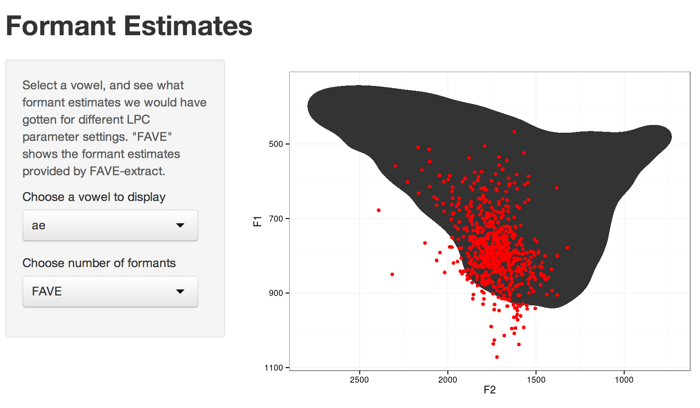

```{r, include = F}
  library(plyr)
  library(dplyr)
  library(sqldf)
  library(ggplot2)
  library(grid)
  library(car)
  library(scales)

  library(lme4)
  library(boot)
  library(gss)
  library(knitr)
  library(PNC)
  library(stringr)

  library(rstan)
  library(reshape2)
  opts_chunk$set(message = F,
    			 echo = F,
				 warning = F,
				 fig.align = "center")
```

# Introduction

## Outline of the talk

>- The Benefits of Automation
>- The Real Benefits of Automation
>- How FAVE works
>- The FUD Surrounding Automation
>- eVoweluate


# Benefits of Automation

## Some Undeniable Benefits

>- It's a bit faster.
>- You get more, and richer data.


## Dinkin (2009)
- 57,464 formant measurements
- 119 speakers
- Average of `r round(57464/119)` mesurements per speaker

## Philadelphia Neighborhood Corpus
```{r}
  pnc_info <- read.delim("data/pnc_info.txt")
```

- `r formatC(sum(pnc_info$nvowels), format = "d", big.mark=",")` formant measurements
- `r nrow(pnc_info)` speakers
- Average of `r formatC(round(mean(pnc_info$nvowels)), format = "d", big.mark = ",")` measurements per speaker
- Average of `r round(mean(pnc_info$nvowels/pnc_info$transcribed), digits = 2)` vowels per second.

## More Data

```{r}
#   ay_flap %>% 
#     mutate(word = as.numeric(reorder(as.factor(word), F1_n, mean)),
#            speaker = as.numeric(as.factor(File)),
#             DOB = year-age)%>%
#     arrange(speaker, word)%>%
#     select(word, speaker, DOB, F1, F2, F1_n, F2_n, fol_seg, context, word_status, phrase_status)->ay_flap
#   write.table(ay_flap, "data/ay_flap.txt", quote = F, sep = "\t", row.names = F)

  ay_flap <- read.delim("data/ay_flap.txt")
```                               


/ay/ followed by different /t,d/ contexts.

<div align="center" style="margin:5%;">

```{r, results='asis'}
  kable(formatC(with(ay_flap, table(fol_seg, context)), format = "d", big.mark = ","))
```

</div>

## More Data

```{r}
  mod_df <- readRDS("data/one_sig_df.rds")
  extract_from_summary <- function(summary = NULL, pars){
    require(stringr)
    require(plyr)
    
    pars <- paste(paste("^", pars, sep = ""), collapse = "|")
    if(class(summary) == "matrix"){
      summary.df <- as.data.frame(summary[grepl(pars, row.names(summary)),])
    }else{
      summary.df <- summary[grepl(pars, row.names(summary)),]
    }
    
    summary.df$full_pars <- row.names(summary.df)
    summary.df$pars <- gsub("\\[.*\\]", "", summary.df$full_pars)
    
    dim_cols <- ldply(
      llply(
        llply(
          str_split(
            gsub("\\[|\\]","",
                 str_extract(summary.df$full_pars, "\\[.*\\]")
            ),
            ","), 
          as.numeric),
        rbind), 
      as.data.frame)
    
    summary.df <- cbind(summary.df, dim_cols)
    
    return(summary.df)
    
  }
```

```{r}
  mu <- extract_from_summary(mod_df, "dob_mu") %>%     
              mutate(fol_seg_context = c("D_faithful","D_flap","T_faithful","T_flap")[V1])

  mu <- cbind(mu,colsplit(mu$fol_seg_context, pattern = "_", names = c("fol_seg","context")))
```

```{r}
  ggplot(mu, aes(V2 + 1888, mean, color = fol_seg))+
    geom_line()+
    geom_ribbon(aes(ymin = `2.5%`, ymax = `97.5%`, fill = fol_seg), 
                alpha = 0.3)+
    facet_wrap(~context)+
    scale_y_reverse("Normalized F1")+
    xlab("Date of Birth")+
    scale_fill_brewer(palette = "Set1")+
    scale_color_brewer(palette = "Set1")+
    theme_bw()

```

## More Data

```{r}
  mu_diffs <- extract_from_summary(mod_df, "mu_diff") %>% 
                  filter(V1 %in% 1:2)%>%
                  mutate(context = c("faithful","flap")[V1])
```

```{r}
  ggplot(mu_diffs, aes(V2+1888, mean, color = context)) + 
    geom_hline(y=0, color = "grey50")+
    geom_line()+
    geom_ribbon(aes(ymin = `2.5%`, ymax = `97.5%`, fill = context), alpha = 0.3)+
    scale_y_reverse("height diff pre-/t/ vs pre-/d/")+
    xlab("Date of Birth")+
    scale_color_brewer(palette = "Dark2")+
    scale_fill_brewer(palette = "Dark2")+
    theme_bw()
```

## Richer Data


## Richer Data


## Richer Data
```{r}
  days <- read.delim("data/days_hist.txt")
  days$plural <- grepl("S$", days$word)
  days$prefix <- gsub("DAYS?$", "", days$word)
```

```{r}
  days %>% 
    filter(prefix %in% c("MON", "TUES", "WEDNES", "THURS","FRI","SATUR","SUN"))%>%
    group_by(prefix, plural) %>%
    summarise(n = n()) -> prefix_count

  ggplot(prefix_count ,aes(prefix, n, fill = plural)) + 
    geom_bar(stat = "identity", position = "dodge")+
    xlim(c("MON", "TUES", "WEDNES", "THURS","FRI","SATUR","SUN"))+
    scale_fill_brewer(palette = "Dark2")+
    theme_bw()
```


# The Real Benefits of Automation

## Reproducibility 

```{r}
  formants <- Sys.glob("data/*Table")
  read_formants <- function(formant){
    form <- gsub("data/time_|.Table", "",formant)
    data <- read.delim(formant)
    data$formant <- form
    return(data)
  }
  
  one_vowel <- ldply(formants, read_formants)
```

```{r}
  candidates <- readRDS("data/candidates.rds")
  fave <- candidates %>% filter(nFormants == formants)
```

```{r}
  ggplot(fave, aes(F2, F1))+
    stat_density2d(geom = "polygon")+
    geom_point(data = one_vowel, aes(F2.Hz., F1.Hz.), color = "red")+
    stat_ellipse(data = one_vowel, aes(F2.Hz., F1.Hz.), color = "red")+  
    scale_y_reverse()+
    scale_x_reverse()+
    theme_bw()
```

## Researcher Heuristics

>- Choosing a measurement point.
>- Adjusting the LPC settings.
>- **Choosing vowels to measure or ignore.**

## Researcher Effects

>- How explicitly defined their heuristics are.
>- How strictly they enforce them.
>- How experienced and skilled they are.
>- Their recent caffiene consumption, and quality of previous night's sleep.

## Automation

*Knowable, Explicitly Defined, Exceptionless*

>- Measurement point selection method.
>- LPC parameter setting method.
>- Decision process for measuring a vowel or not.


## Automation

*Eliminated*

>- ~~Researcher experience and skill.~~
>- ...oops

## Reproducibility

<embed src = "http://github.com/JoFrhwld/FAVE" width = "100%" height = "500"></embed>

## Reproducibility


# FAVE-extract

## FAVE

[](http://jofrhwld.shinyapps.io/formants/)

## FAVE

>- For each vowel token, the F1 and F2 estimates you could get for different LPC parameter settings constitute a *candidate set*.
>- Choose a winner based on its multivariate distance (based on F1, F2, log(B1), log(B2)) to the Atlas of North American English's distribution for that vowel class.
>- Logic: If there is an LPC setting whch is produces a measurement close to the ANAE distribution for that vowel class, it's probably ok.

## FAVE - Once more, but Bayesian this time

>- The ANAE distribution for a vowel class is the *prior*.
>- The candidate set of potential formant estimates is the *likelihood*.
>- The winner is the *posterior*.

<br>

>- Like most worries about Bayesian reasoning, people worry that the prior might exert too strong an influence on the posterior.
>- Fortunately, the prior's influence here doesn't seem to be too strong.

## FAVE - Step 1

[](http://jofrhwld.shinyapps.io/fave_step1/)

## FAVE - Remeasurement

[](http://jofrhwld.shinyapps.io/remeasure/)

## FAVE - Step 2

[](http://jofrhwld.shinyapps.io/fave_step2/)

## FAVE - Results
[](http://jofrhwld.shinyapps.io/fave_results/)

## FAVE - Future Directions

>- [`feature/iterremeasure`](https://github.com/JoFrhwld/FAVE/tree/feature/iterremeasure)
    - Continue iterating through re-estimation either until it arrives at a stable distribution, or a maximum iteration is reached.
>- [`feature/bootstrap`](https://github.com/JoFrhwld/FAVE/tree/feature/bootstrap)
    - Try to figure out the best LPC setting based on the distribution of the candidate set alone.
    - This approach would only be appropriate for vowel classes with a lot of tokens.

## FAVE - Future Directions

```{r}
#   bootstrap <- read.delim("~/Documents/FAVE/FAVE-extract/PH06-2-1-AB-Jean_bootstrap.txt")
#   bootstrap <- bootstrap %>%
#     mutate(id = 1:length(F1)) %>%
#     select(id, plt_vclass, nFormants, dur, F1, F2, B1, B2)
#   
#   saveRDS(bootstrap, "data/bootstrap.rds")
  
  bootstrap <- readRDS("data/bootstrap.rds")

  bootstrap$method <- "bootstrap"
  fave$method <- "anae"

  comp_method <- rbind.fill(fave,bootstrap)
```

```{r fig.width=10, fig.height=5}
  comp_method %>%
    filter(plt_vclass %in% c("iy", "aeh", "ae","o","oh")) %>%
    ggplot(., aes(F2, F1, color = plt_vclass)) +
      geom_point()+
      stat_ellipse()+
      scale_y_reverse()+
      scale_x_reverse()+
      scale_color_brewer(palette = "Dark2")+
      facet_wrap(~method)+
      theme_bw()

```

# Fear, Uncertainty, Doubt

## Errors

## People make errors too


## The "correct" answer isn't well defined anyway

```{r}
  ggplot(fave, aes(F2, F1))+
    stat_density2d(geom = "polygon")+
    geom_point(data = one_vowel, aes(F2.Hz., F1.Hz.), color = "red")+
    stat_ellipse(data = one_vowel, aes(F2.Hz., F1.Hz.), color = "red")+  
    scale_y_reverse()+
    scale_x_reverse()+
    theme_bw()
```


## "Black Box"

## People are black boxes


## [FAVE](https://github.com/JoFrhwld/FAVE) is *not* a black box

<embed src = "http://github.com/JoFrhwld/FAVE"  width = "100%", height = "500"></embed>

## It's like...

<div class="fragment">

</div>
## It'll encourage...

<div class = "fragment">
</img>

"<a href="https://commons.wikimedia.org/wiki/File:Choloepus_didactylus_-_Buffalo_Zoo.jpg#mediaviewer/File:Choloepus_didactylus_-_Buffalo_Zoo.jpg">Choloepus didactylus - Buffalo Zoo</a>" by <a href="//commons.wikimedia.org/wiki/User:Davepape" title="User:Davepape">Dave Pape</a> - <span class="int-own-work">Own work</span>. Licensed under Public domain via <a href="//commons.wikimedia.org/wiki/">Wikimedia Commons</a>.
</div>

## Moral Panic

>- Either we're clever enough to learn how to appropriately use new research tools, or we're not.
>- Automation is not an excuse to understand your data less well.

<br>

>- The proof is in the pudding.

# eVoweluate

## eVoweluate Survey

[](https://jofrhwld.github.io/eVoweluate/)