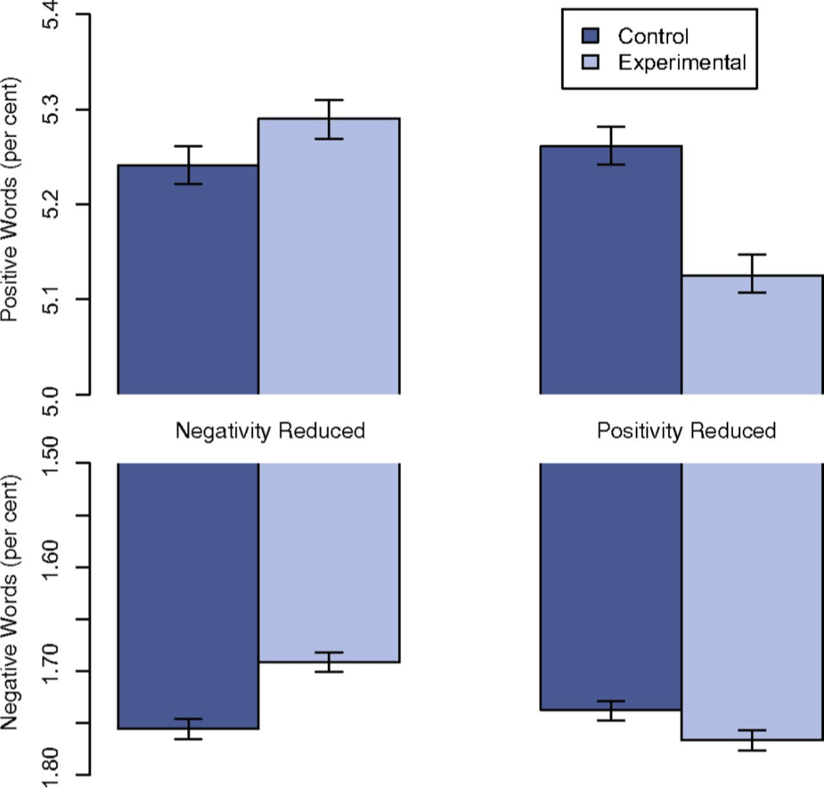
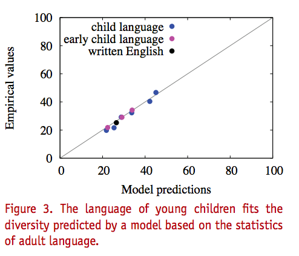
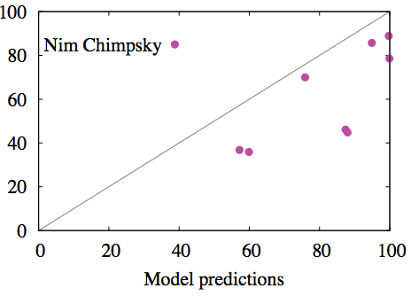

```{r load_lib, echo = F, message = F, error=FALSE, warning=F}
library(DiagrammeR)
library(MASS)
library(plyr)
library(dplyr)
library(stringr)
library(magrittr)
library(knitr)
library(ggplot2)
library(reshape2)
library(lme4)
library(tidyr)
library(rstan)

opts_chunk$set(echo = F, message = F, warning = F, cache = T, autodep = T)
dep_auto()


  verboten_vector <- c("PH76-3-1-",
                       "PH84-2-5-",
	                     "PH84-2-3-",
	                     "PH92-1-1-",
	                     "PH82-1-16-",
	                     "PH80-2-5-",
	                     "PH80-2-4-",
	                     "PH85-1-5-",
	                     "PH84-1-2-",
	                     "PH84-1-1-",
                       "PH77-3-4-")
	
	verboten_string <- paste(verboten_vector, collapse = "|")
```

```{r eval = F}
ays <- readRDS("~/Documents/Papers/untitled folder/Early Infuence of Phonology/ays.Rds")
mid_low_vowels <- readRDS("~/Documents/Papers/untitled folder/Early Infuence of Phonology/mid_low_vowels.Rds")
saveRDS(ays, file = "data/ays.Rds")
saveRDS(mid_low_vowels, file = "data/mid_low_vowels.Rds")
```


# Big Data

## Are Sociolinguists Using Big Data?

>  You cannot email this data to a colleague. You can’t even download it on your computer. This is data on an unprecedented impossibly mind boggling massive scale. - [Kenneth Benoit (2015)](http://www.lse.ac.uk/newsAndMedia/videoAndAudio/channels/publicLecturesAndEvents/player.aspx?id=2888)

Not sociolinguistics yet.

## The Philadelphia Neighborhood Corpus

```{r load_pnc_info}
  demos <- read.delim("/Volumes/jfruehwa/PNC/PNC_corpus_info.txt")
```

<div style = "width:75%;margin-left:auto;">
| speakers |duration | wav files | other | 
|----: | ----: | -----: | -----: |
|`r nrow(demos)` |  `r round((sum(demos$total)/60)/60, digits = 2)` hours | 51G | `r 83-51`G |
</div>

## Big for Sociolinguistics Data

> Big data is a broad term for data sets so large or complex that traditional data processing applications are inadequate. - [Wikipedia](https://en.wikipedia.org/w/index.php?title=Big_data&oldid=651266139)

## "Traditional data processing applications"

<div style="width:50%;margin:auto;">

</div>

## Useful Data

> It is data made useful to us for analysis - [Hilary Mason](https://www.youtube.com/watch?v=XzB_YcB6rPs&t=235)

## Big Enough N

> Sample sizes are never large. If N is too small to get a sufficiently-precise estimate, you need to get more data (or make more assumptions). But once N is “large enough,” you can start subdividing the data to learn more [...]. N is never enough because if it were “enough” you’d already be on to the next problem for which you need more data. - [Andrew Gelman](http://andrewgelman.com/2005/07/31/n_is_never_larg/)


## "Big Data", whatever it is, is coming to sociolinguistics

### Already Here:
- **FAVE-extract** - automates formant analysis.
- [**DARLA**](http://darla.dartmouth.edu/) - Automatic Speech Recognition implementation (Reddy & Stanford)


### Likely coming soon
- Document classification, generally
- Sentiment analysis, specifically
- Topic modeling, etc.

## What it means for us

- We need to keep learning about and developing new computational tools.
- We need to push our students to do the same.

## Big Data-ism

[](http://www.nature.com/srep/2012/121210/srep00943/full/srep00943.html)

## Big Data-ism
My alternate title


## Big Data-ism
Another alternate title


## Big Data-ism

**A Fear:**

- More people doing superficial and theoretically unmotivated work.

**A Problem**

- It'll be trivial to find effect sizes != 0.

## Effect Size
**The Facebook Contagion Experiment**

<div style="width:50%;margin:auto;">

</div>
<div style="align:center;">
Adam D. I. Kramer et al. PNAS 2014;111:8788-8790
</div>

## Alternate Universes

The headlines about the same effect size, but with different Ns might be:

### N = 1,000

**Facebook's unethical experiment has no apparent effect on users' emotions.**

### N = 689,003

**Facebook is using mind control!**

## Let's Get Serious About <br> Effect Size

- Is the effect size of some predictor big enough to explain the phenomenon under discussion?
- Is it about the size we *expected* it to be.

Expectations about how big an effect *ought* to be can only be provided by an articulated theory.

## Let's Get Serious about <br> Theory

<div style = "width:100%">
<div style = "float:left;width:50%;">

</div>
<div style = "float:left;width:50%;">
  
</div>
Yang (2013)
</div>


## Remainder of the talk

>- There are two different models of undershoot that predict pre-voiceless /ay/ raising. I estimate the rate of change they predict, and compare that to the observed rates of change.
>- Using ideas from information theory, I estimate the predicted indexical association between gender and filled pause choice.
>- Both analysis are based on data from the Philadelphia Neighborhood Corpus


# /ay/ Raising

## /ay/ Raising


```{r load_ays}
  ays <- readRDS("data/ays.Rds")
  ays <- ays %>%
            mutate(DOB = year-age)

  mid_low_vowels <- readRDS("data/mid_low_vowels.Rds")
  mid_low_vowels <- mid_low_vowels %>%
                            mutate(DOB = year-age)
```

```{r calc_ays1}
  ays_means <- ays %>%
                filter(context=="internal", stress == 1) %>%
                group_by(File, year, age, DOB, sex, years_of_schooling, 
                         plt_vclass, word) %>%
                summarise(F1_n = mean(F1_n)) %>%
                summarise(F1_n = mean(F1_n))

  mid_low_means <- mid_low_vowels %>%
                      group_by(plt_vclass,File, word) %>%
                      summarise(F1_n = mean(F1_n)) %>%
                      summarise(F1_n = mean(F1_n)) %>%
                      summarise(F1_n = mean(F1_n)) %>%
                      mutate(label = c(e = "ɛ",
                                            uh = "ʌ",
                                            o = "ɑ")[as.character(plt_vclass)])
  
```

<div>
```{r plot_ays1, dev = "svg", fig.width = 8, fig.height = 5}
  
  mid_low_means <- mid_low_means %>% filter(plt_vclass %in% c("o","uh"))
  ggplot(ays_means, aes(DOB, F1_n,
                     color = plt_vclass)) +
    geom_point()+
    stat_smooth(method = "gam", formula = y ~ s(x, bs = "cs"))+
    scale_y_reverse("Normalized F1")+
    geom_hline(data = mid_low_means, aes(yintercept = F1_n), linetype = 3)+
    geom_text(data  = mid_low_means, x= 1895, aes(y = F1_n-0.1, label = label),
              color = "black", show_guide = F)+
    scale_color_brewer("Voicing Context",
                       palette = "Set1",
                       limits = c("ay","ay0"),
                       breaks = c("ay0","ay"),
                       labels = c("-voice",
                                  "+voice"))+
    xlab("Date of Birth")+
    theme_bw()  
```
</div>
- Philadelphia used to have no pre-voiceless /ay/ raising.
- It does now.

## Undershoot Explanation


As a diphthong, /ay/ has a lot of ground to cover. Its nucleus raises before voicless consonants because

>- /ay/ is shorter before voiceless, giving you less time to all the way from /a/ to /i/. Therefore, the nucleus raises to [ʌ], so you don't have to make such a big gesture in such a short amount of time. (Joos 1942)
>- The offglide of /ay/ is forced to be peripheral before voiceless, so the nucleus raises to [ʌ] via co-articulation with the glide. (Moreton & Thomas, 2007)

## /ay/ Trajectories

```{r trajectory_plot, dev = "svg"}
library(car)
jean <- readRDS("data/jean.Rds")
jean %>%
  filter(plt_vclass %in% c("i", "o", "uh", "e","ae","u"))%>%
  mutate(plt_vclass = recode(plt_vclass, recodes = "'i'='ɪ'; 'e'='ɛ';
                             'ae'='æ';'o'='ɑ';'u'='ʊ';
                             'uh'='ʌ';"))%>%
  group_by(plt_vclass)%>%
  summarise(F1 = mean(F1),
            F2 = mean(F2))->point_means


jean %>%
  mutate(id = 1:n())%>%
  select(id, plt_vclass, matches("F[12]\\.[0-9]"))%>%
  gather(variable, hz, F1.20.:F2.80.)%>%
  filter(plt_vclass %in% c("ay","ay0"))%>%
  mutate(variable = gsub(".$", "", variable))%>%
  separate(variable, sep = "\\.", into = c("formant", "time"))%>%
  group_by(plt_vclass, formant, time)%>%
  summarise(hz = mean(hz, na.rm = T))%>%
  ungroup()%>%
  spread(formant, hz) -> ay_traj

library(grid)

ggplot(ay_traj, aes(F2, F1, color = plt_vclass))+
    geom_point()+
    geom_path(arrow = arrow())+
    geom_text(data = point_means, 
              aes(F2, F1, label = plt_vclass), color = "black")+
  scale_color_brewer("Voicing Context",
                     palette = "Set1",
                     limits = c("ay","ay0"),
                     breaks = c("ay0","ay"),
                     labels = c("-voice",
                                "+voice"))+
    scale_x_reverse()+
    scale_y_reverse()+
    theme_bw()  
  
```

## Theory Prediction

**The rate of change across phonetic contexts ought to be *proportional* to the phonetic pressure driving the change in that context.**

>- Contexts: /ay/ preceding:
    - /t/, /d/ $\rightarrow$ [t], [d]
    - /t/, /d/ $\rightarrow$ [ɾ]

## Pressure 1: Nucleus-to-glide distance

```{r load_subtlex}
  subtlex <- read.delim("~/Documents/LingTools/SUBTLEXus74286wordstextversion.txt")
  subtlex <- subtlex %>% mutate(word = tolower(Word))%>%
              select(word, SUBTLWF)
```


```{r word_freq1}
	ays_to_test <- ays %>%
	                filter(context=="internal", stress == 1) %>%
	                mutate(Decade_c = (DOB-1950)/10,
                         word = gsub("\\*","",tolower(word))) %>%
                  mutate(word = gsub("in'", "ing", word)) %>%
                  mutate(word = gsub("'", "", word)) %>%
                  left_join(subtlex)%>%
                  mutate(subtlex = SUBTLWF)
  ays_to_test$subtlex[is.na(ays_to_test$subtlex)] <- 0

  word_freq <- ays_to_test %>%
	                group_by(word, plt_vclass, add = F) %>%
	                summarise(freq = min(subtlex)) %>%
                  ungroup() %>%
	                mutate(freq_c = log2(freq) - median(log2(freq), na.rm = T))
	
	
	  

```


```{r prep_flap}
  library(PNC)
  syllabify_no_stress <- function(trans){
    syls <- unlist(syllabify(trans))
    syls <- syls[names(syls) != "stress"]
    return(syls)
  }

  new_vowel_index <- function(trans, vowel_index){
    while(!grepl("AY", trans[vowel_index])){
      vowel_index <- vowel_index + 1
    }
    return(vowel_index)
  }
  
  ayTD <- ays %>% 
          filter(fol_seg %in% c("T","D"),
                 context == "internal")

  syllables <- ayTD %>% 
    group_by(word_trans, fol_word_trans, vowel_index) %>%
    summarise(n = n()) %>%
    ungroup()%>%
    mutate(fol_word_trans2 = gsub("SP|NS|LG|BR|CG", "", fol_word_trans)) %>%
    group_by(word_trans, fol_word_trans, vowel_index) %>%
    do(word = syllabify_no_stress(.$word_trans),
       phrase = syllabify_no_stress(gsub(" $", "", 
                               paste(.$word_trans, 
                                     .$fol_word_trans2, sep = " "))),
       vowel_index2 = new_vowel_index(syllabify_no_stress(.$word_trans),
                                      .$vowel_index))%>%
    group_by(word_trans, fol_word_trans, vowel_index) %>%
    do(data.frame(word_status = names(.$word[[1]])[.$vowel_index2[[1]]+1],
                  phrase_status = names(.$phrase[[1]])[.$vowel_index2[[1]]+1]))%>%
    rowwise()%>%
    mutate(fol_word_trans2 = gsub("SP|NS|LG|BR|CG", "", fol_word_trans),
           full_string = gsub(" $", "", 
                              paste(word_trans, fol_word_trans2, sep = " ")),
           phrase_fol_seg2 = unlist(str_split(full_string, " "))[vowel_index + 2],
           word_fol_seg2 = unlist(str_split(word_trans, " "))[vowel_index + 2] )%>%
    select(word_trans, fol_word_trans, vowel_index, word_status, phrase_status,
           word_fol_seg2, phrase_fol_seg2)

    ayTD <- ayTD %>% left_join(syllables)
  
```  


```{r get_flap}
  phrase_flap <- ayTD %>%
                  filter(word_status %in% c("coda","coda1"),
                         phrase_status %in% c("onset1", "onset"),
                         grepl("0", phrase_fol_seg2))
  coda <- ayTD %>%
            filter(word_status %in% c("coda1", "coda"),
                   phrase_status %in% c("coda1", "coda"),
                   fol_word_trans == "SP")

#   word_flap <- ayTD %>%
#                 filter(word_status %in% c("onset1", "onset"),
#                        grepl("0", word_fol_seg2))
# 
#   exclude <- c("BITIN'", "CIDER", "ENLIGHTENMENT",
#                "FIGHTIN'", "FRIDAY", "FRIDAYS", "FRIGHTEN", 
#                "FRIGHTENED", "FRIGHTENING", "LIGHTENER", "LIGHTENING",
#                "LIGHTIN'", "SNEIDER", "SNYDER", "SNYDER'S", "SPIDER",
#                "SPIDERMAN", "SPIDERS", "TIGHTEN", "TIGHTENS", "VIDA",
#                "WRITIN'","WRITINGS")
#   word_flap <- word_flap %>%
#                 filter(!word %in% exclude)
  word_flap <- read.delim("data/word_flap.Table")

  coda$context <- "faithful"
  coda$flap_coding <- "?"
  word_flap$context <- "word_flap"
  phrase_flap$context <- "phrase_flap"
  phrase_flap$flap_coding <- "?"
  
  ay_flap <- rbind.fill(coda %>% select(-(city:name), -state, -F3,-B3),
                        word_flap %>% select(-(city:name), -state,-F3,-B3),
                        phrase_flap %>% select(-(city:name), -state,-F3,-B3)) %>%
                  mutate(word = tolower(word))%>%
                  join(word_freq)

  ay_flap <- ay_flap %>%
                filter(!grepl(verboten_string, File),
                       flap_coding %in% c("?","app","approx",
                                          "flao","flap"))
```    


```{r load_tracks}
  tracks <- readRDS("data/flap_comp.rds")
  track_flap1 <- tracks%>%filter(context == "flap")
  track_flap2 <- tracks%>%filter(context == "faithful", fol_word_trans == "SP")

  track_flap <- rbind.fill(track_flap1, track_flap2)
  
  
  glides <- track_flap %>%
                filter(percent > 0.75, percent < 0.85)%>%
                mutate(part = "glide")
  f1_max <- track_flap %>%
              group_by(id, idstring)%>%
              filter(F1_n == max(F1_n))%>%
              mutate(part = "nucleus")


  f1_max %>%
    rbind_list(glides)%>%
    mutate(DOB = year-age)%>%
    dcast(., id + idstring + DOB + word + fol_seg + context ~ part, value.var = "F1_n")->ay_parts
```

```{r glide_plot, dev = "svg", fig.width = 8, fig.height = 5}
#   ay_parts%>%
#     group_by(DOB, fol_seg, context, idstring, word)%>%
#     summarise(glide = mean(glide),nucleus = mean(nucleus), 
#               ntg = mean(nucleus-glide))%>%
#     summarise(glide = mean(glide),
#               nucleus = mean(nucleus),
#               ntg = mean(nucleus-glide))%>%
#     ggplot(., aes(DOB, glide, color = fol_seg, linetype = context))+
#       stat_smooth(method = gam, formula = y ~ s(x))+
#       scale_y_reverse("/ay/ Glide Normalized F1")+
#       xlab("Date of Birth")+
#       scale_color_brewer("Following Segment", palette = "Set1", limits = c("D","T"))+
#       scale_linetype("Context")+
#       theme_bw()
  
```


```{r glide_plot2, dev = "svg", fig.width = 8, fig.height = 5}
  ay_parts%>%
    group_by(DOB, fol_seg, context, idstring, word) %>%
    summarise(glide = mean(glide),
              nucleus = mean(nucleus), 
              ntg = mean(nucleus-glide))%>%
    summarise(glide = mean(glide),
              nucleus = mean(nucleus), 
              ntg = mean(nucleus-glide))%>%
    ggplot(., aes(DOB, ntg, color = fol_seg, linetype = context))+
      #stat_smooth(method = lm)+
      stat_smooth(method = gam, formula = y ~ s(x))+
      ylab("Nucleus to Glide Distance")+
      xlab("Date of Birth")+
      scale_color_brewer("Following Segment", palette = "Set1", limits = c("D","T"))+
      scale_linetype("Context")+
      theme_bw()
```  


```{r }
    ay_parts %>%
      mutate(ntg = nucleus-glide,
             decade = (DOB-1940)/10 )%>%
      mutate(fol_seg = factor(fol_seg, levels = c("T","D")),
             context = factor(context, levels = c("faithful", "flap")))%>%
      lmer(ntg ~ fol_seg * context * decade + 
                (fol_seg * context|idstring) + 
                (1|word),
           data = .)->ntg_model;
  
  parts_pred <- expand.grid(fol_seg = factor(c("T","D"), levels = c("T","D")),
                            context = factor(c("faithful", "flap"), 
                                             levels = c("faithful", "flap")),
                            decade = (1910-1940)/10)
  
  parts_pred_mat <- model.matrix(~fol_seg * context * decade, data = parts_pred)

  B <- fixef(ntg_model)
  E <- vcov(ntg_model)
  
  rand_coef <- mvrnorm(n = 10000, mu = B, Sigma = E)
  mult_left <- function(x,y){y %*% x}

  estimated <- apply(rand_coef, MARGIN = 1, mult_left, y = parts_pred_mat)
  
  maxes <- estimated %>% apply(., 2, max)
  mins  <- estimated %>% apply(., 2, min)
  
  rate_rels <- rbind((estimated[1,]-estimated[2,])/(estimated[1,]-estimated[2,]),
                           (estimated[2,]-estimated[2,])/(estimated[1,]-estimated[2,]),
        (estimated[3,]-estimated[2,])/(estimated[1,]-estimated[2,]),
        (estimated[4,]-estimated[2,])/(estimated[1,]-estimated[2,]))
  
  rate_rels_df <- melt(rate_rels)
  rate_rels_df %<>%
    mutate(fol_seg = parts_pred$fol_seg[Var1],
           context = parts_pred$context[Var1])
  
  rate_rels_df %>%
    group_by(fol_seg, context)%>%
    summarise(lo = quantile(value, probs = 0.025),
              hi = quantile(value,  probs = 0.975))->conf_ints
  
```


## Pressure 2: Duration


```{r}
  ay_flap %>%
      filter(context %in% c("faithful", "word_flap"))%>%
      mutate(context = gsub("word_", "", context),
             both = factor(paste(fol_seg, context, sep = "_")),
             decade = (DOB-1940)/10,
             fol_seg = factor(fol_seg, levels = c("T","D")),
             context = factor(context, levels = c("faithful", "flap")))->ay_flap_tomod
  
```


```{r}
  ay_flap_tomod%>%
      group_by(fol_seg, context, DOB, File, word)%>%
      mutate(logdur = log2(dur))%>%
      summarise(dur = mean(dur))%>%
      summarise(dur = mean(dur))%>%
      ggplot(aes(DOB, dur, color = fol_seg, linetype = context))+
        stat_smooth(method = "lm")+
        scale_color_brewer("Following Segment", 
                           palette = "Set1", limits = c("D","T"))+
      scale_linetype("Context")+
      theme_bw()
  
```

```{r}  
  
  ay_flap_tomod%>%
    mutate(logdur = log2(dur)) %>%
    lmer(dur ~ context*fol_seg * decade +
                  (context+fol_seg | File) + (1|word),
         data = .)->dur_mod;
  
  pred_dur <- expand.grid(fol_seg = factor(c("T","D"), levels = c("T","D")),
                            context = factor(c("faithful", "flap"), 
                                             levels = c("faithful", "flap")),
                            decade = ((1910)-1940)/10)
  
 dur_pred_mat <- model.matrix(~context*fol_seg * decade, data = pred_dur)
 pred_dur$pred <- as.vector(dur_pred_mat %*% fixef(dur_mod))

  dur_B <- fixef(dur_mod)
  dur_E <- vcov(dur_mod)
  
  dur_rand_coef <- mvrnorm(n = 10000, mu = dur_B, Sigma = dur_E)
  mult_left <- function(x,y){y %*% x}

  dur_estimated <- apply(dur_rand_coef, MARGIN = 1, mult_left, y = dur_pred_mat)
  
  dur_maxes <- dur_estimated %>% apply(., 2, max)
  dur_mins  <- dur_estimated %>% apply(., 2, min)
  
  dur_rate_rels <- rbind((dur_estimated[1,]-dur_estimated[2,])/(dur_estimated[1,]-dur_estimated[2,]),
                          (dur_estimated[2,]-dur_estimated[2,])/(dur_estimated[1,]-dur_estimated[2,]),
        (dur_estimated[3,]-dur_estimated[2,])/(dur_estimated[1,]-dur_estimated[2,]),
        (dur_estimated[4,]-dur_estimated[2,])/(dur_estimated[1,]-dur_estimated[2,]))
  
  dur_rate_rels_df <- melt(dur_rate_rels)
  dur_rate_rels_df %<>%
    mutate(fol_seg = pred_dur$fol_seg[Var1],
           context = pred_dur$context[Var1])
  
  dur_rate_rels_df %>%
    group_by(fol_seg, context)%>%
    summarise(lo = quantile(value, probs = 0.025),
              hi = quantile(value,  probs = 0.975))->dur_conf_ints  
```


## Predicting

### We know
- We know /ay/ rose before {/t/ $\rightarrow$ [t]}
- We know /ay/ did not raise before {/d/ $\rightarrow$ [d]}

### Procedure

> - Estimate the strength of the glide/duration precursor at the beginning of the change in the contexts:
    - {/t/ $\rightarrow$ [t]}, {/d/ $\rightarrow$ [d]}
    - {/t/ $\rightarrow$ [ɾ]}, {/d/ $\rightarrow$ [ɾ]}
> - Rescale these effects so {/t/ $\rightarrow$ [t]} = 1, {/d/ $\rightarrow$ [d]} = 0
> - Resulting *relative* precursors in flapping contexts should be proportional to the rate of change in these contexts.

## Relative Precursors:


```{r dev = "svg", fig.width = 10, fig.height = 5}
  rate_rels_df %>%
    mutate(predictor = "nucleus to glide")%>%
    rbind_list(dur_rate_rels_df%>%mutate(predictor = "duration"))->comp_rate_rels
  
  comp_rate_rels%>%
    filter(context == "flap")%>%
    ggplot(aes(value, fill = predictor))+
    geom_vline(x = c(0,1))+
    geom_bar(aes(y = ..count../10000), position = "identity", alpha = 0.6, color = "black")+
    xlab("relative precursor")+
    ylab(NULL)+
    facet_grid(context~fol_seg)+
    theme_bw()+
    ggtitle("relative precursor strengths for flaps")
```

<div  style="font-size:smaller;">
Based on 10,000 samples from the posterior of the model

`precursor ~ TD * context * decade +` <br>
`(TD * context | Speaker) + (1|Word)`
</div>


## Rate of Change

```{r}
  
  stanfit <- readRDS("stanmod/stanfit.Rds")
  
  t_flap_stan <- rstan::extract(stanfit, pars = "slope_factor[2]")
  d_flap_stan <- rstan::extract(stanfit, pars = "slope_factor[3]")
  t_flap_stan_df <- data_frame(rel_rate = t_flap_stan$`slope_factor[2]`, 
                               fol_seg = "T",
                               context = "flap",
                               predictor = "F1")
  d_flap_stan_df <- data_frame(rel_rate = d_flap_stan$`slope_factor[3]`, 
                               fol_seg = "D",
                               context = "flap",
                               predictor = "F1")  
  
  
  flap_stan_df <- rbind_list(t_flap_stan_df%>%mutate(pre_mod = NULL), 
                             d_flap_stan_df%>%mutate(pre_mod = NULL))%>%
                    mutate(posterior = "estimated")
  pred_rate <- comp_rate_rels%>%filter(context == "flap") %>%
                              mutate(rel_rate = value,
                                     pre_mod = predictor,
                                     posterior = "precursor predicted")
  
  
```

```{r flap_graph, dev = "svg", fig.width = 8, fig.height = 5}
    ay_flap_tomod%>%
      group_by(fol_seg, context, DOB, File, word)%>%
      summarise(F1_n = mean(F1_n))%>%
      summarise(F1_n = mean(F1_n))%>%
      ggplot(aes(DOB, F1_n, color = fol_seg, linetype = context))+
      stat_smooth(method = "gam", formula = y ~ s(x, bs = "cs"))+
      scale_color_brewer("Following Segment", 
                           palette = "Set1", limits = c("D","T"))+
      scale_y_reverse("Normalized F1")+
      xlab("Date of Birth")+
      scale_linetype("Context")+
      theme_bw()
  
```

## Modelling

### Estimating relative rates of change

>- Fit a linear model, estimating the rate of change for {/t/$\rightarrow$[t]} contexts.($\beta$)
>- Estimate multipliers between 0 and 1 for each remaining context. ($p_c$)
>- Treat the rate of change of the other contexts as the {/t/$\rightarrow$[t]} slope times the multiplier ($p_c\beta$)

## Results

```{r comp_plot, fig.width = 10, fig.height = 5}
  ggplot(flap_stan_df%>%mutate(pre_mod = NULL), aes(rel_rate, fill = posterior, 
                                                    color = posterior)) +
    geom_vline(x = c(0,1))+
      geom_bar(position = "identity", alpha = 0.6, 
               aes(y = ..count../10000)) + 
      geom_bar(data = pred_rate, aes(y = ..count../10000),
               position = "identity", alpha = 0.6)+
    facet_grid(pre_mod~fol_seg)+
    scale_fill_manual(values= c("red","grey30"))+
    scale_color_manual(values= c("red","grey30"))+    
    xlab("relative participation")+
    ylab(NULL)+
    theme_bw()
  
```

## Results

Neither precursor model accounts for the behavior of *both* t-flaps and d-flaps.

# Um...

## Filled Pauses

```{r um_plot, dev='svg', fig.width=8, fig.height=5}
  library(UhUm)
  um_PNC %>%
    mutate(word = gsub("AND_", "", word),
           dob = year-age,
           decade = floor(dob/10)*10)%>%
    filter(word %in% c("UH","UM"))->um_uh
  
  um_uh%>%
    mutate(um = (word == "UM")*1) %>%
    group_by(year, age, dob, decade, sex, idstring)%>%
    summarise(um = mean(um))-> speaker_um
  
  
  speaker_um %>%
    group_by(sex, decade)%>%
    summarise(um = mean(um))->decade_um
    
  
  speaker_um %>%
    ggplot(aes(dob, um, color = sex))+
      geom_point(alpha = 0.6)+
      geom_point(data = decade_um, aes(x = decade + 5), size = 3)+
      geom_line(data = decade_um, aes(x = decade + 5), size = 1)+
      scale_color_brewer("gender", palette = "Dark2")+
      ylab("proportion 'Um'")+
      xlab("date of birth")+
      theme_bw()
      
      
  
```

## Is this a signal?

<div style='margin:auto;'>
```{r boxplot, dev = 'svg', fig.width = 6, fig.height = 5}
  speaker_um %>%
    filter(decade == 1940)%>%
    ggplot(aes(sex, um))+
      geom_boxplot(aes(fill = sex)) +
      scale_fill_brewer("gender", palette = "Dark2")+
      xlab("gender")+
      ylim(0,1)+
      theme_bw()
```
</div>

## Information Theory

```{r cache = F}
grViz("
digraph rmarkdown {
  rankdir=LR;
  subgraph cluster0 {
    node [shape = rectangle];
    male [style=filled, color = '#d95f02'];
    female [style = filled, color = '#1b9e77'];
    label='message space';
    rank = same; male; female;
  }
  subgraph cluster1{
    shape = rectangle;
    label = 'signal space';
    um;
    uh;
  }
  male -> um;
  female -> um;
  male -> uh;
  female -> uh;
}
", height = 200)
```

## Mutual Information

How much does the patterning of the message and signal together reduce uncertainty about either in isolation?

## Um: Mutual Information with Gender

```{r}
  entropy <- function(probs){
    sum(probs * log2(1/probs), na.rm = T)
  }

  speaker_um %>%
    group_by(decade, sex)%>%
    summarise(is_um = mean(um), 
              n = n())%>%
    mutate(n = sum(n))%>%
    filter(n > 5) -> um_probs
  
  
  um_probs %>%
    summarise(joint = entropy(c(is_um * 0.5, (1-is_um)*0.5)),
              sex = entropy(c(0.5, 0.5)),
              um = entropy(c(sum(is_um * 0.5), sum((1-is_um)*0.5))),
              um_prob = sum(is_um * 0.5),
              mutual_info = sex + um - joint)->entropies  
```


```{r dev = 'svg', fig.width=8, fig.height = 5}
  ggplot(entropies, aes(decade)) + 
    geom_ribbon(aes(ymax = 1, ymin = 0), alpha = 0.2, color = "grey30") + 
    geom_line(aes(y = mutual_info, color = "mutual\ninformation"), size = 1)+
    geom_ribbon(aes(min = 0, ymax = mutual_info, fill = "mutual\ninformation"), color = "black")+
    ylab("bits")+
    theme_bw()+
    scale_color_brewer(name = "", palette = "Dark2")+
    scale_fill_brewer(name = "", palette = "Dark2")+
    ggtitle("marginal entropy - gender")  
  
```

## Comparison: Names


```{r echo = F,cache = F}
library(babynames)
pal <- c(`F` = 1, M = 2)


babynames%>%
    filter(year == 1990)%>%
    group_by(sex)%>%
    arrange(-n)%>%
    slice(1:5)%>%
    mutate(edges = paste(sex, "->", name,
                       "[",
                       #"penwidth =", prop*10,
                       #" weight = ", floor(prop*100),  
                       " colorscheme = dark23, color = ",
                       pal[sex],
                       "]" 
                       ))%>%
  use_series(edges)%>%
  paste(collapse = ";\n")%>%
  paste("digraph {rankdir = LR \n
        F [shape=box]\n
        M [shape=box]\n", .)%>%
  paste("}")%>%
  grViz()

```

## Comparison: Last Letter of Names

```{r echo = F, cache = F}
library(babynames)
pal <- c(`F` = 1, M = 2)


babynames%>%
    filter(year == 1990)%>%
    mutate(last_letter = name %>% str_extract(".$"))%>%
    group_by(sex, last_letter)%>%
    summarise(n = sum(n))%>%
    mutate(prop = n /sum(n))->letter_relationships


letter_relationships %>%
  arrange(-n)%>%
  filter(n > quantile(n, probs = 0.70))%>%
  mutate(edges = paste(sex, "->", last_letter,
                       "[",
                       "penwidth =", prop*10,
                       " weight = ", floor(prop*100),  
                       " colorscheme = dark23, color = ",
                       pal[sex],
                       "]" 
                       ))%>%
  use_series(edges)%>%
  paste(collapse = ";\n")%>%
  paste("digraph {rankdir = LR \n
        F [shape=box]\n
        M [shape=box]\n", .)%>%
  paste("}")%>%
  grViz()

```

## Comparison

```{r}
babynames%>%
  mutate(last_letter = gsub("[A-Za-z]+([a-z]$)", "\\1", name),
         first_letter = gsub("(^[A-Z]).*", "\\1", name),
         decade = floor(year/10)*10) -> baby2
   

baby2%>%
  group_by(decade,sex, name)%>%
  summarise(n2 = sum(n))%>%
  group_by(decade)%>%
  summarise(joint_entropy= entropy(n2/sum(n2))) -> name_joint_entropy

baby2%>%
  group_by(decade, name)%>%
  summarise(n2 = sum(n))%>%
  summarise(margin_letter = entropy(n2/sum(n2)))->name_margin_entropy

name_entropies <- merge(name_joint_entropy, name_margin_entropy)%>%
                    mutate(signal = "name",
                           mutual_info = margin_letter + 1 - joint_entropy)

baby2%>%
  group_by(decade,sex, first_letter)%>%
  summarise(n2 = sum(n))%>%
  group_by(decade)%>%
  summarise(joint_entropy= entropy(n2/sum(n2))) -> firstL_joint_entropy

baby2%>%
  group_by(decade, first_letter)%>%
  summarise(n2 = sum(n))%>%
  summarise(margin_letter = entropy(n2/sum(n2)))->firstL_margin_entropy

firstL_entropies <- merge(firstL_joint_entropy, firstL_margin_entropy)%>%
                    mutate(signal = "first_letter",
                           mutual_info = margin_letter + 1 - joint_entropy)
baby2%>%
  group_by(decade,sex, last_letter)%>%
  summarise(n2 = sum(n))%>%
  group_by(decade)%>%
  summarise(joint_entropy= entropy(n2/sum(n2))) -> lastL_joint_entropy

baby2%>%
  group_by(decade, last_letter)%>%
  summarise(n2 = sum(n))%>%
  summarise(margin_letter = entropy(n2/sum(n2)))->lastL_margin_entropy

lastL_entropies <- merge(lastL_joint_entropy, lastL_margin_entropy)%>%
                    mutate(signal = "last_letter",
                           mutual_info = margin_letter + 1 - joint_entropy)

  entropies <- entropies %>% mutate(signal = "filled_pause")  
  
  all_signals <- rbind_list(name_entropies, firstL_entropies, lastL_entropies, entropies)

```

```{r dev = 'svg', fig.width = 8, fig.height=5}
ggplot(all_signals, aes(decade, mutual_info)) + 
  geom_ribbon(aes(ymax = 1, ymin = 0), alpha = 0.3, color = "grey30") +   
  geom_line(size = 1, aes(color = signal)) + 
#   geom_ribbon(data = all_signals %>% filter(signal == "name"), color = "black", 
#               aes(ymin = 0, ymax = mutual_info, fill = signal))+
#   geom_ribbon(data = all_signals %>% filter(signal == "last_letter"), color = "black", 
#               aes(ymin = 0, ymax = mutual_info, fill = signal))+  
#   geom_ribbon(data = all_signals %>% filter(signal == "first_letter"), color = "black", 
#               aes(ymin = 0, ymax = mutual_info, fill = signal))+  
#   geom_ribbon(data = all_signals %>% filter(signal == "filled_pause"), color = "black", 
#               aes(ymin = 0, ymax = mutual_info, fill = signal))+  
  ylim(0,1) + 
  scale_color_brewer(palette = "Dark2")+
  scale_fill_brewer(palette = "Dark2")+
  theme_bw()  
```

## Um: Results

- A big difference in $P(um|gender)$ doesn't translate to a big $P(gender|um)$.
- The socio-indexical association between filled pause use and gender is very weak, despite the large difference in usage rates between men and women.


# Summing Up

## Preparing for the future

"Big Data" or "Big for Sociolinguistics Data" is going to allow us to investigate some phenomena we've always been interested in in detail that wasn't possible before. If we're creative, we might be able to investigate phenomena that we hadn't thought were investigatable.

## The future is now
<div class = "incremental">
> In the almost total absence of large-scale, questionnaire-supported observations which would have to be extended or repeated over generations of speakers in a community, such a picture can be only guesswork. - Hoenigswald (1960)

</div>

<div class = "incremental">
> It could be observed only by means of an enormous mass of mechanical records, reaching through several generations of speakers. - Bloomfield (1933)

</div>

## Preparing for the future

We need to stay on our theory building game. Our theories need to make quantitative predictions about what we'll observe in our big data. Without that, we risk devolving into a field of superficial and insightless observation.