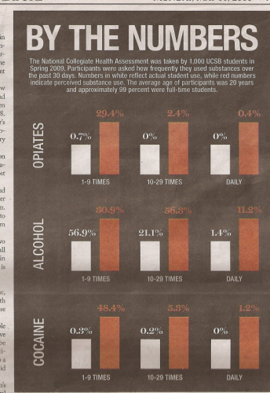
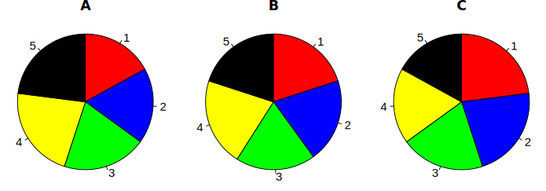

```{r include = F}
  library(plyr)
  library(dplyr)
  library(reshape2)
  library(ggplot2)
  library(scales)

  library(knitr)
```


# Overview

In this brief workshop, we're going to review some basics of data visualization and statistics, and tools you can use.
If you don't know anything about statistics, there is no 60 minute presentation on earth that will be able to teach you the basics.
A good introductory course might do the job for you, but the only way to be able to connect up practical statistical tools with your research needs is to learn through doing.

# Background

When it comes to reading about information design, it all starts with Edward Tufte's *The Visual Display of Quantitative Information*. I have found that insights from this and other Tufte works have greatly influenced my own approaches to data visualization, specifically in terms of maintaining graphical integrity, and minimizing use of non-data "ink".

I also suggest subscribing to a few blogs on data visualization. I find that nothing inspires me to try new and better visualizations like seeing new excellent examples. The two blogs I'd suggest most highly are [Eager Eyes](http://eagereyes.org/) and [Junk Charts](http://junkcharts.typepad.com/). Eager Eyes is maintained by Robert Kosara, who is an academic focusing on information visualization. Apparently they have conferences and everything. Junk Charts is maintained by Kaiser Fung, who is a professional statistician.


# Visualization Goals

There are two primary reasons to visualize data.

1. To help yourself understand your data.
2. To help other people understand your data.

I'll call the first goal "Exploratory Data Visualization" and the second goal "Expository Data Visualization".


## Exploratory Data Visualization

For any kind of data analysis, this should be your workflow:


More or less, you should always be visualizing your data *before* you do statistical analyses, so that you can really understand what you're working with. 
The Anscombe quartet is a good example of why that is.
Here are 4 series of data points:

```{r anscomb_plot, echo = F, dev = "svg"}
  anscombe %>%
    mutate(id = 1:n()) %>%
    melt(., id = "id") %>%
    mutate(series = as.factor(gsub(".*([0-9])", "\\1", variable)),
           dimension = gsub("([xy]).*", "\\1", variable)) %>%
    dcast(., id + series ~ dimension) %>%
    ggplot(., aes(x, y, color = series)) + 
      geom_point()+
      stat_smooth(method = "lm", fullrange = T)+ 
      facet_wrap(~series)+
      theme_bw()
```

If this were real data, and you were trying to figure out how some real process worked with this data, you definitely wouldn't want to treat these 4 data series as being the "same."
But, if you just take the means and standard deviations of `x` and `y` from each series, they're (more or less) identical.
Maybe even more disturbing, the correlation of `x` and `y` is identical for every series!

<div style="width:50%;">

```{r echo = F, results='asis'}
    anscombe %>%
    mutate(id = 1:n()) %>%
    melt(., id = "id") %>%
    mutate(series = as.factor(gsub(".*([0-9])", "\\1", variable)),
           dimension = gsub("([xy]).*", "\\1", variable)) %>%
    dcast(., id + series ~ dimension) %>%
    group_by(series) %>%
    summarise(`mean(x)` = mean(x),
              `sd(x)` = sd(x),
              `mean(y)` = mean(y),
              `sd(y)` = sd(y),
              `cor(x,y)` = cor(x,y))%>%
    kable(.)
```
</div>

Even worse, if you fit a linear regression to each series, the intercept, slope, p-values for the intercept and slope, and r-squared for the regression, are all more or less identical.

<div style="width:70%;">

```{r echo = F, results='asis'}
    anscombe %>%
    mutate(id = 1:n()) %>%
    melt(., id = "id") %>%
    mutate(series = as.factor(gsub(".*([0-9])", "\\1", variable)),
           dimension = gsub("([xy]).*", "\\1", variable)) %>%
    dcast(., id + series ~ dimension) %>%
    group_by(series) %>%
    do(mod = lm(x ~ y, data = .)) %>%
    do(rbind.fill(
        data.frame(value = round(coef(.$mod), 3),
                  var = names(coef(.$mod)),
                  series = .$series),
        data.frame(value = round(summary(.$mod)$coef[,4], 3),
                   var = paste(names(coef(.$mod)), "p-value"),
                   series = .$series),
        data.frame(value = round(summary(.$mod)$r.squared, 3),
                   var = "r-squared",
                   series = .$series)
        )) %>%
    dcast(series ~ var, value = "value") %>%
    kable(.)
```
</div>

Most default statistical analyses of these 4 series of data wouldn't inform you that they are meaningfully different, but the visualization immediately does.
If you run stats without having visualized your data, you're effectively flying blind.
So visualize aggressively. Visualize early, and visualize often.

## Expository Data Visualization

When your sights move towards expository visualization, that is, to communicate your research to others, it's important to make your graphs as accurate as possible.
It's important to think of graphics you produce as a **report** of your data, on equal footing with the statistical analysis. 
Avoid thinking of a plot as a sketch, drawing, illustration, cartoon, decoration, or interpretive art piece of your data. They are merely a spacially and temporally more effective means of reporting your raw data than printing all of the raw data in its entirety.

Of course, it's impossible to simply "report" data in any format without first interpreting it. In fact, the raw data you collect in the first place is interpretive. However, insofar as there is a particular or conventional way you would publish numbers in a large table, and insofar as there are natural properties of those numbers, you want your graphic to accurately represent those properties.

When thinking about numerical data, it's important to think about properties of numbers. Numbers have order, magnitude, and what I'll call contextual magnitude. When you read numbers printed in a table, you have an immediate sense of order and magnitude of the numbers in comparison, and your experience with whatever the numbers represent tells you the contextual magnitude. For example,

<div style="width:20%;">
|group | Measure|
|-------|-------|
| A      | 2    |
| B     | 5     |

</div>

You immediately know:

- **Order**: The order is 2 < 5, or A < B
- **Magnitude**: The magnitude is 5 = 2.5 * 2, or B = 2.5 * A. 
- **Contextual Magnitude**: This depends on what is being measured. If A and B are pubs, and the measure is the cost of a pint, then we know that B is is a bit expensive, and A is a bit cheap. If A and B are people, and the measure is their number of legs, then A is what you'd expect, and B has an unbelievably large number of legs.

A graphic is only useful if it accurately conveys at least the order and magnitude of numbers, and ideally it would also convey the contextual magnitude as well. Here is an inaccurate plot of the numbers from above.

```{r, fig.width = 5/1.5, fig.height = 5/1.5, fig.keep='all'}
data = data.frame(Groups = c("A","B"), Measure = c(2,5))

ggplot(data = data, aes(Groups, Measure))+
  geom_point(size = 5)+
  geom_segment(aes(xend = Groups), yend = 1.75, size = 3)+
	ylim(1.75,5) + 
  ggtitle("Inaccurate")
```

In this plot, the lines start at 1.75, and go up to 2 and 5.
The order is still the same, line A is still shorter than line B, but the magnitudes are way off.
In the data, B is 5/2 = `r 5/2` times larger than A.
In the graph, line B is 5-1.75 = `r 5-1.75` long, and line A is 2-1.75 = `r 2-1.75`, meaning line B is now `r 5-1.75`/`r 2-1.75` = `r (5-1.75)/(2-1.75)` times longer than line B.

Tufte proposes measured called the **"Lie Factor"** of graphs like this (a loaded but appropriate term). It's the ratio of the magnitude of the effect represented in the graph to the magnitude of the effect in the data. In this case, this graph has a Lie Factor of `r (5-1.75)/(2-1.75)`:`r 5/2` = `r ((5-1.75)/(2-1.75))/(5/2)`


Now, some people might object and say something like

> It's not an inaccurate plot! The y-axis is accurately labeled the numbers meant to be expressed.

I warn you, this is the excuse of the charlatan! This is basic sophistry. 

If readers would understand your data better if they *ignored the graphical elements of your plot*, then your plot is net-negative to accurate communication, and I can only assume that accuracy was never your primary goal anyway. 


If you think this kind of thing never happens, here are two examples.


[](http://www.electionleaflets.org/leaflets/full/9419276288f157b409ee60682ef1b814/)

```{r  dev = "svg"}
  mp_data <- data.frame(party = c("conservative", "snp", "lib dem", "labour"),
                     mps = c(1, 7, 12, 39))

  ggplot(mp_data, aes(party, mps, fill = party))+
    geom_bar(stat = "identity", color = "black")+
    xlim("conservative", "snp", "lib dem", "labour")+
    scale_fill_manual(values = c("blue", "red2", "goldenrod1","purple3"))

```


```{r  dev = "svg"}
drug<-data.frame( 
  freq = rep(c(rep("1-9",2),rep("10-29",2),rep("Daily",2)),3),
	perceive = rep(c("actual","perceived"),9),
	drug = factor(c(rep("Opiates",6), rep("Alcohol",6), rep("Cocaine",6)),
                  level = c("Opiates", "Alcohol", "Cocaine")),
	p = c(0.7,29.4,0,2.4,0,0.4,56.9,30.9,21.1,56.3,1.4,11.2,0.3,48.4,0.2,5.3,0,1.2)/100
	)

head(drug)

ggplot(data = drug, aes(perceive, p))+
	geom_bar(stat = "identity")+
	facet_grid(drug~freq)+
  ylim(0,1)
```


The second example of the drugs data is an interesting one.
It seems clear that a graphic designer laid out the graph, and never bothered to go back to make the bars reflect the data.
The mocked up graph reflects what the ideal effect size would be for the author, which I think is pretty similar to the effect sizes researchers in the social sciences would like to always see.
One bar is slightly less than twice as long as the other.

# Basic Visualization Principles

Here are some basic principles for data visualization

## Immediately eliminate these elements from your plots

Never use any of these elements, or their combination, again.

- Pointless 3D elements.
- Drop Shadows
- Pie Charts
- Doughnut Charts

[](https://upload.wikimedia.org/wikipedia/commons/b/b4/Piecharts.svg)

## Be Parsimonious

A plot which communicates the same data in many ways is not better than a plot which uses fewer ways, or one way.  To borrow an example from Tufte, this plot is not particularly offensive:

```{r fig.width = 8/1.5, fig.height=5/1.5,  dev = "svg"}
ggplot(data, aes(Groups, Measure))+
  geom_bar(aes(fill = Groups), color = "black", stat = "identity")+
	geom_text(aes(y = Measure + 0.2, label = Measure))
```

It accurately represents the data. However, it is overly redundant. The size of the measure is indicated in 7 different ways.

1. The height of the left line.
2. The height of the right line.
3. The height of the top line.
4. The height of the filled color.
5. The height of the number.
6. The value of the number.
7. The axis labeling.


Groups in the data are indicated twice.

1. The position of the bars on the x-axis.
2. The filled colors of the bars.

```{r fig.width = 8/1.5, fig.height=5/1.5,  dev = "svg"}
ggplot(data, aes(Groups, Measure))+
  geom_bar(stat="identity")

```

## Map Plot Aesthetics to Data Dimensions

```{r include= F }
  load("~/Documents/Classes/FAAV_Data/basic_context.Rdata")
  aw <- load.vowels("aw", path = path)
  aw <- subset(aw, !grepl("a|h", Eth))
  aw_means <- aw %>%
                mutate(Edu_n = as.numeric(as.character(Edu)),
                       Higher_edu = factor(Edu_n > 12, labels = c("High School",
                                                                  "Higher")),
                       DOB_cat = cut(Year-Age, 6, dig.lab = 4)) %>%
                filter(!is.na(Higher_edu)) %>%
                group_by(DOB_cat, Higher_edu, Sex, File, Word) %>%
                summarise(Diag = mean(F2.n - F1.n)) %>%
                summarise(Diag = mean(Diag)) %>%
                summarise(Diag = mean(Diag))
              
```

```{r fig.width = 11/1.5, fig.height = 5/1.5, dev = "svg"}
  head(aw_means)
  # Not Quite
  ggplot(aw_means, aes(DOB_cat, Diag, color = Sex:Higher_edu)) +
    geom_line(aes(group = Sex:Higher_edu))

  # Not this either
  ggplot(aw_means, aes(DOB_cat, Diag, linetype = Sex:Higher_edu)) +
    geom_line(aes(group = Sex:Higher_edu))

  # This is better
  ggplot(aw_means, aes(DOB_cat, Diag, linetype = Higher_edu, color = Sex)) +
    geom_line(aes(group = Sex:Higher_edu))
```


### This goes for color as well

```{r dev= "svg", fig.height =10}
library(RColorBrewer)
display.brewer.all()
```

## Use the appropriate graphical element for the data

There are certain conventions in data graphics, and readers will assume that there are certain properties of your data given these properties' conventional representation. 
Be sure that your graphical elements communicate correctly. 
For instance, lines indicate changes within some category across a variable with a meaningful order. 
So, this plot incorrectly uses a line:
```{r  dev = "svg", fig.width = 5, fig.height = 5}
 ggplot(data, aes(Groups, Measure))+
  geom_point()+
	geom_line(aes(group = 1))+
	expand_limits(y = 0)
```

## Be Consistent

If you're going to plot the same things, multiple times, try to keep your axis ranges, aspect ratios, and color mappings consistent across plots.

## Try it a few different ways.

```{r dev = "svg", fig.width = 10}
source("http://jofrhwld.github.io/postgradconf_2014/phila_income.R")
head(phila_income)

ggplot(phila_income, aes(Name, value))+
  geom_bar(aes(fill = Gender), position = "dodge", 
           stat = "identity")+
	coord_flip()+
  scale_y_continuous("Income", breaks = c(0, 30000, 60000, 90000))+
  xlab("County") +
	facet_wrap(~Level) 
  
```

```{r dev = "svg"}
  library(reshape2)
  phila_income_c <- dcast(phila_income, Name + Level ~ Gender)
  head(phila_income_c)


  ggplot(phila_income_c, aes(Male, Female, color = Name, shape = Level)) +
      geom_point()+
      geom_line(aes(group = Name))+
      scale_x_continuous(labels = dollar)+
      scale_y_continuous(labels = dollar)+
      geom_abline()+
      coord_fixed()

  ggplot(phila_income_c, aes(Male, Female, color = Name, shape = Level)) +
      geom_point()+
      geom_line(aes(group = Level))+
      scale_x_continuous(labels = dollar)+
      scale_y_continuous(labels = dollar)+
      geom_abline()+
      coord_fixed()

  ggplot(phila_income_c, aes(Level, Female/Male, color = Name))+
    geom_point() + 
    geom_line(aes(group = Name)) + 
    geom_hline(y = 1)+
    ylim(0.5,1)
```


# Tools to use

## R

- R
- RStudio
- ggplot2


