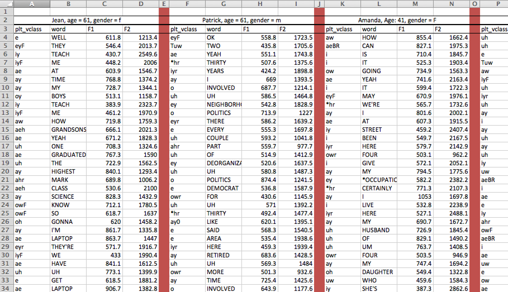

```{r, load_libs, echo = F, message = F}
  library(dplyr)
  library(tidyr)
  library(magrittr)
  library(knitr)
  library(reshape2)
  library(ggplot2)

  opts_chunk$set(cache = T, autodep = T)
  dep_auto()
```
# Introduction

This workshop will cover the following facets of working with quantitative data:

1. What tools to (not) use.
2. Principles of tidy data.
3. The Split-Apply-Combine approach to data analysis.
4. Practical R code littered throughout.

Hopefully this workshop will be able to act as a starting point for some.
There is no 45 minute workshop, or semester long course for that matter, that will be able to comprehensively teach you all you need to know to be quantitative researcher.
That requires some self direction and an entrepreneurial spirit.

# What tools to (not) use.

Simply put:

<div style="text-align:center;font-size:300%;">Don't use Excel.</div>

<div style="text-align:center;font-size:300%;">Do use [R](http://www.r-project.org/) and [Python](https://www.python.org/).</div>

## Why not use Excel?

First, it is too easy to make mistakes and not realize it.
To our Excel devotees out there, how many of you have spreadsheets and data that look like this?


The results displayed in the spreadsheet above led the authors to conclude that when countries' debt to GDP ratio approached 90%, their economies would shrink at a rate of -0.1%.^[Reinhart, Carmen M., and Kenneth S. Rogoff. "Growth in a Time of Debt (Digest Summary)." American Economic Review 100.2 (2010): 573-578.]
This result was widely cited in the fallout of the 2008 financial crisis, especially by politicians supporting austerity measures.
Without taking a stance here, it should suffice to say that the policy decisions connected to this spreadsheet are not uncontroversial.

One problem, though, is that there are coding and formula errors in that spreadsheet!
When you fix the coding errors in the spreadsheet, it turns out that countries with a debt to GDP ratio of 90% actually grow at a rate of about 2.2%.^[Herndon, Thomas, Michael Ash, and Robert Pollin. "Does high public debt consistently stifle economic growth? A critique of Reinhart and Rogoff." Cambridge Journal of Economics 38.2 (2014): 257-279.]
There is, in fact, a [European Spreadsheet Risks Interest Group](http://www.eusprig.org/index.htm) that meets annually to discuss the risks about spreadsheet errors, and share horror stories.

---

Second, spreadsheets tend to encourage data formatting that is pleasing to the eye, which is rarely formatting that is useful. 
For example, here is a screenshot of a spreadsheet containing vowel fromant data from 4 speakers.
Each speaker has their own set of columns, with demographic information in one, merged cell at the top.



This data formatting is almost worse than useless when it comes to doing your statistical analyses.
You might spend more time reformatting the data into a usable format than you will on an analysis.

We'll touch on tidy data further down, but the way this data ought to be formatted is with all speakers data concatenated together, length wise, with additional columns for the demographic data.

```{r echo = F, warning = F}
library(dplyr)

sherwin <- Sys.glob("/Volumes/jfruehwa/PNC/PH06-2-SherwinStreet/PH*/PH*_meas.txt")
meas_df <- data.frame(file = sherwin)

meas_df %>%
  rowwise()%>%
  do(data.frame(file = basename(as.character(.$file)[1]),
    read.delim(as.character(.$file))))->all_data

all_data %>%
  group_by(file, plt_vclass )%>%
  slice(1:min(n(), 10))%>%
  group_by(file)%>%
  arrange(t)%>%
  select(file, age, sex, plt_vclass, word, F1, F2)->samp
```

```{r echo = F}
  samp
```

---

Third, and maybe most importantly, Excel has had long standing errors in its statistical procedures.^[Mélard, Guy. "On the accuracy of statistical procedures in Microsoft Excel 2010." Computational statistics 29.5 (2014): 1095-1128.].
As Mélard (2014) said about Excel 2010:

> Microsoft has fixed the errors in the statistical procedures of Excel neither quickly nor correctly. The recent improvements reported in this paper should not hide the fact that Microsoft is still marketing a product that contains known errors. We didn’t analyze Excel in Office 2013 but, according to Microsoft (2013), where the changes with respect to Office 2010 are collected, there are few changes to Excel and nothing about the statistical aspects is mentioned.


## Why use R and Python?

### Common Understanding

In equal parts, R and Python are becoming the lingua francas of research and analysis in the social sciences and beyond.
That means we all wind up benefiting from the collective wisdom of other researchers who are also using these tools. 
There are large communities of support surrounding them, and community investment in improving them and expanding them.


### Free and Open Source

R and Python are both free and open source. 
This means there is no need for student or institutional licenses to use them. 
After you leave Edinburgh, you'll be able to re-run all of your analyses without worrying about your licence expiring.

### Reproducibility

R and Python are both programming languages, meaning you'll need to write code to do your analyses.
While this may seem intimidating for those of you who don't feel computationally inclined, writing, running, and retaining the code is *crucial* for doing reproducible research.
You'll always be able to precisely reproduce your earlier results providing you save your scripts.
The same can't be said for using spreadsheet programs like Excel. 

### Career Utility

If you're doing quantitative research, and you want to pursue an academic career, employers are going to want you to be able to teach their students how to do quantitative research.
That means they'll want you to teach R and/or Python.

Outside of academia, knowing R and/or Python is a salable skill.
"Data science" is still a growing sector of employment, and if you take the opportunity to learn these data skills to do your postgraduate research, you may be able to successfully leverage them into a career outside of academia.


# Tidy Data

Organizing your data so that it is "tidy" is crucial to efficiently carrying out your analysis.
I'll be adopting the definition of "tidy data" from Wickham (2014).^[Wickham Rstudio, H. (2014). Tidy Data. JSS Journal of Statistical Software, 59(10). Retrieved from http://www.jstatsoft.org/]
But first, let's talk a little bit about data collection.

## General Principles of Data Collection

### Over-collect
When collecting data in the first place, over-collect if at all possible. The world is a very complex place, so there is no way you could cram it all into a bottle, but give it your best shot! If during the course of your data analysis, you find that it would have been really useful to have data on, say, duration, as well as formant frequencies, it becomes very costly to recollect that data, especially if you haven't laid the proper trail for yourself.

If your data collection involves you typing individual observations into a spreadsheet, this recommendation may seem especially onerous.
That is why you should try to learn as many computation tricks and time saving techniques as possible.
If you're working with speech data, this means learning some [Praat](http://www.fon.hum.uva.nl/praat/manual/Scripting.html) and Python scripting.
If you're working with textual data, this means learning some Python scripting.


### Preserve High Dimensional Info

Let's say you're broadly interested in the effect following consonants have on the preceding vowels.
The following consonants have some of the following properties:

- place of articulation
- degree of closure
- voicing
- nasality

All of these properties are usually conveniently encodable in a single character.

<div style = "width:75%">
| encoding | place | closure | voicing | nasality |
| --------: | -----: |-----: | -----: |  -----: |
| **k** | dorsal | stop | voiceless | non |
| **n** | apical | stop | voiced | nasal |
</div>

We're calling the coding **k** "High Dimensional" because if you know the following consonant was a /k/, you automatically know a lot of other things about the following context.
My recommendation here is two fold.
First, in a context like this, you shouldn't just record that the following segment was "dorsal", and not keep a record that it was specifically /k/.
*Preserve* the high dimensional coding.

Second, take advantage of the high dimensionality of some encodings when you're doing your data collection.
For example, in the case of seeing what effect following segments have on vowels, in your initial data collection, you could *just* code for the identity of the following consonant:

<div style = "width:25%">

```{r echo = F, results = 'asis'}
  all_data %>%
    filter(plt_vclass == "i",
           fol_seg %in% c("P","T",
                          "B","D",
                          "F","S")) %>%
    group_by(fol_seg)%>%
    slice(1:2)%>%
    ungroup()%>%
    mutate(following = fol_seg)%>%
    select(dur, fol_seg)->dur_data
  
  dur_data %>%
    kable(align = c('r','r'))
```

</div>

Then, code all of the other information you need via a lookup table.

```{r}
  features <- data.frame(fol_seg = c("P","T", 
                                     "B","D", 
                                     "F","S"),
                         voicing = c("voiceless", "voiceless",
                                     "voiced", "voiced",
                                     "voiceless","voiceless"),
                         place = c("labial", "apical",
                                   "labial", "apical",
                                   "labial", "apical"))
  features
  merge(dur_data, features)
```


### Leave A Trail of Crumbs 
Be sure to answer this question: How can I preserve a record of this observation in such a way that I can quickly return to it and gather more data on it if necessary? 
If you fail to successfully answer this question, then you'll be lost in the woods if you ever want to restudy, and the only way home is to replicate the study from scratch.
For research involving speech data, keep a record of the coding you're doing in a Praat TextGrid.

### Give Meaningful Names
Give meaningful names to both the names of predictor columns, as well as to labels of nominal observations. Keeping a readme describing the data is still a good idea, but at least now the data is approachable at first glance.

## Storing Data

When we store data, it should be:

(@raw)
**Raw**
Raw data is the most useful data. It's impossible to move down to smaller granularity from a coarser, summarized granularity. Summary tables etc. are nice for publishing in a paper document, but raw data is what we need for asking novel research questions with old data. 

(@open)
**Open formatted**
Do not use proprietary database software for long term storage of your data. I have enough heard stories about interesting data sets that are no longer accessible for research either because the software they are stored in is defunct, or current versions are not backwards compatible. At that point, your data is property of Microsoft, or whoever. Store your data as raw text, delimited in some way (I prefer tabs).

(@consistent)
**Consistent**
I think this is most important when you may have data in many separate files. Each file and its headers should be consistently named and formatted. They should be consistently delimited and commented also. There is nothing worse than inconsistent headers and erratic comments, labels, headers or NA characters in a corpus.

(@documented)
**Documented**
Produce a readme describing the data, how it was collected and processed, and describe every variable and its possible values.


## Tidy Data

Wickham (2014) identifies the following properties of tidy data.

1. Each variable forms a column. 
2. Each observation forms a row. 
3. Each type of observational unit forms a table.

I'm going to focus on 1 and 2.

Let's return to our example where we're trying to explore the relationship between vowel duration and following segments.
Here's a table, like you might see published in a paper, that contains the mean duration of four vowels in six different segmental contexts.

<div style = "width:75%">

```{r echo = F}
  all_data %>%
    filter(plt_vclass %in% c("iy","ey",
                             "uw", "ow"),
           fol_seg %in% c("P","T", 
                          "B","D", 
                          "F","S"))%>%
    dcast(plt_vclass ~ fol_seg, value.var = "dur", 
          fun.aggregate = .%>%mean(.)%>%multiply_by(1000)%>%round(.))->mean_durs
  mean_durs%>%
    kable(caption = "Table 1: Mean vowel duration in ms")
```

</div>

The **variables** in this table are

- The *vowel*
- The following *consonant*
- The *mean duration.*


Each **observation** is

- The *mean duration* of each *vowel* preceding each *consonant*


Table 1 violates the principles of tidy data in the following ways:

- The values of the *consonant* variable aren't stored in any columns (they're being used to defined columns).
- The values of *mean duration* variable are spread out across multiple columns.
- There are multiple **observations** per row.


In order to conform to the tidy data format, we need:

- 1 column for each **variable** (*vowel*, *consonant*, *mean_duration*)
- 1 row for each **observation** (the *mean duration* for each *vowel* before each *consonant*)

That's going to look like Table 2.

<div style="width:30%">

```{r echo = F}
  mean_durs %>%
    gather(consonant, mean_dur, B:T)%>%
    mutate(plt_vclass = as.character(plt_vclass),
           consonant = as.character(consonant))%>%
    slice(1:8)%>%
    rbind(c("...","...","..."))%>%
    kable(align = c('r','r','r'),
          caption = "Table 2: Mean vowel duration in ms")
  
  mean_durs %>%
    gather(consonant, mean_dur, B:T)%>%
    mutate(plt_vclass = as.character(plt_vclass),
           consonant = as.character(consonant))->melt_durs  
  
```

</div>

With the data in this format, it's possible to begin doing visualization & analysis.

```{r}
  ggplot(melt_durs, aes(plt_vclass, mean_dur, fill = consonant))+
    geom_bar(position = "dodge", color = "black", stat = "identity")+
    scale_fill_hue(limits = c("B","P","F",
                              "D","T","S"))
```

### Tools for tidying data:

In R, there are two key packages for tidying data:

- `tidyr`
- `reshape2`

In Python, similar functionality can be found in the [`pandas`](http://pandas.pydata.org/) library.


# [Split-Apply-Combine](http://www.jstatsoft.org/v40/i01/paper)

When doing data analysis, you're going to find yourself doing these following steps a lot:

1. Splitting the data up into subsets.
2. Applying some kind of function to those subsets.
3. Combining the results back together

Let's take the tidy data from before:

```{r}
dur_data <- data.frame(plt_vclass = rep(c("ey", "iy", "ow"), 6), 
                       consonant = rep(c("B","D","F", "P","S","T"), each = 3),
                       mean_dur = c(128, 94, 79, 
                                    133,116, 132, 
                                    170, 110, 149, 
                                    164, 107, 98,  
                                    133, 112, 95,  
                                    136, 135, 113))
```

<div style = "width:30%">

```{r echo = F}
kable(dur_data)
```  

</div>

One thing we might want to calculate is the average duration of each vowel. To do that we'll

- **Split** the data up into smaller tables, based on the `plt_vclass` column.
- **Apply** the `mean()` function to the `mean_dur` column.
- **Combine** the results back into one table.

## Split the data up

First, split the data up into subsets based on the `plt_vclass` column:

<div style="width:100%;float:left;">

```{r echo = F, results='asis'}
for(i in sort(unique(as.character(dur_data$plt_vclass)))){
  cat("<div style='width:30%;float:left;margin:15px;'>\n\n")
  dur_data %>%
    filter(plt_vclass == i)%>%
    kable()%>%print()
  cat("\n</div>\n")
}
cat("</br>")

```

</div>

## Apply some function to the data

In each subset, calculate the average duration.

<div style="width:100%;float:left;">

```{r echo = F, results='asis'}
for(i in sort(unique(as.character(dur_data$plt_vclass)))){
  cat("<div style='width:20%;float:left;margin:15px;'>\n\n")
  dur_data %>%
    filter(plt_vclass == i)%>%
    group_by(plt_vclass)%>%
    summarise(mean_dur = mean(mean_dur))%>%
    kable()%>%print()
  cat("\n</div>\n")
}
cat("</br>")

```

</div>

## Combine the result

Combine these results into a new table.

<div style="width:20%;">

```{r echo = F, results='asis'}
  dur_data %>%
    group_by(plt_vclass)%>%
    summarise(mean_dur = mean(mean_dur))%>%
    kable()%>%print()
```

</div>


## Split-Apply-Combine in R

The relatively new `dplyr` package in R is designed to implement this Split-Apply-Combine workflow in an easy to read fashion. 
It's key functionality derives from

- The pipe operator: `%>%`
- Its data operation "verbs"

```{r eval = F}
  library(dplyr)
```

### The `%>%` ("pipe")

<div style="font-family:monospace;font-size:xx-large;text-align:center;">
<span style="color:red">%>%</span>
</div>


We'll pronounce `%>%` as "pipe".

The way `%>%` works is it takes a data frame on the left side, and inserts it as the first argument to the function on its right side.
For example the `head()` function prints the first 6 rows of a data frame.

```{r}
  head(dur_data)
```

With `%>%`, you'd do it like this:

```{r}
  dur_data %>% head()
```

How useful is that really? Not very until you start chaining them together. If you wanted to get the number of rows in the data frame after you've applied `head()` to it, normally you'd write it out like this:

```{r}
  nrow(head(dur_data))
```

Nested functions are kind of tough to read. You need to read them from the inside out. With `dplyr`, you can chain each function you want to use with `%>%`.

```{r}
  dur_data %>% head() %>% nrow()
```

The way to read that is "Take the `ing` data frame, and pipe it into `head()`. Then take the output of `head()` and pipe it into `nrow()`."

### Verbs

`dplyr` comes with a few "verbs" specially developed for chaining together.

<div style = "width:75%;">
|verb | description |
| :---- | :----- | 
| `filter()` | This works almost exactly like `subset()`|
| `summarise()` | This takes a data frame, and outputs a new data frame based on the summary you asked for|
| `mutate()` | This takes a data frame, and adds additional columns based on the formula you give it formula |
| `select()` | This takes a data frame, and returns only the columns you ask for |
| `arrange()` | Reorders the rows of the data frame|
|**`group_by()`** | Defines sub-groupings in a data frame|
</div>


The `group_by()` function is the crucial one for doing Split-Apply-Combine in `dplyr`.
First, let's look at how we'll use the `summarise()` function.

```{r}
  dur_data %>%
    summarise(dur = mean(mean_dur))
```

By just passing `dur_data` to summarise, it creates a new data frame with one column, `dur`. 
The value of `dur` is calculated by applying `mean()` to `mean_dur`.
It's possible to create as many columns as you want like this:

```{r}
  dur_data%>%
    summarise(dur = mean(mean_dur),
              dur_sd = sd(mean_dur),
              n = length(mean_dur),
              arbitrary = "foo")
```


The `summarise()` verb gets more powerful in combination with `group_by()`.

```{r}
  dur_data%>%
    group_by(plt_vclass)%>%           ## Grouping the data by vowel
    summarise(dur = mean(mean_dur),
              dur_sd = sd(mean_dur),
              n = length(mean_dur),
              arbitrary = "foo")
```

## Strategy for doing Split-Apply-Combine

A general strategy for cracking difficult Split-Apply-Combine nuts would be to first figure out how to solve the problem for a subset of the data, then try to figure out how to generalize it.

Let's ask the following question: How much do speakers vary with respect to vowel centralization.
Shorter vowels tend to be more centralized, as do more frequent words.
We'll investigate this question using data from the `phoneticChange` package, which can be installed like so:

```{r eval = F}
  library(devtools)
  install_github("jofrhwld/phoneticChange")
  library(phoneticChange)
  library(magrittr)
  
```

```{r echo = F}
  library(phoneticChange)
  library(magrittr)
```


First, let's trim down the data a little bit, just to look at the data we're interested in.

```{r}
  ay <- ays %>%
    filter(plt_vclass == "ay",
           !word %in% c("i","my"))%>%    ## I and MY are super frequent pronouns
    select(idstring, sex, age, year, F1_n, F2_n, dur, SUBTLWF)%>%
    mutate(dur_ms = (dur * 1000),
           logdur = log10(dur_ms),
           center_dur = logdur - median(logdur),
           zipf = log10(SUBTLWF) + 3)%>% ## The "Zipf scale", after http://crr.ugent.be/archives/1352
  select(idstring, sex, age, year, F1_n, F2_n, center_dur, zipf)
  
  head(ay)
  nrow(ay)
```


### Solving the problem for one speaker

First, we'll take out the data from one speaker:

```{r}
  one_speaker <- ay %>% filter(idstring == "PH00-1-1-")
```

We can estimate the effect of duration on F1 and F2 of /ay/.

```{r}
  f1_model = lm(F1_n ~ center_dur, data = one_speaker)
  f1_model
  
  
  f2_model = lm(F2_n ~ center_dur, data = one_speaker)
  f2_model
```


## Expanding it for all speakers
```{r}
  speaker_models <- ay %>%
    group_by(idstring)%>%
    filter(n() > 40)%>%
    do(f1_model = lm(F1_n ~ center_dur, data = .),
       f2_model = lm(F2_n ~ center_dur, data = .))
  
  speaker_parameters <- speaker_models %>%
                          rowwise()%>%
                          do(data.frame(idstring = .$idstring,
                                        f1_intercept = coef(.$f1_model)[1],
                                        f1_slope = coef(.$f1_model)[2],
                                        f2_intercept = coef(.$f2_model)[1],
                                        f2_slope = coef(.$f2_model)[2]))
```

```{r}
  ggplot(speaker_parameters, aes(f2_slope, f1_slope))+
      geom_vline(x = 0)+
      geom_hline(y = 0)+
      geom_point(color = 'red')+
      scale_y_reverse()+
      scale_x_reverse()+
      coord_fixed()
```


```{r}
  library(tidyr)
  
  tidy_params <- speaker_parameters %>%
    gather(formant_param, estimate, f1_intercept:f2_slope)%>%
    separate(formant_param, c("formant","parameter"), sep = "_")%>%
    spread(parameter, value = estimate)
  
  tidy_params  
```

```{r}
  ggplot(tidy_params, aes(intercept, slope))+
      geom_hline(y= 0)+
      geom_point()+
      facet_wrap(~formant, scales = "free")
```


  
  

